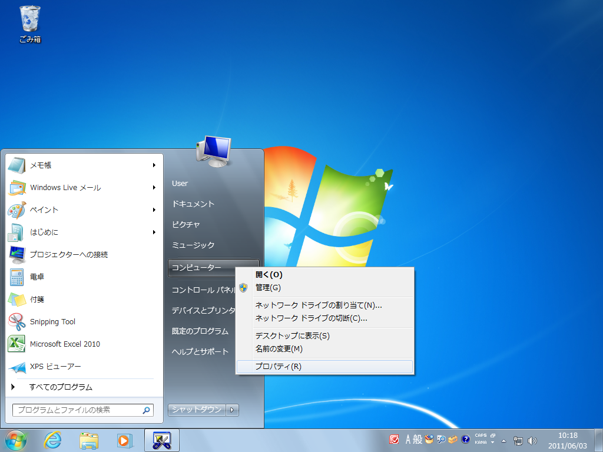
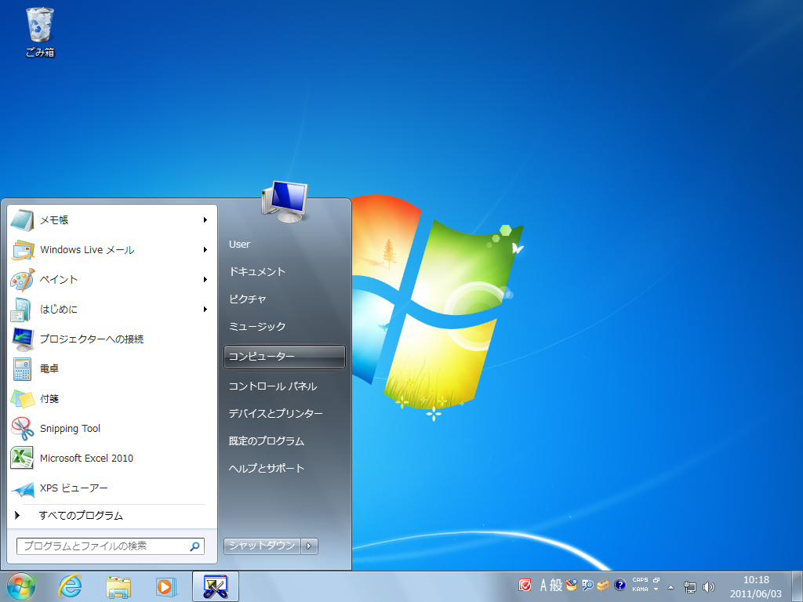
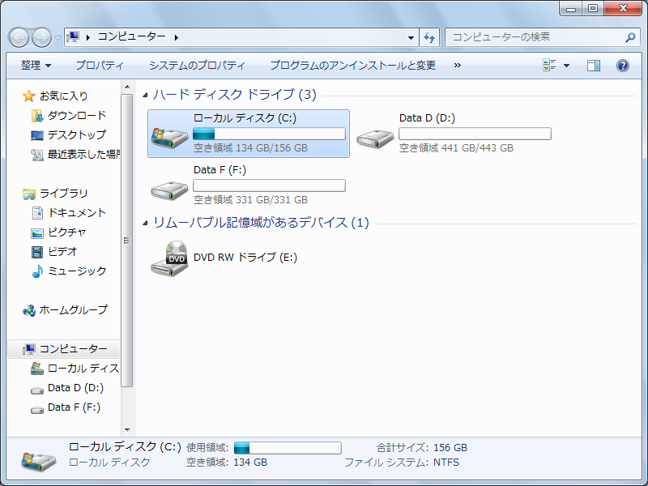
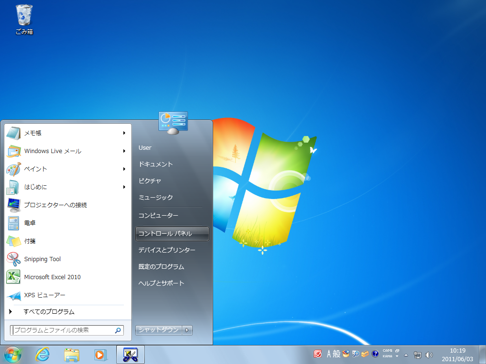
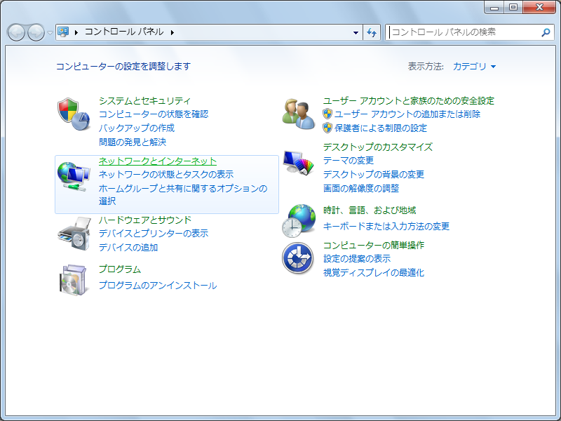
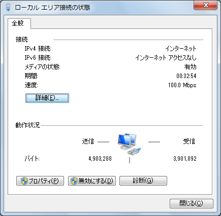

= 第3章 動作環境の確認とDockerのインストール - Next-L Enju インストールマニュアル（Docker編）
:doctype: book
:group: enju_install_vm
:page-layout: page
:title_short: 第3章 動作環境の確認とDockerのインストール
:version: 1.4

* Contents

[#section3]
= 第3章 動作環境の確認とDockerのインストール

[#section3-1]
== 3-1 動作環境を確認する

作業を開始する前に，Enjuをインストールするコンピュータの環境を確認します。
この文書では，Windows 10 でのやり方について説明します。

[#section3-1-1]
=== 3-1-1 Windowsが64bit版であるかの確認，使用可能メモリ容量の確認

Windowsが64ビット版であるか，メモリ容量をシステムのプロパティで確認します。※32bit版では動作しません

==== 1. ［スタート］ボタンをクリックし，［コンピュータ］を右クリックします。

==== 2. ［プロパティ］をクリックします。

==== 3. 以下の項目を確認します。

* システムの種類 : 64bitのオペレーティングシステム
* 実装メモリ　　 : 使用可能容量が 4.00GB 以上

image::../assets/images/1.1/image_install_005.png[コンピュータのプロパティ画面から動作環境を確認します]

[#section3-1-2]
=== 3-1-2 ハードディスク空き容量の確認

Enjuコンテナのインストールと動作に必要なハードディスクの空き容量を確認します。

==== 1. ［スタート］ボタンをクリックし，［コンピュータ］を選択します。

==== 2. 以下の項目を確認します。

* ドライブの空き容量 : 25.0GB以上を推奨

[.label.label-info]#Memo# ハードディスクに必要な空き容量は，蔵書規模により異なります。25.0GBは蔵書が20 万件の規模を想定しています。これよりも蔵書規模が大きい場合は，より多くの容量が必要となります。

[#section3-1-3]
=== 3-1-3 IPアドレスの確認

ホストOSのIPアドレスを確認します。

==== 1. ［スタート］ボタンをクリックし，［コントロールパネル］を選択します。

==== 2. ［ネットワークとインターネット］をクリックします。

==== 3. ［ネットワークと共有センター］をクリックします。

image::../assets/images/1.1/image_install_021.png[［ネットワークと共有センター］をクリック]

==== 4. ［アクティブネットワークの表示］で［ローカルエリア接続］または［ワイヤレスネットワーク接続］をクリックします。

image::../assets/images/1.1/image_install_022.png[［アクティブネットワークの表示］で［ローカルエリア接続］または［ワイヤレスネットワーク接続］をクリック]

==== 5. ［詳細］をクリックします。

==== 6. 表示された画面で，以下の情報をメモなどに記録します。

* DHCPの状態
* IPv4アドレス
* IPv4サブネットマスク
* IPv4デフォルトゲートウェイ
* IPv4 DNSサーバ

image::../assets/images/1.1/image_install_024.png[表示された画面で，情報をメモ]

[#section3-2]
== 3-2 Dockerのダウンロードとインストール

ここでは Windows の場合を説明しますが，Mac，Linuxなど様々なOS上で動きます。

[#section3-2-1]
=== 3-2-1 Dockerのダウンロード

Docker DesktopをDocker社のWebサイトからダウンロードします。次のWebページで［Downloads］をクリックします。 https://www.docker.com/products/docker-desktop/

[#section3-2-2]
=== 3-2-2 Dockerのインストール

前項でダウンロードしたファイルを実行し，Docker Desktopをインストールします。


