= 第3章　図書館のシステム設定を行う - Next-L Enju初期設定マニュアル
:doctype: book
:group: enju_setup
:page-layout: page
:title_short: 第3章 図書館のシステム設定を行う
:version: 1.4

* Contents

[#section3]
= 第3章　図書館のシステム設定を行う

Enjuの利用を始めるにあたり，図書館のシステム設定として，次のような設定作業を行います。入力にはひらがな，カタカナ，漢字，英数字などの文字が利用できます。ただし，半角カナは使用できません。

* システム全体の設定
* 個々の図書館の設定
* 本棚
* 利用者情報・貸出区分とその関係
* 資料の種類と貸出区分との関係
* 催し物の種類
* 書店
* 検索エンジン

[#section3-1]
== 3-1 システム全体の設定をする

[#section3-1-1]
=== 3-1-1 設定項目

* *名前* ：本システムで使用する全体名称を入力します。図書館からのお知らせメールのFromなどに使用されます。
* *表示名* ：画面に表示する名称を入力します。本システムのヘッダなどに表示されます。
* *ヘッダーのロゴ* ：本システムのヘッダに表示されるロゴの画像ファイルを指定します。画像ファイルは縦80ピクセルに合わせてサイズが変更されて登録されます。
* *メール* ：図書館のメールアドレスを入力します。図書館からのお知らせメールのFromなどに使用されます。
* *URL* ：図書館のURLを入力します。資料の表示画面のURLなどに使用します。
* *ログイン画面でのメッセージ* ：ログイン画面で表示したいメッセージを入力します。日本語インタフェース用と英語インタフェース用があります。
* *フッターのメッセージ* ：フッターで表示したいメッセージを入力します。日本語インタフェース用と英語インタフェース用があります。``__VERSION__``と入力すると本システムのバージョン（例：1.2.0）が表示されます。
* *検索結果の最大件数* ：検索したときに表示する最大の件数を表します。「0」と入力したときは上限なしを表します。検索結果の全レコードIDをブラウザに保存するため、上限を設定できるようにしてます（ブラウザによって5MBや10MBなどと異なりますが、いずれにしても上限が決まっているため）。
// 関連 issue  #605
* *書影の取得元* ：書影を取得するサービス（例：「Googleブックス」）を選択します。（※ version 1.2.1現在は、他に、版元ドットコム、openBDを選択可能です）
// 関連 issue #712
* *色* : タイトルの色（標準では青）などを変更する場合に入力します。値はRGBで指定します。
 ** Enjuの標準設定の色
  *** table_border（表の枠線）: 2779aa
  *** table_line1（表のセルの塗りつぶし色1）: ffffff
  *** table_line0（表のセルの塗りつぶし色2）: d7ebf9
  *** header_title（タイトルの色）: 5970B2
 ** オレンジ基調の例
  *** table_border: f8ad6f
  *** table_line1: ffffff
  *** table_line0: fdefe9
  *** header_title: f79646
* *LANとして扱うネットワーク* ：ネットワークの名称を入力します。ここで指定することによってこのEnjuにアクセスできるIPアドレスを制限することができるようになります。
* *管理用として扱うネットワーク* ：ネットワークの名称を入力します。ここで指定することによって特定のIPアドレスからのアクセスのみAdministrator権限やLibrarian権限での作業ができるように制限ができるようになります。
* *注記* ：注意事項や特記事項などを入力します。
* *国と地域* ：▼をクリックし，リストから選択します。利用者の住所の国と地域のデフォルトを指定できます。※現在この値は使用していません（Next-L Enju Leaf 1.1.0.rc9）。

[#section3-1-2]
=== 3-1-2 設定方法

==== 1. ［図書館の管理］メニューから［システムの設定］を選択します。

image::../assets/images/1.2/image_system_setup.png[「システムの設定」を選択]

==== 2. ［システム全体の設定］をクリックします。

image::../assets/images/1.2/image_initial_014.png[「システム全体の設定」を選択]

==== 3. ［編集］をクリックします。

image::../assets/images/1.2/image_initial_015.png[図書館名の編集]

【Memo】インストール直後は，仮の名前が入っています。［編集］をクリックして，情報を変更します。

==== 4. すべての設定項目に必要事項を入力し、［更新］ボタンをクリックして，設定内容を更新します。

image::../assets/images/1.3/image_initial_016.png[設定項目の入力]

【Memo】［表示名］の前には，日本語名ならば「ja:」，英語名ならば「en:」というように，言語がわかるように先頭に文字を付記します。+++
+++【Memo】

* [ログイン画面でのメッセージ]と[フッターのメッセージ]はHTMLやmarkdownを使って、文字装飾したり、リンクをつけたり、画像を表示させたりすることができます。
* 画像をEnjuに置く方法はlink:enju_install_vm_10.html#section10-5[インストールマニュアル「10-5 トップ画面やヘルプなどに表示する画像を置く」]を参照してください。
* 画像を表示させるmarkdown記述の例：`++`
* リンクのmarkdown記述の例: `+[Porject NextL](https://www.next-l.jp/)+`+++
+++

【Memo】右メニューの[表示］をクリックすると「システム全体の設定の表示」の画面に遷移します。

==== 5. 設定が登録され，［システム全体の設定の表示］画面が表示されます。

image::../assets/images/1.3/image_initial_017.png[設定項目の入力]

[#section3-2]
== 3-2 個々の図書館を設定する

図書館の案内ページで表示される情報及び、検索結果等で表示される図書館名を登録します。

[#section3-2-1]
=== 3-2-1 設定項目

* 名前*：図書館の名称を入力します。TSVファイルを使った所蔵のインポートなどに図書館を表す名前として使用します。
* 短縮表示名：短縮した名称を入力します。短縮して表示したい箇所で使用される表示名です。
* 表示名*：画面に表示する名称を入力します。一般的にはこちらの表示名を使用します。
* ISIL*：https://www.ndl.go.jp/jp/library/isil/[図書館及び関連組織のための国際標準識別子（https://www.ndl.go.jp/jp/library/isil/）]を入力します。
* 国と地域：▼をクリックし，リストから選択します。
* 郵便番号*：図書館の所在地の郵便番号を入力します。
* 都道府県*：図書館の所在地の都道府県名を入力します。
* 市町村*：図書館の所在地の市町村名を入力します。
* 番地*：図書館の所在地の番地を入力します。
* 緯度：図書館の所在地の緯度を入力します。図書館の所在地の地図表示に利用します。
* 経度：図書館の所在地の経度を入力します。図書館の所在地の地図表示に利用します。
* 電話番号１*：図書館の電話番号を入力します。
* 電話番号２*：図書館の電話番号を入力します。
* ファックス番号*：図書館のファックス番号を入力します。
* 請求記号の列数：請求記号で利用する列数を入力します。背ラベルの表示に使用します。
* 請求番号の区切り文字：請求記号に利用する区切り文字を入力します。背ラベルの表示に使用します。
* 開館時間*：図書館の開館時間を選択します。
* 注記*：注意事項や特記事項などを入力します。

「*」がある項目については、図書館の情報表示のページで表示される情報になります。

[#section3-2-1]
=== 3-2-2 設定方法

==== 1. ［図書館の管理］メニューから［システムの設定］を選択します。

image::../assets/images/1.1/image_system_setup.png[「システムの設定」を選択]

==== 2. ［図書館］をクリックします。

image::../assets/images/1.1/image_initial_019_0.png[「図書館全体の設定」を選択]

==== 3. ［図書館の新規作成］をクリックします。

image::../assets/images/1.1/image_initial_019.png[図書館の新規作成]

【Memo】入力済みの図書館の設定内容を変更する場合は，［編集］をクリックします。

==== 4. 設定項目に必要事項を入力し、[登録する]ボタンをクリックして，設定内容を登録します。

image::../assets/images/1.1/image_initial_020.png[設定項目の入力]

【Memo】「＊」のマークが付いた項目は入力必須項目です。[名前]は3文字以上、256文字以内で、半角である必要があります。使用できる文字はアルファベットの小文字、数字、-（ハイフン）、_（アンダースコア）です。ただし、名前の最初はアルファベットの小文字のみが使用でき、名前の最後にはハイフンとアンダースコアは使用できません。

==== 5. 「図書館は正常に作成されました」と表示され、図書館が作成されます。

image::../assets/images/1.1/image_initial_020_2.png[図書館の作成]+++
+++【Memo】

1.1.0および1.1.1の場合でプロキシ環境でお使いの場合、地図が表示されないことがあります。
その場合は、以下を実行してください。

....

$ cd enju
$ rails g geocoder:config
....

詳細は https://github.com/next-l/enju_leaf/issues/727[issue #727]を参照してください。+++
++++++
+++【Memo】 [請求記号の列数]、[請求記号の区切り文字]を設定すると
「資料の表示」の右に請求記号が背ラベルのように表示されます。
次は、請求記号の列数を *3* 、請求記号の区切り文字を *||* とし、
請求記号「015.2||ハ||1」を表示した例です。

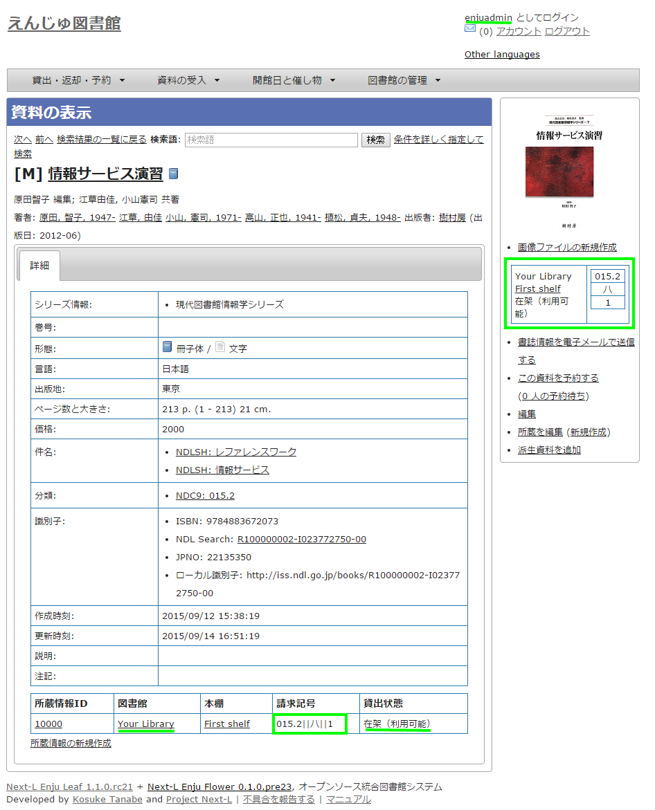

注：次の条件でのみ、背ラベルが表示されます。

* ログインしている
* 図書館に請求記号ルールが設定されている
* 当該資料の所蔵が登録されている
* 所蔵資料の「請求記号」が [請求記号の列数]と[請求記号の区切り文字]のルール通りに入力されている
* 所蔵資料の本棚が「World Wide Web」（ブックマーク用）以外である
* 所蔵資料の所蔵のステータスが「在架（利用可能） 」「貸出中」「再配架待ち」のいずれかである
* 所蔵資料の利用制限が「返却不要」「長期期間貸出」「通常期間貸出」「短期期間貸出」「複製不可」
「一夜貸出のみ」「貸出更新不可」「監督下でのみ利用可」「学期間の貸出」「利用者の署名が必要」のいずれかである
* ログインしているユーザーの所属図書館のもののみ表示する
（例：所属図書館Your library　だったらYour libraryのもののみ）+++
+++

[#section3-3]
== 3-3 本棚を設定する

[#section3-3-1]
=== 3-3-1 設定項目

* 名前：本棚の名称を入力します。TSVファイルを使った所蔵情報のインポートなどに本棚を表す名前として使用します。
* 表示名：画面に表示する名称を入力します。
* 閉架：閉架の場合にチェックを入れます。本棚の一覧画面で「閉架」と表示されるようになります。
// 詳細は #729 参照
* 注記：注意事項や特記事項などを入力します。
* 図書館：▼をクリックし，リストから選択します。
 ** ここで表示される図書館のリストは，<<section3-2,「3-2 個々の図書館を設定する」>>で設定します。

[#section3-3-2]
=== 3-3-2 設定方法

==== 1. ［図書館の管理］メニューから［システムの設定］を選択します。

image::../assets/images/1.1/image_system_setup.png[システムの設定]

==== 2. ［本棚］をクリックします。

image::../assets/images/1.1/image_initial_022.png[「本棚」を選択]

==== 3. ［本棚の新規作成］をクリックします。

image::../assets/images/1.1/image_initial_023.png[本棚の新規作成]

【Memo】入力済みの本棚の設定内容を変更する場合は，［編集］をクリックします。

==== 4. 設定項目に必要事項を入力し，［登録する］ボタンをクリックして，設定内容を登録します。

image::../assets/images/1.1/image_initial_024.png[本棚の作成]

【Memo】「＊」のマークが付いた項目は入力必須項目です。[名前]は3文字以上、256文字以内で、半角である必要があります。使用できる文字はアルファベットの小文字、数字、-（ハイフン）、_（アンダースコア）です。ただし、名前の最初はアルファベットの小文字のみが使用でき、名前の最後にはハイフンとアンダースコアは使用できません。+++
+++【Memo】本棚の一覧の見方

image::../assets/images/1.1/image_initial_024_2.png[背ラベル]

表の各行が一つの本棚をあらわしています。例えば、「きり閉架1」は本棚の「表示名」を、「kiri_closed」は本棚の「名前」を、「きり図書館」は当該本棚がある図書館の「表示名」を、「kiri」その「名前」をあらわしています。
「閉架」にチェックを入れた場合は、「図書館」列に「閉架」が表示されます（例　「きり閉架1」に「閉架」を表示）。
右側に「図書館」で絞り込みをするためのリンクがあります。たとえば、上の画像の例ですと、「きり図書館」のリックをたどると、「きり図書館」の本棚の「きり閉架1」「kiri_default」「きり本棚1」のみが表示されるようになります。+++
+++

[#section3-4]
== 3-4 利用者グループを設定する

[#section3-4-1]
=== 3-4-1 設定項目

* 名前：利用者グループ名を入力します。
 ** 例えば、一般利用者、在勤・在学利用者、団体利用者など利用者をグループに分けて区別したい場合に入力します。
 ** <<section3-6,「3-6 利用者グループと貸出区分の関係を設定する」>>で，利用者グループごとに貸出の設定などを設定することができます。
 ** 貸出については<<section3-5,「3-5 貸出区分を設定する」>>、link:enju_setup_5.html#section5-3[「5-3 貸出状態を編集作成する」]などで設定します。
* 表示名：画面に表示する名称を入力します。
* 新規ユーザの有効日数：図書館カードの有効日数を数値で入力します。新規にユーザを作成してからの有効日数になります。標準は0になっており、0は有効期限がなくずっと有効となります。
* 貸出期限の何日前に督促を送るか：「何日後に返却日を通知するか」を数値で入力します。標準は3になっています。
* 貸出期限の何日後に督促を送るか：「返却日を何日過ぎたら通知するか」を数値で入力します。標準は7になっています。
* 貸出期限が切れた後に何回督促を送るか：「返却日を過ぎた通知を何回送るか」を数値で入力します。標準は0になっています。
* 注記：注意事項や特記事項などを入力します。

[#section3-4-2]
=== 3-4-2 設定方法

==== 1. ［図書館の管理］メニューから［システムの設定］を選択します。

image::../assets/images/1.1/image_system_setup.png[システムの設定]

==== 2. ［利用者グループ］をクリックします。

image::../assets/images/1.1/image_initial_025_0.png[「利用者グループ」を選択]

==== 3. ［利用者グループの新規作成］をクリックします。

image::../assets/images/1.1/image_initial_025.png[利用者グループを作成]

【Memo】入力済みの利用者グループの設定内容を変更する場合は，［編集］をクリックします。

==== 4. 設定項目に必要事項を入力し，［登録する］ボタンをクリックして，設定内容を登録します。

image::../assets/images/1.1/image_initial_026.png[利用者グループの作成]

[#section3-5]
== 3-5 貸出区分を設定する

[#section3-5-1]
=== 3-5-1 設定項目

* 名前：貸出区分名を入力します。
 ** 貸出日数や貸出数の制限などは，<<section3-6,「3-6 利用者グループと貸出区分の関係を設定する」>>で，利用者グループごとに貸出の設定などを設定することができます。
* 表示名：画面に表示する名称を入力します。
* 注記：注意事項や特記事項などを入力します。

[#section3-5-2]
=== 3-5-2 設定方法

==== 1. ［図書館の管理］メニューから［システムの設定］を選択します。

image::../assets/images/1.1/image_system_setup.png[システムの設定]

==== 2. ［貸出区分］をクリックします。

image::../assets/images/1.1/image_initial_027_0.png[貸出区分の設定]

==== 3. 右メニューの［貸出区分の新規作成］をクリックします。

image::../assets/images/1.1/image_initial_027.png[システムの設定]

【Memo】入力済みの貸出区分の設定内容を変更する場合は［編集］を，削除する場合は［削除］をクリックします。一覧表示の表示順序を変更するには，表の1列目に表示されている↑または↓をクリックして行を入れ替えます。

==== 4. 設定項目に必要事項を入力、［登録する］ボタンをクリックして，設定内容を登録します。

image::../assets/images/1.1/image_initial_028.png[貸出区分の作成]

[#section3-6]
== 3-6 利用者グループと貸出区分の関係を設定する

[#section3-6-1]
=== 3-6-1 設定項目

* 利用者グループ：▼をクリックし，リストから選択します。ここで表示されるリストは，<<section3-4,「3-4 利用者グループを設定する」>>で設定します。
* 貸出区分：▼をクリックし，リストから選択します。ここで表示されるリストは，<<section3-5,「3-5 貸出区分を設定する」>>で設定します。
* 貸出数の上限：貸出数を数値で設定します。
* 貸出期間：期間を数値で設定します。
* 貸出更新回数の上限：回数を数値で設定します。
* 予約冊数の上限：冊数を数値で設定します。
* 返却日を閉館日の前日にする：クリックしてon/offを切り替えます。この項目がオンになっている場合、返却日は通常返却日の前日になり、オフになっている場合は通常返却日の翌日に設定されます。
* 注記：注意事項や特記事項などを入力します。

[#section3-6-2]
=== 3-6-2 設定方法

==== 1. ［図書館の管理］メニューから［システムの設定］を選択します。

image::../assets/images/1.1/image_system_setup.png[システムの設定]

==== 2. ［利用者グループと貸出区分の関係］をクリックします。

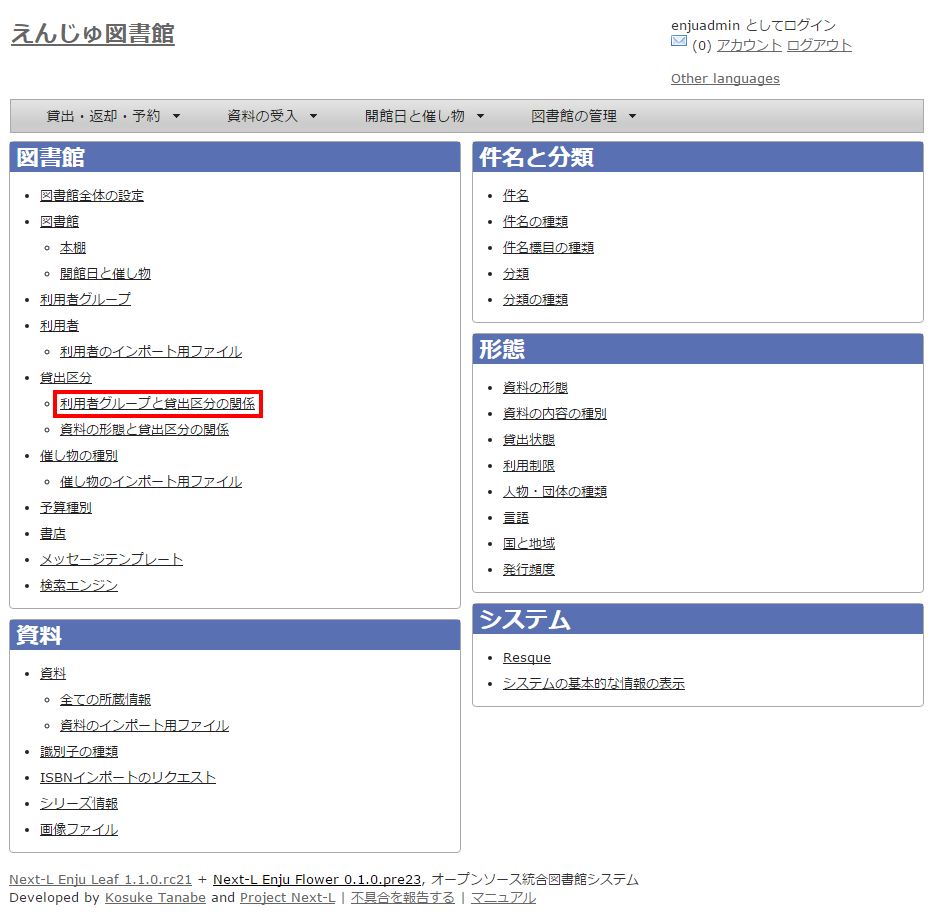

==== 3. 右メニューの［利用者グループと貸出区分の関係の新規作成］をクリックします。

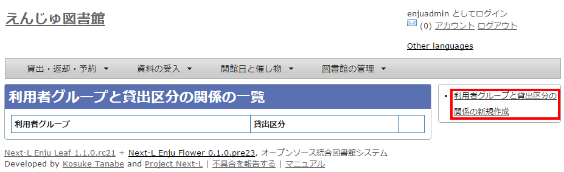

【Memo】入力済みの設定内容を変更する場合は［編集］を，削除する場合は［削除］をクリックします。

==== 4. 設定項目に必要事項を入力し、［登録する］ボタンをクリックして，設定内容を登録します。

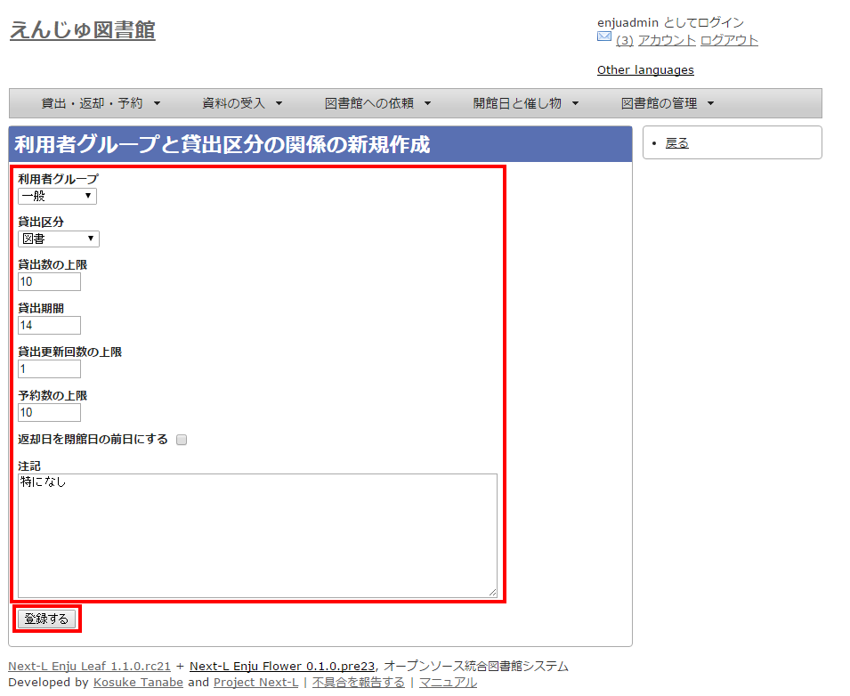

[#section3-7]
== 3-7 資料の形態と貸出区分の関係を設定する

[#section3-7-1]
=== 3-7-1 設定項目

* 資料の形態：▼をクリックし，リストから選択します。ここで表示されるリストは，link:enju_setup_5.html#section5-1[「5-1 資料の形態を作成する」]で設定します。
* 貸出区分：▼をクリックし，リストから選択します。ここで表示されるリストは，<<section3-5,「3-5 貸出区分を設定する」>>で設定します。
* 注記：注意事項や特記事項などを入力します。

[#section3-7-2]
=== 3-7-2 設定方法

==== 1. ［図書館の管理］メニューから［システムの設定］を選択します。

image::../assets/images/1.1/image_system_setup.png[システムの設定]

==== 2. ［資料の形態と貸出区分の関係］をクリックします。

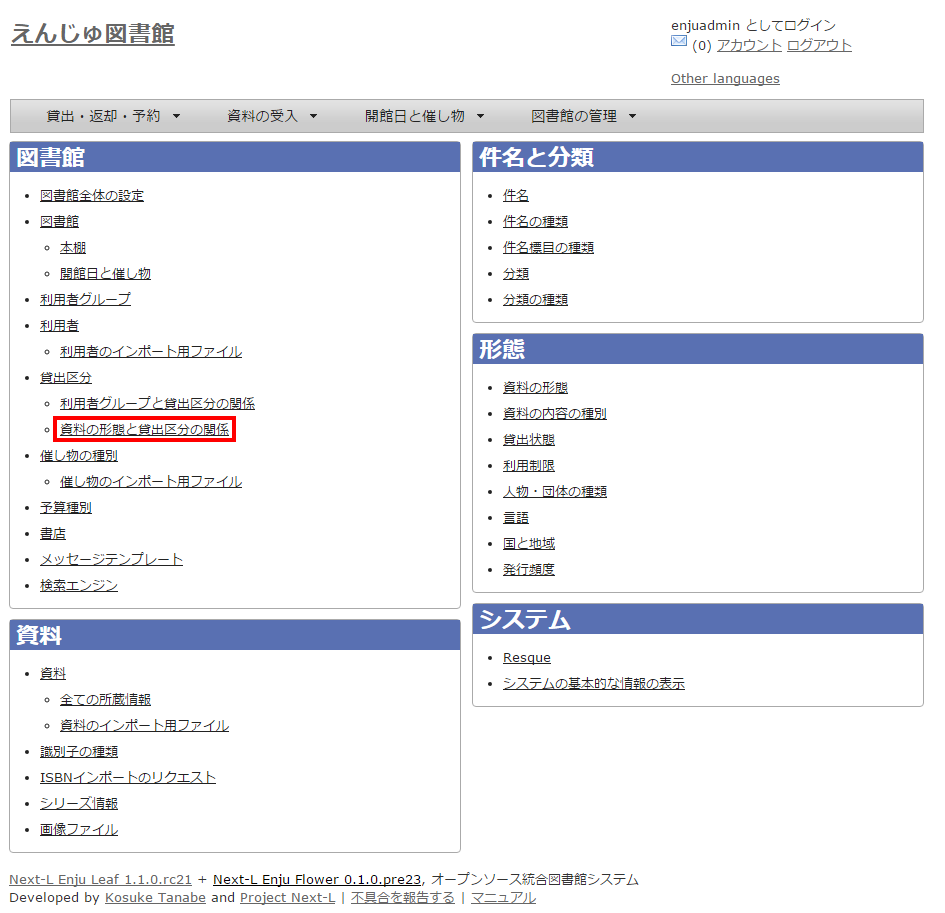

==== 3. 右メニューの［資料の形態と貸出区分の関係の新規作成］をクリックします。

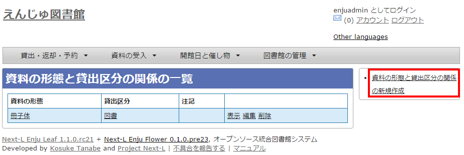

【Memo】入力済みの設定内容を変更する場合は［編集］を，削除する場合は［削除］をクリックします。

==== 4. 設定項目に必要事項を入力し、［登録する]ボタンをクリックして，設定内容を登録します。

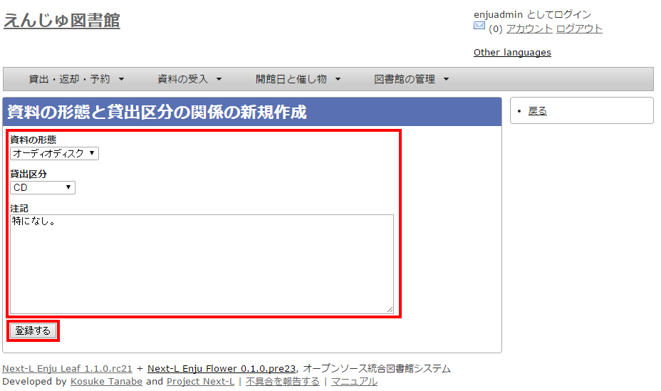

[#section3-8]
== 3-8 催し物の種別を設定する

催し物（お知らせ）の登録機能およびカレンダー表示機能で、休館日以外の催し物の種別（例：お話会、蔵書点検など）が必要なった場合に必要になる設定です（参照：link:enju_operation_7.html[運用マニュアル「第7章 休館日と催し物を登録する」]。

[#section3-8-1]
=== 3-8-1 設定項目

* 名前：催し物名を入力します。
* 表示名：画面に表示する名称を入力します。
* 注記：注意事項や特記事項などを入力します。 +
＊催し物については，既存のデータファイルを指定して読み込むインポート機能が利用できます。link:enju_operation_7.html#section7-2-2[運用マニュアル「7-2-2 催し物のデータをインポートする」]を参照してください。

[#section3-8-2]
=== 3-8-2 設定方法

==== 1. ［図書館の管理］メニューから［システムの設定］を選択します。

image::../assets/images/1.1/image_system_setup.png[システムの設定]

==== 2. ［催し物の種別］をクリックします。

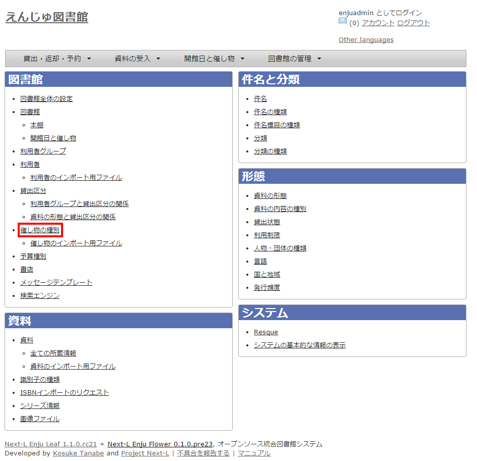

==== 3. 右メニューの［催し物の種別の新規作成］をクリックします。

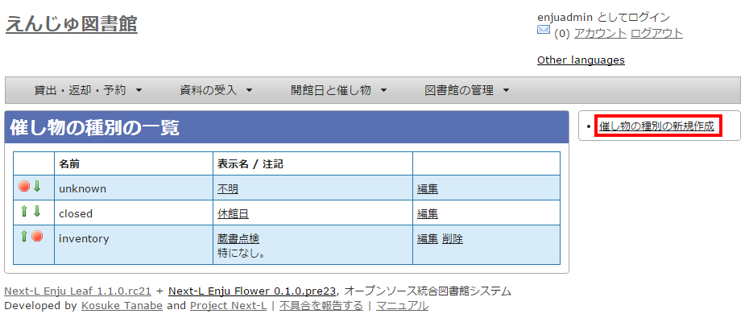

【Memo】入力済みの設定内容を変更する場合は［編集］を、削除する場合は［削除］をクリックします。ただし、"unknown"、 "closed"は標準カテゴリとなっており、削除できないため削除リンクはありません。 一覧表示の表示順序を変更するには，表の1列目に表示されている↑または↓をクリックして行を入れ替えます。

==== 4. 設定項目に必要事項を入力し、［登録する］ボタンをクリックして，設定内容を登録します。

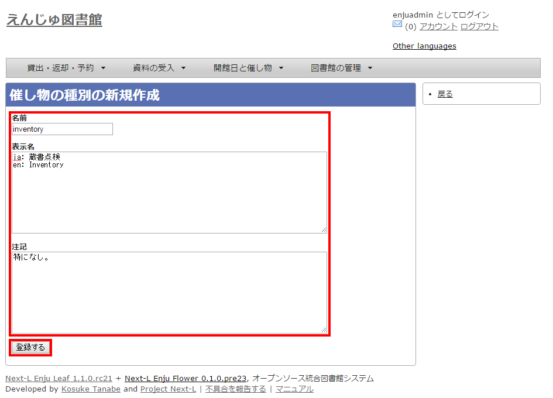

==== 5. 「催し物の種別は正常に作成されました。」と表示され、催し物の種別の作成が完了します。

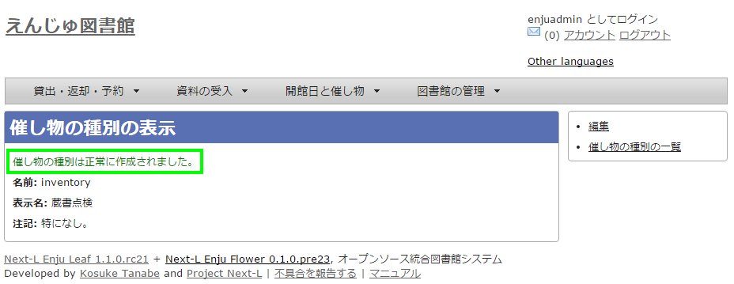

[#section3-9]
== 3-9 予算種別を設定する

所蔵情報の登録の際に、予算の区別（寄贈など）を登録したい場合に必要になります。詳細はlink:enju_operation_4.html#section4-3[運用マニュアル「4-3 所蔵情報を登録・一覧表示する」]を参照してください。

[#section3-9-1]
=== 3-9-1 設定項目

* 名称：予算種別の名称を入力します。
* 表示名：表示名を入力します。
* 注記：注意事項や特記事項などを入力します。

[#section3-9-2]
=== 3-9-2 設定方法

==== 1. ［図書館の管理］メニューから［システムの設定］を選択します。

image::../assets/images/1.1/image_system_setup.png[システムの設定]

==== 2. ［予算種別］をクリックします。

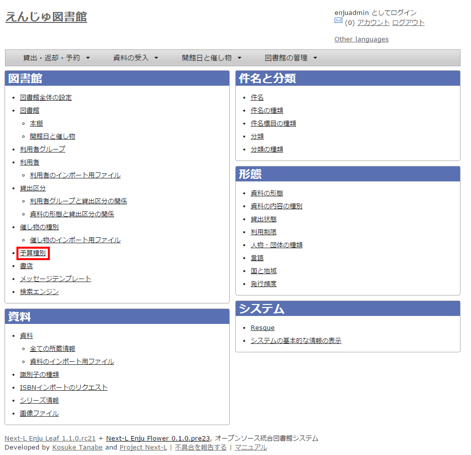

==== 3. 右メニューの［予算種別の新規作成］をクリックします。

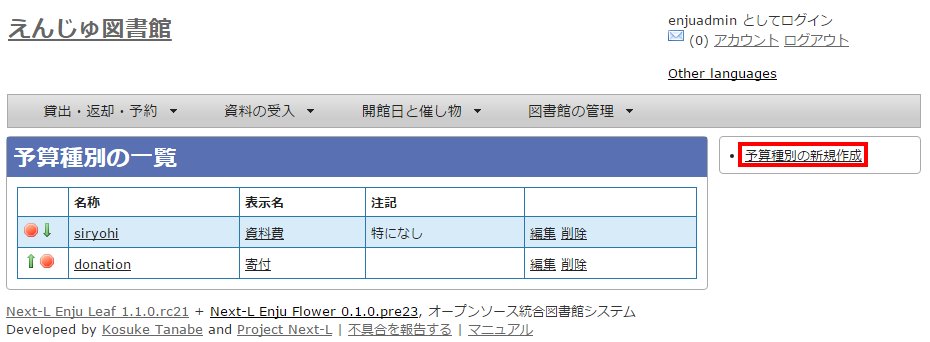+++
+++【Memo】入力済みの設定内容を変更する場合は，表の最終列に表示されている「編集」を，削除する場合は「削除」をクリックします。
一覧表示の表示順序を変更するには，表の1列目に表示されている↑または↓をクリックして行を入れ替えます。+++
+++

==== 4. 設定項目に必要事項を入力し、［登録する］ボタンをクリックして，設定内容を登録します。

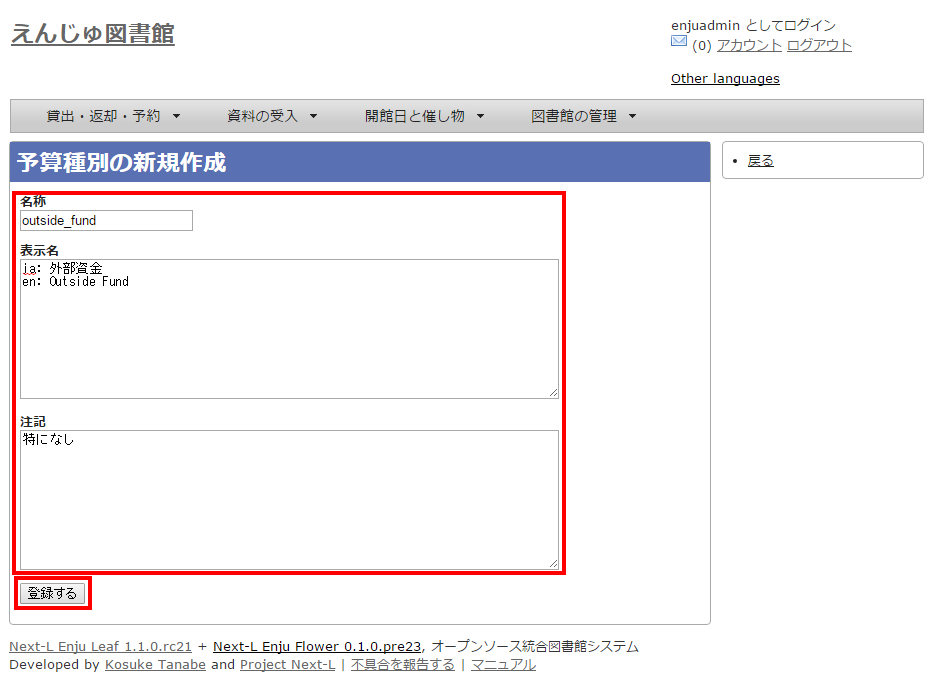

[#section3-10]
== 3-10 書店を設定する

所蔵情報の登録の際に、どの書店から購入したかを登録したい場合に必要になります。詳細はlink:enju_operation_4.html#section4-3[運用マニュアル「4-3 所蔵情報を登録・一覧表示する」]を参照してください。

[#section3-10-1]
=== 3-10-1 設定項目

* 名前：書店名を入力します。
* 郵便番号：書店の所在地の郵便番号を入力します。
* 住所：書店の所在地の住所を入力します。
* 電話番号：書店の電話番号を入力します。
* ファックス番号：書店のファックス番号を入力します。
* URL：書店のWebサイトのURLを入力します。
* 注記：注意事項や特記事項などを入力します。

[#section3-10-2]
=== 3-10-2 設定方法

==== 1. ［図書館の管理］メニューから［システムの設定］を選択します。

image::../assets/images/1.1/image_system_setup.png[システムの設定]

==== 2. ［書店］をクリックします。

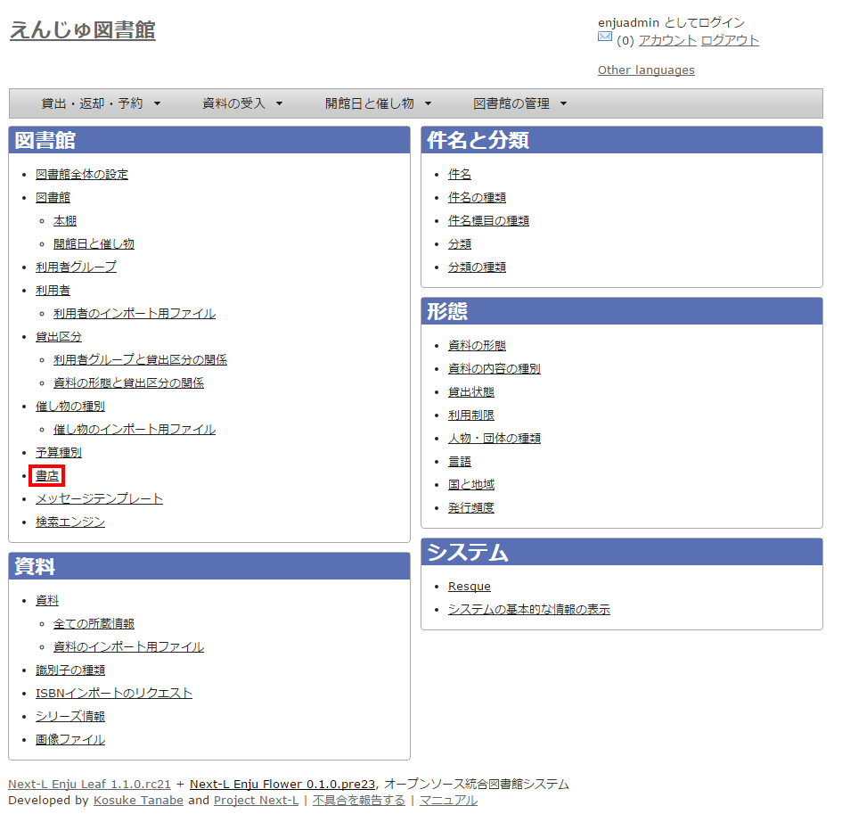

==== 3. 右メニューの［書店の新規作成］をクリックします。

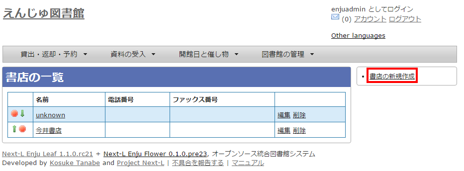+++
+++【Memo】入力済みの設定内容を変更する場合は，表の最終列に表示されている[編集]を，削除する場合は[削除]をクリックします。
一覧表示の表示順序を変更するには，表の1列目に表示されている↑または↓をクリックして行を入れ替えます。+++
+++

==== 4. 設定項目に必要事項を入力し、［登録する］ボタンをクリックして，設定内容を登録します。

image::../assets/images/1.1/image_initial_041.png[新規書店の作成]

[#section3-11]
== 3-11 メッセージテンプレートを設定する

予約を受け付けた時や、書誌のエクスポートが完了したときなどに、
システムから送られてくるメッセージの定型文を変更できます。

[#section3-11-1]
=== 3-11-1 設定項目

* 状態：メッセージの内容を示す状態を入力します。
* 言語：▼をクリックし，リストから選択します。
* タイトル：メッセージを表示するときのタイトルを入力します。
* 本文：メッセージの本文を入力します。

＊メッセージの本文には資料名やユーザー名などの変数を組み込み，送信時に本文中の変数に値を代入して送信できます。

[#section3-11-2]
=== 3-11-2 設定方法

==== 1. ［図書館の管理］メニューから［システムの設定］を選択します。

image::../assets/images/1.1/image_system_setup.png[システムの設定]

==== 2. ［メッセージテンプレート］をクリックします。

image::../assets/images/1.1/image_initial_042_0.png[メッセージテンプレートの設定]

==== 3. 設定したい項目の［編集］をクリックします。

image::../assets/images/1.1/image_initial_042.png[メッセージテンプレートの編集]

【Memo】一覧表示の表示順序を変更するには，表の1列目に表示されている↑または↓をクリックして行を入れ替えます。

==== 4. 設定項目に必要事項を入力し、［更新する］ボタンをクリックして，設定内容を更新します。

image::../assets/images/1.1/image_initial_043.png[メッセージテンプレートの更新]

[#section3-12]
== 3-12 検索エンジンを設定する

検索エンジンを設定すると、資料を検索したときにヒット件数が0件だった場合に、同じ検索語で別のデータベース（検索エンジン）に検索をすることができるようになります。
次の図は、ヒット件数が0件だったときの画面を表しています。ここでは、3つの検索エンジン（NDL Search, amazon.co.jp, CiNii Books）を表示しています。

image::../assets/images/1.1/image_initial_044_00.png[0件ヒットと検索エンジン]

[#section3-12-1]
=== 3-12-1 設定項目

* 名前：検索エンジンの名称を入力します。
* URL：URLを入力します。（入力必須）
* ベースURL：ベースURLを入力します。
* HTTPメソッド：▼をクリックし，リストから選択します。
* クエリパラメータ：URLに追加するパラメータを入力します。
* 追加のパラメータ：URLに追加するパラメータを入力します。
* 注記：注意事項や特記事項などを入力します。

[#section3-12-2]
=== 3-12-2 設定方法

==== 1. ［図書館の管理］メニューから［システムの設定］を選択します。

image::../assets/images/1.1/image_system_setup.png[システムの設定]

==== 2. ［検索エンジン］をクリックします。

image::../assets/images/1.1/image_initial_044_0.png[検索エンジンの設定]

==== 3. 右メニューの［検索エンジンの新規作成］をクリックします。

image::../assets/images/1.1/image_search_engine_create.png[検索エンジンの設定]

==== 4. 設定項目に必要事項を入力し、［登録する］ボタンをクリックして，設定内容を登録します。

image::../assets/images/1.1/image_search_engine_input.png[検索エンジンの設定]

【Memo】CiNii Booksの登録例（検索語がflowerであれば：https://ci.nii.ac.jp/books/search?q=flower&format=html というリクエストになる）を示しています。

==== 5. 以下はその他の検索エンジンの設定例です。

* 名前: NDL Search
 ** URL: https://iss.ndl.go.jp/
 ** ベースURL: https://iss.ndl.go.jp/books
 ** HTTPメソッド: get
 ** クエリパラメータ: any
* 名前: amazon.co.jp
 ** URL: https://www.amazon.co.jp/
 ** ベースURL: https://www.amazon.co.jp/s?
 ** HTTPメソッド: get
 ** クエリパラメータ: field-keywords
 ** 追加のパラメータ: url=search-alias=aps
* 名前: CiNii Books
 ** URL: https://ci.nii.ac.jp/books/
 ** ベースURL: https://ci.nii.ac.jp/books/opensearch/search
 ** HTTPメソッド: get
 ** クエリパラメータ: q
 ** 追加のパラメータ: format=html

[#section3-13]
== 3-13 その他の機能

Enjuでは，システムの設定は管理者権限を持つアカウントで設定します。システムの設定以外にも，個人情報に関わることなどは，管理者権限で行うように設定されています。

管理者権限では，次のような設定・閲覧機能を持っています。

[#section3-13-1]
=== 3-13-1 システムの設定以外でも管理者権限で設定・閲覧する機能

* 返却済み貸出履歴の一覧
* 図書館員のプロフィール変更
* 権限変更
* 操作履歴一覧の表示


