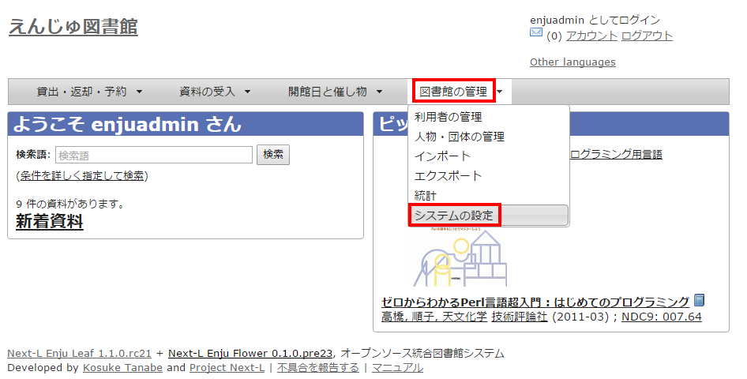
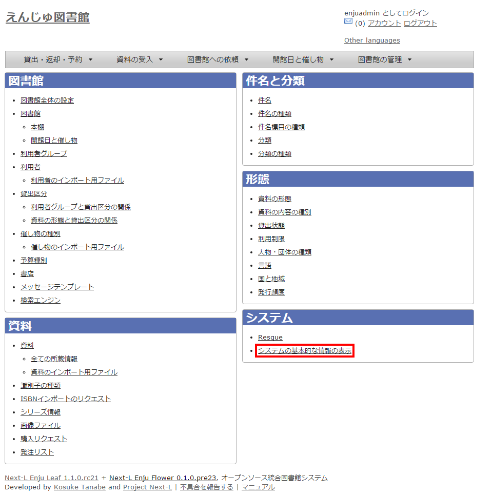
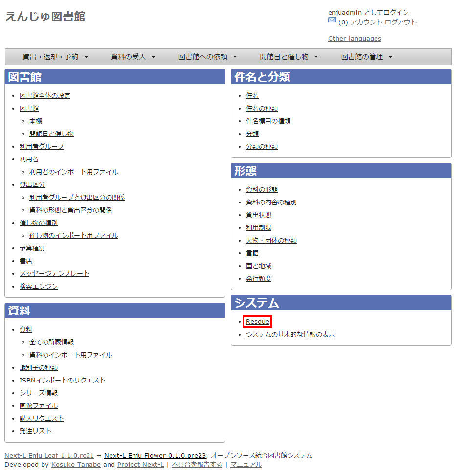
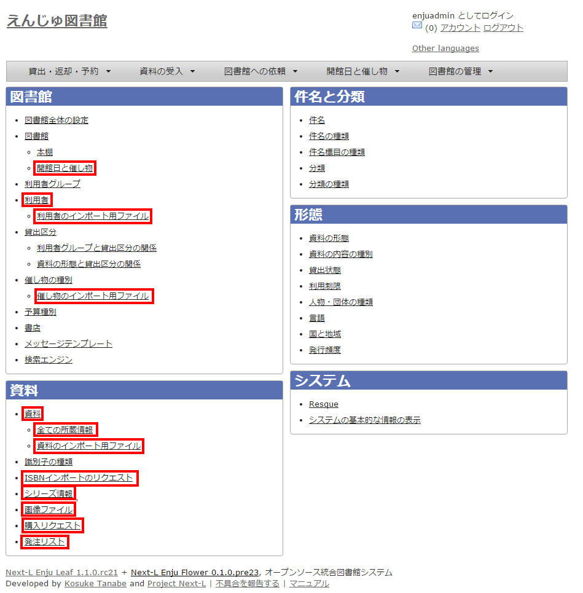

= 第7章 その他 - Next-L Enju初期設定マニュアル
:doctype: book
:group: enju_setup
:page-layout: page
:title_short: 第7章 その他
:version: 1.4

* Contents

[#section7]
= 第7章 その他

[#section7-1]
== 7-1 システムの基本的な情報の表示機能

システムの基本的な情報を確認できる機能があります。不具合の報告時などに、こちらの情報をシステム担当者にお知らせください。

[discrete]
==== 1. ［図書館の管理］メニューから［システムの設定］を選択します。

[discrete]
==== 2. システムの[システムの基本的な情報の表示]リンクをたどります。

[discrete]
==== 3. システムの基本的な情報を確認できます。

* Ruby： Ruby のバージョンが表示されます。（例： ruby 2.2.2p95 (2015-04-13 revision 50295) [x86_64-linux-gnu])
* Environment: システムの環境が表示されます（例：production）
* Gems：Enju の詳細なバージョン等が表示されます（例：enju_leaf: 1.1.0.rc21，enju_circulation: 0.1.0.pre48）
* Languages：使用言語が表示されます（例：ja: 日本語 (既定の言語)）

image::../assets/images/1.1/image_initial_systemdisp03.png[システムの基本的な情報の表示結果]+++
+++【Memo】

* リリース前のパッケージを使用している場合にはコミットのハッシュを表示します。

image::../assets/images/1.3/image_initial_systemdisp03-hash.png[システムの基本的な情報のコミットのハッシュを表示]+++
+++

[discrete]
==== 4. リリース前のパッケージを使用している場合。

[#section7-2]
== 7-2 非同期処理の状態確認機能（Resque）

資料等のインポートやエクスポート、自動メール送信などの非同期処理の状態を確認できる機能があります。

[discrete]
==== 1. ［図書館の管理］メニューから［システムの設定］を選択します。

[discrete]
==== 2. システムの[Resque]リンクをたどります。

[discrete]
==== 3. Resque の画面で非同期処理の状態を確認できます。エラーを確認するには[failed]リンクをたどります。

image::../assets/images/1.1/image_initial_resque2.png[failedリンク]

[discrete]
==== 4. 詳細なエラーを確認するために、閲覧したいエラーのリンクをたどります。

image::../assets/images/1.1/image_initial_resque_3.png[詳細なエラーへのリンク]

[discrete]
==== 5. 詳細なエラーが表示されます。

image::../assets/images/1.1/image_initial_resque_4.png[詳細なエラー]

[#section7-3]
== 7-3 運用マニュアルにおいて説明する機能

［図書館の管理］メニューから［システムの設定］を選択し表示される画面のうち、
次にあげるメニューについては、運用時に使用するメニューですので、
運用マニュアルにて説明します。

* [開館日と催し物]
 ** [開館日と催し物]メニューから[全ての催し物]をたどっていける画面と同じ
 ** 参照：link:enju_operation_7.html[運用マニュアル「第7章 休館日と催し物を登録する」]
* [利用者]　
 ** [図書館の管理]メニューから[利用者の管理]をたどっていける画面と同じ
 ** 参照：link:enju_operation_3.html[運用マニュアル「第3章 利用者情報を管理する」]
* [利用者のインポート用ファイル]
 ** [図書館の管理]メニューから[インポート]をたどり、[利用者]リンクをたどっていける画面と同じ
 ** 参照：link:enju_operation_3.html#section3-2[運用マニュアル「3-2 既存のデータから利用者情報をインポートする」]
* [催し物のインポート用ファイルの新規作成]
 ** [開催日と催し物]メニューから[インポート]をたどっていける画面と同じ
 ** 参照：link:enju_operation_7.html#section7-2-2[運用マニュアル「7-2-2 催し物のデータをインポートする」]
* [資料]
 ** トップ画面において検索式を何もいれずに[検索]ボタンをクリックしたときにいける画面と同じ
 ** 参照：link:enju_operation_9.html[運用マニュアル「第9章 資料を検索する」]
* [全ての所蔵情報]
 ** 参照：link:enju_operation_4.html#section4-3[運用マニュアル「4-3 所蔵情報を登録・一覧表示する」]
* [資料のインポート用ファイル]
 ** [資料の受入]メニューから「TSVファイルからのインポート]をたどり、右メニューの[資料のインポート用ファイルの一覧]をたどっていける画面と同じ
 ** 参照：link:enju_operation_4.html#section4-2-1[運用マニュアル「4-2-1 TSVファイルを読み込んで登録する」]
* [ISBNインポートのリクエスト]
 ** [資料の受入]メニューから[ISBNを入力]をたどり、[ISBNインポートリクエストの一覧]リンクをたどっていける画面と同じ
 ** 参照：link:enju_operation_4.html#section4-2-3[運用マニュアル「4-2-3 ISBNコードを入力して1件ずつ登録する」]
* [シリーズ情報]
 ** (現在、運用マニュアル作成中です）
* [画像ファイル]
 ** 画像を登録した資料の「資料の表示」画面の右メニューにある[画像ファイルの一覧]リンクをたどっていける画面と同じ
 ** 参照：link:enju_operation_4.html#section4-8-2[運用マニュアル「4-8-2 画像の一覧表示」]
* [購入リクエスト]
 ** [図書館への依頼]メニューから[購入リクエスト]をたどっていける画面と同じ
 ** 参照：link:enju_operation_4.html#section4-1-2[運用マニュアル「4-1-2 発注したい図書（購入リクエスト）を発注リストに登録する」]
* [発注リスト]
 ** [図書館の管理]メニューから[発注リスト]をたどっていける画面と同じ
 ** 参照：link:enju_operation_4.html#section4-1-1[運用マニュアル「4-1-1 発注リストを作成する」]


