:toc: macro

toc::[]

== 統計機能を利用する

//{::comment}11-1,2,3  enju_operation/statistics.md {:/comment}

////
{::comment}

現在のEnjuでは、ブックマーク回数の統計を取ることができます

* ブックマーク回数統計

{:/comment}
////

現在のEnjuでは、利用者別と資料別に、貸出の統計を取ることができます

* 利用者別貸出統計
* 資料別貸出統計

現在のEnjuでは、利用者別と資料別で予約の統計を取ることができます

* 利用者別予約統計
* 資料別予約統計

////
{::comment}

10-x ブックマーク回数の統計を取る
---------------------------------

Enjuでは、ブックマークの回数の統計を取ることができます。

====== 1. ［図書館の管理］メニューから［統計］を選択します。  

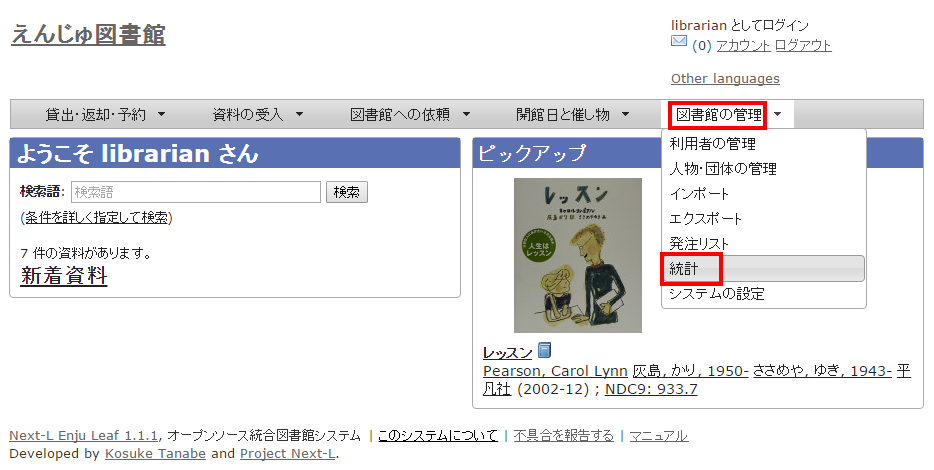

====== 2. ［ブックマーク回数］をクリックします。  

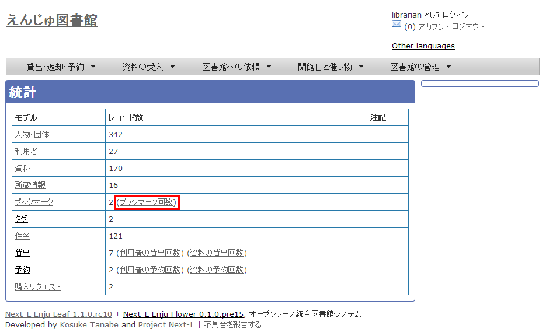

[NOTE]
======
もし、[ブックマーク回数]がない場合は、[enju_bookmark]モジュールを
インストール必要があります。
インストール方法については[インストールマニュアル「5-2 [enju_bookmark]モジュール（ブックマーク機能）」](enju_install_vm.html#section5-2)
の章を参照ください。
======

====== 3. 右メニューの［ブックマーク統計の新規作成］をクリックします。  

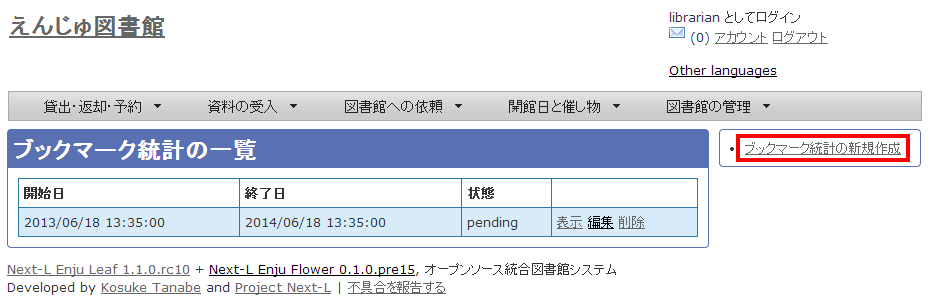

====== 4. 統計期間を設定して［登録する］をクリックします。  

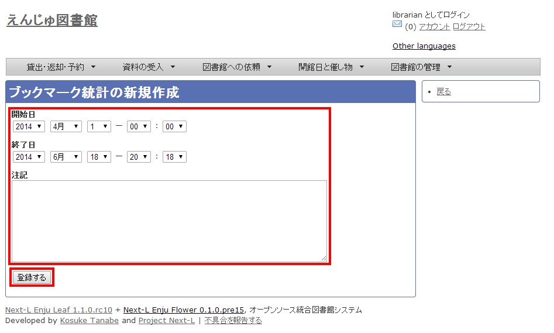

====== 5. 「ブックマーク統計は正常に作成されました。」のメッセージが表示され、ブックマーク統計データが作成されます。右メニューの［CSV］をクリックし、統計データを保存します。  

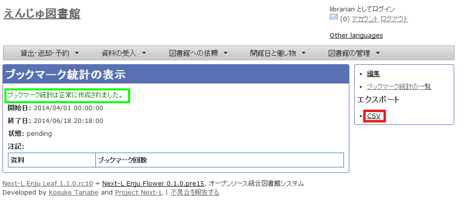

{:/comment}
////

=== 貸出の統計を取る

Enjuでは、利用者別と資料別で貸出の統計を取ることができます。

==== 利用者別貸出統計を取る

1. ［図書館の管理］メニューから［統計］を選択します。  
+

+
2. ［利用者の貸出回数］をクリックします。  
+
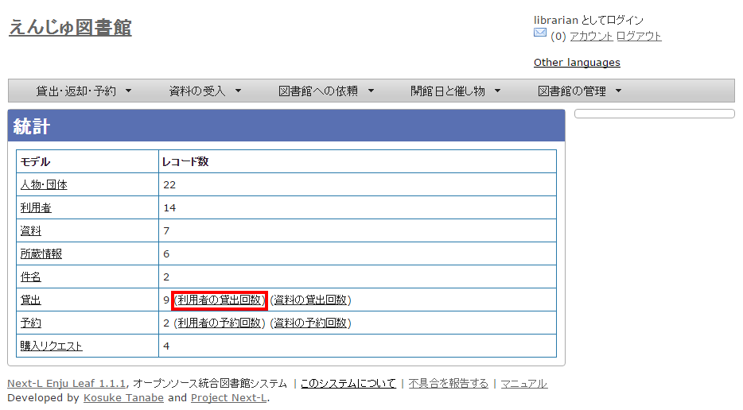
+
3. 右メニューの［利用者別貸出統計の新規作成］をクリックします。  
+
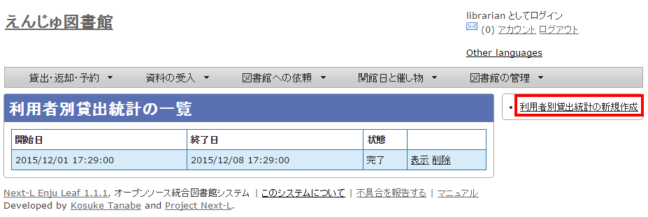
+
4. 統計期間を設定して［集計を開始］をクリックします。  
+
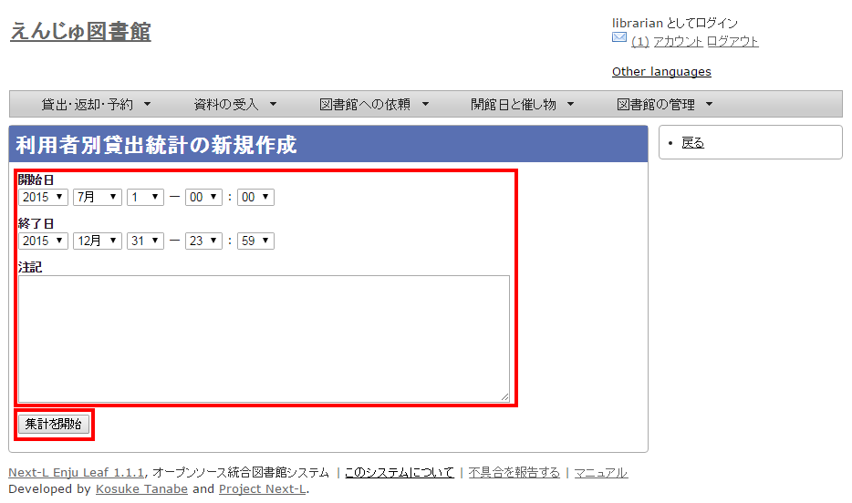
+
5. 「利用者別貸出統計のタスクは正常に作成されました。」のメッセージが表示され、利用者別貸出統計データ作成の準備が整いました（この段階ではまだ、統計データは実際には作成されていません）。右の[利用者別貸出統計の一覧]をクリックします。
+
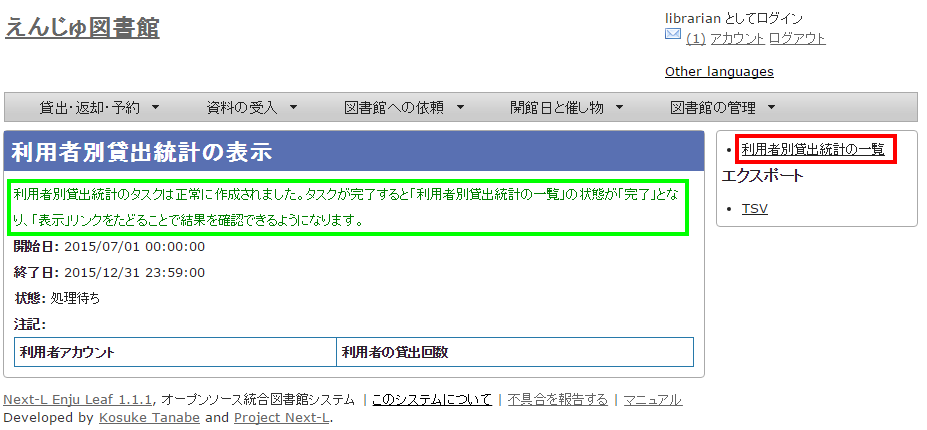
+
6. 今までの利用者別貸出統計の一覧が表示されます。[状態]を見ると処理結果がわかります。 完了したものは[完了]と表示されます。結果を表示させたいレコードの[表示]リンクをクリックします。
+
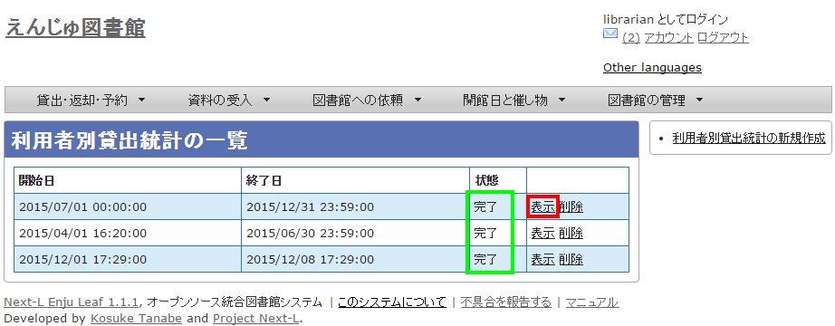
+
[NOTE]
=====
この画面は 3 の画面と同じです。[図書館の管理]メニューの[統計]をたどり、[利用者の貸出回数]リンクをクリックすればでいつでも行けます。
=====
+
7. 統計結果が表示されます。右メニューの［TSV］をクリックし、統計データを保存します。  
+
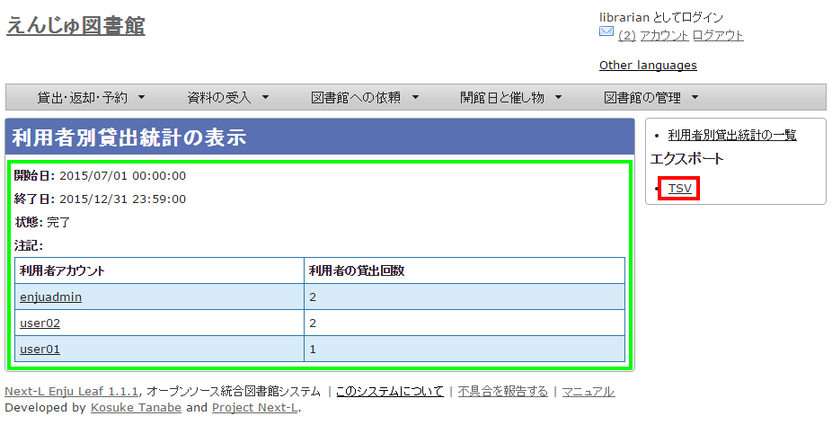
+
[NOTE]
======
TSVファイルの例

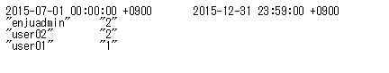
======

==== 資料別貸出統計を取る

1. ［図書館の管理］メニューから［統計］を選択します。  
+

+
2. ［資料の貸出回数］をクリックします。  
+
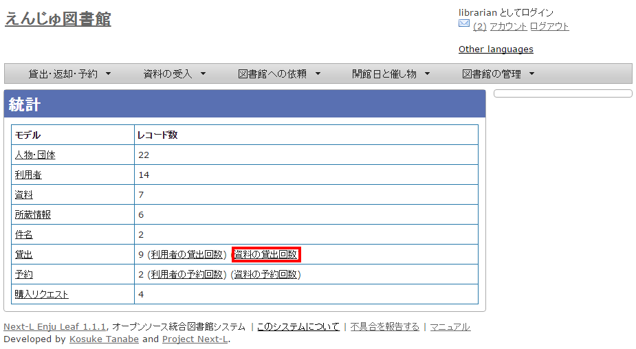
+
3. 右メニューの［資料別貸出統計の新規作成］をクリックします。  
+
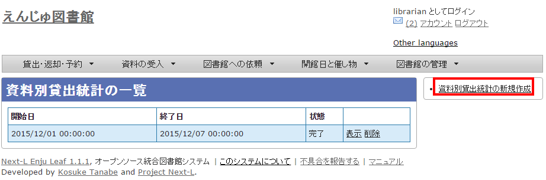
+
4. 統計期間を設定して［集計を開始］をクリックします。  
+
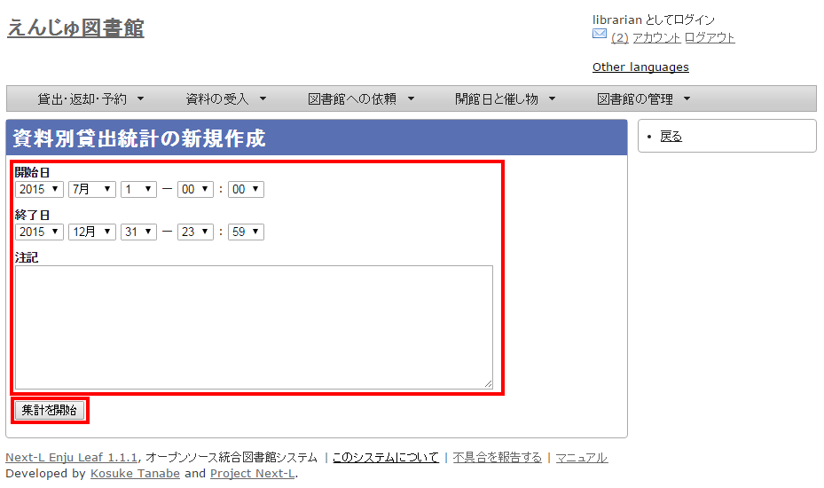
+
5. 「資料別貸出統計は正常に作成されました。」のメッセージが表示され、統計結果が表示されます。[資料の形態別]の統計結果が表示されています。[貸出区分別]のタブをクリックします。
+
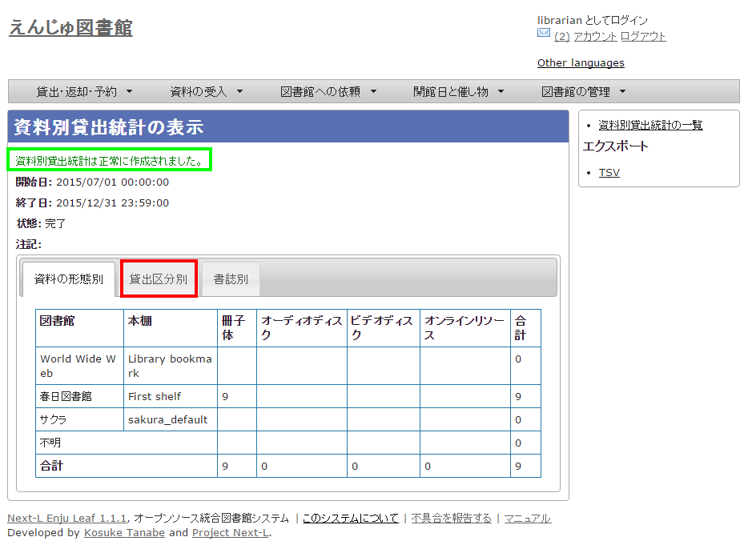
+
6. [貸出区分別]の統計結果が表示されています。[書誌別]のタブをクリックします
+
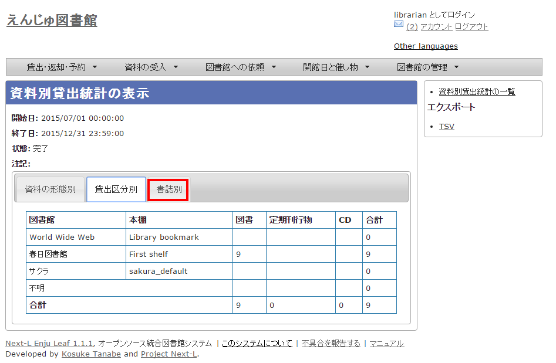
+
7 [書誌別]の統計結果が表示されています。右メニューの［TSV］をクリックし、統計データを保存します。
+
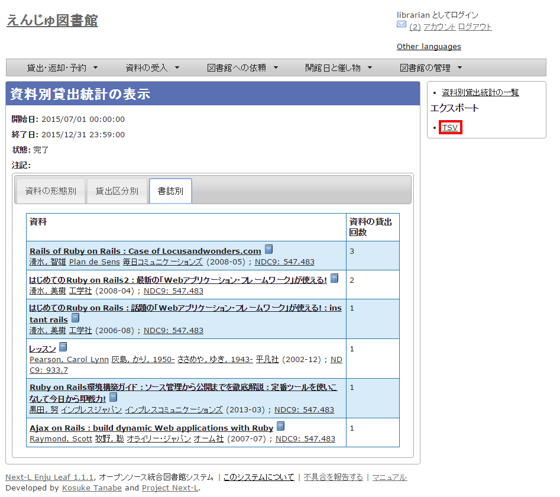
+
[NOTE]
======
TSVファイルの例

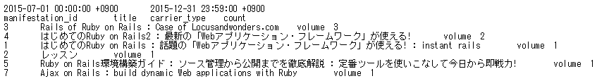

※どのタブを選択していても必ず[書誌別]のデータをTSVダウンロードすることになります。
======

=== 予約の統計を取る

Enjuでは、利用者別と資料別に、予約の統計を取ることができます。

==== 利用者別予約統計を取る

1. ［図書館の管理］メニューから［統計］を選択します。  
+

+
2. ［利用者の予約回数］をクリックします。  
+
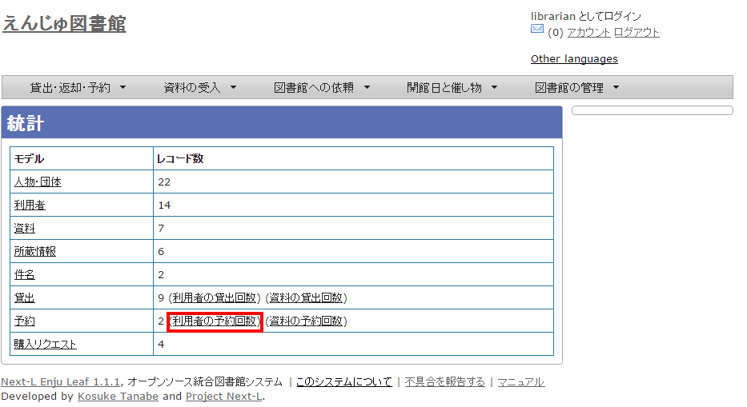
+
3. 右メニューの［利用者別予約統計の新規作成］をクリックします。  
+
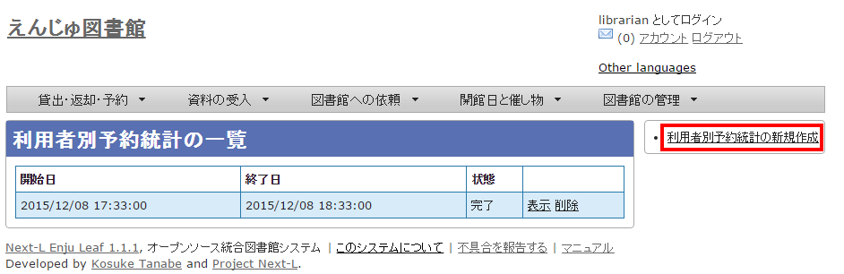
+
4. 統計期間を設定して［集計を開始］をクリックします。  
+
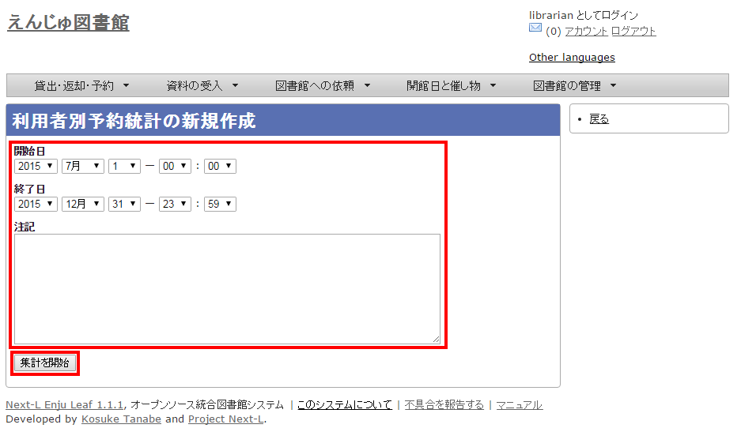
+
5. 「利用者別予約統計のタスクは正常に作成されました。」のメッセージが表示され、
利用者別予約統計データ作成の準備が整いました
（この段階ではまだ、統計データは実際には作成されていません）。
右の[利用者別予約統計の一覧]をクリックします。
+
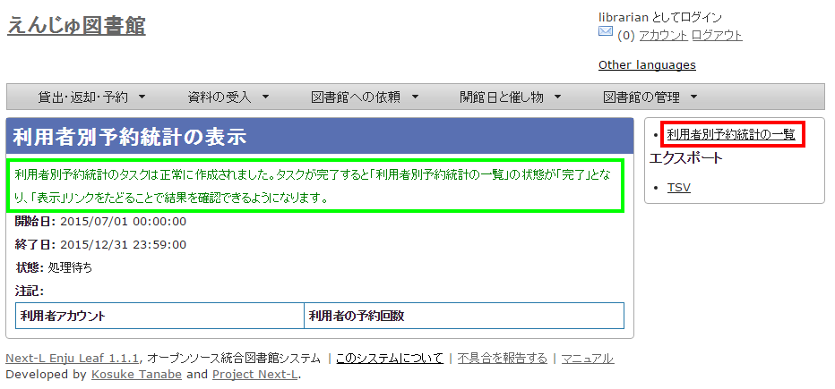
+
6. 今までの利用者別予約統計の一覧が表示されます。
+
[状態]を見ると処理結果がわかります。
 完了したものは[完了]と表示されます。
結果を表示させたいレコードの[表示]リンクをクリックします。
+
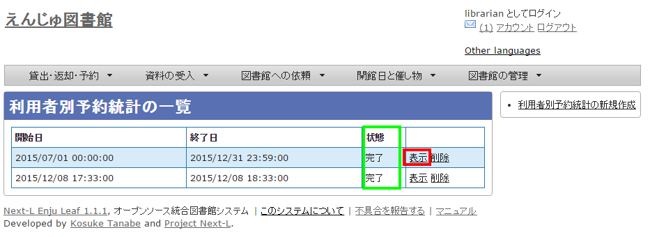
+
[NOTE]
======
この画面は 3 の画面と同じです。[図書館の管理]メニューの[統計]をたどり、
[利用者の予約回数]リンクをクリックすればでいつでも行けます。
======
+
7. 統計結果が表示されます。右メニューの［TSV］をクリックし、統計データを保存します。
+
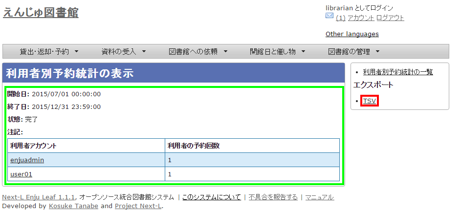
+
[NOTE]
======
TSVファイルの例

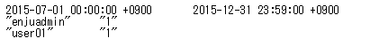
======

==== 資料別予約統計を取る

1. ［図書館の管理］メニューから［統計］を選択します。  
+

+
2. ［資料の予約回数］をクリックします。  
+
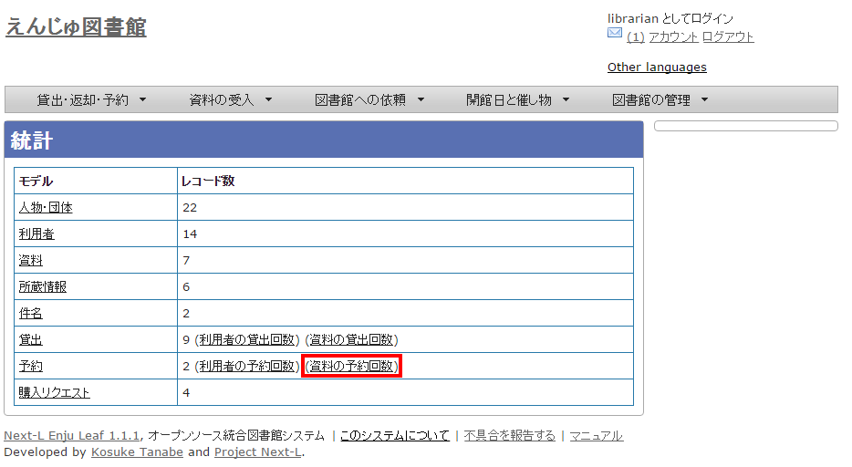
+
3. 右メニューの［資料別予約統計の新規作成］をクリックします。  
+
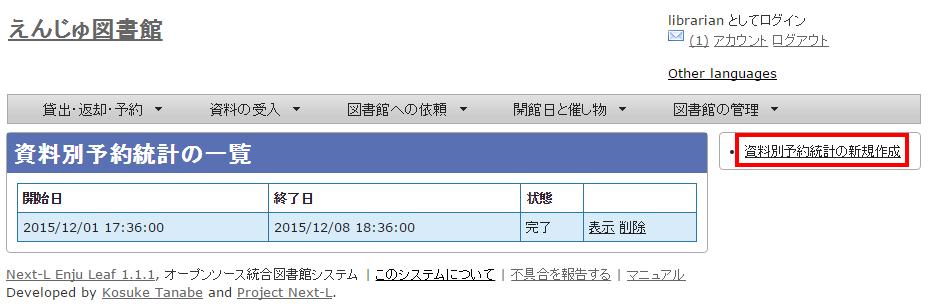
+
4. 統計期間を設定して［集計を開始］をクリックします。  
+
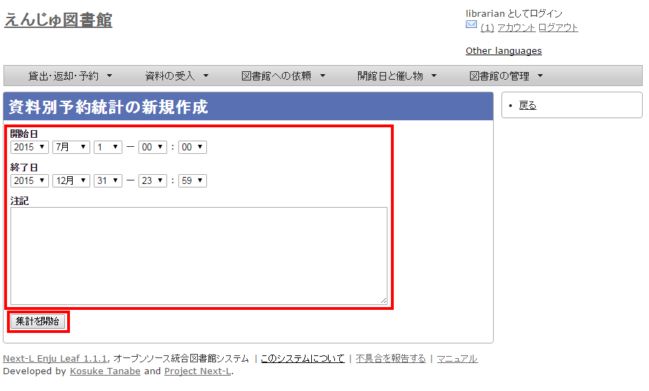
+
5. 「資料別予約統計のタスクは正常に作成されました。」のメッセージが表示され、
資料別予約統計データ作成の準備が整いました
（この段階ではまだ、統計データは実際には作成されていません）。
右の[資料別予約統計の一覧]をクリックします。
+
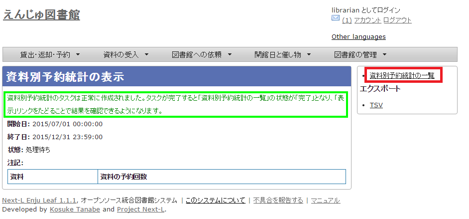
+
6. 今までの資料別予約統計の一覧が表示されます。
[状態]を見ると処理結果がわかります。
 完了したものは[完了]と表示されます。
結果を表示させたいレコードの[表示]リンクをクリックします。
+
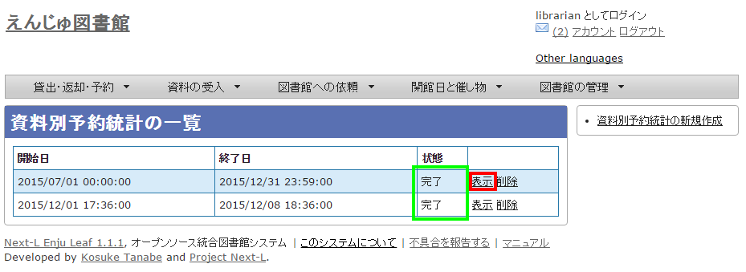
+
[NOTE]
======
この画面は 3 の画面と同じです。[図書館の管理]メニューの[統計]をたどり、
[資料の予約回数]リンクをクリックすればでいつでも行けます。
======
+
7. 統計結果が表示されます。右メニューの［TSV］をクリックし、統計データを保存します。
+
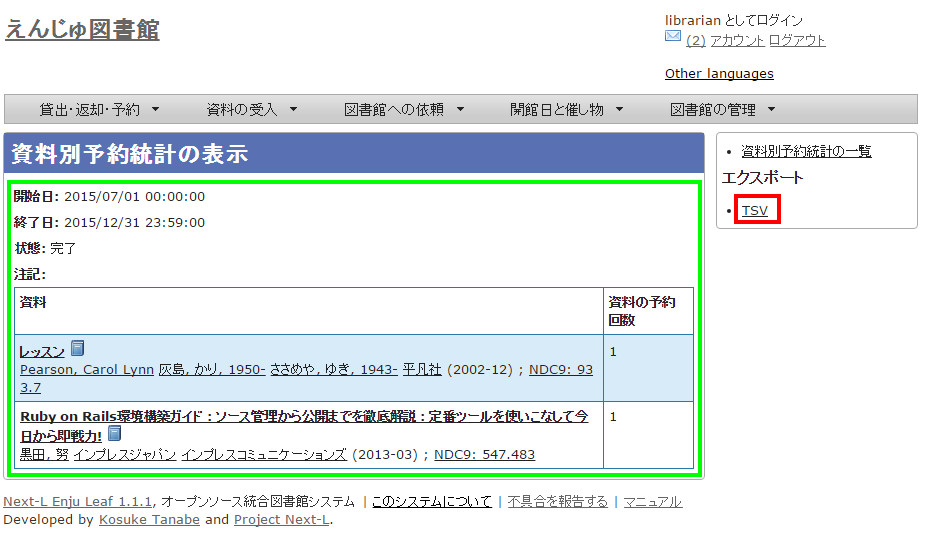
+
[NOTE]
======
TSVファイルの例

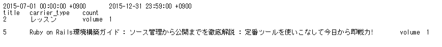
======

include::enju_operation_toc.adoc[]
