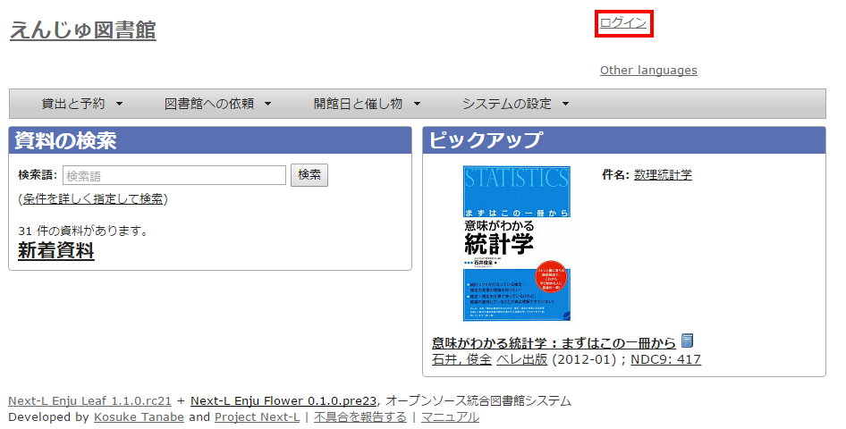
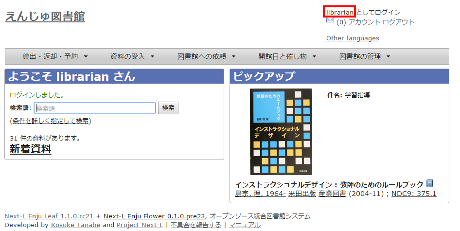
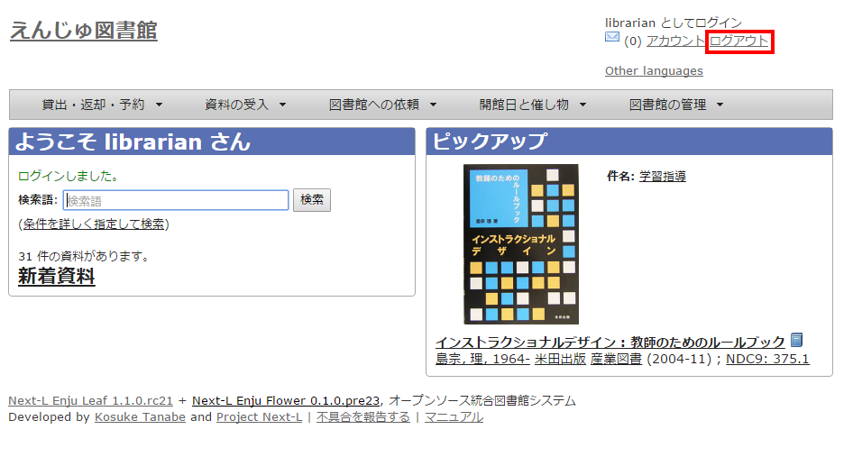
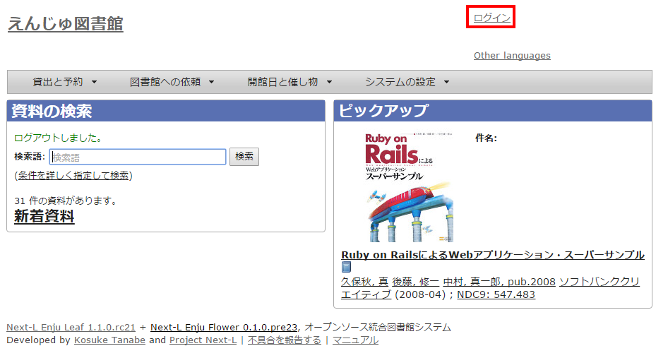
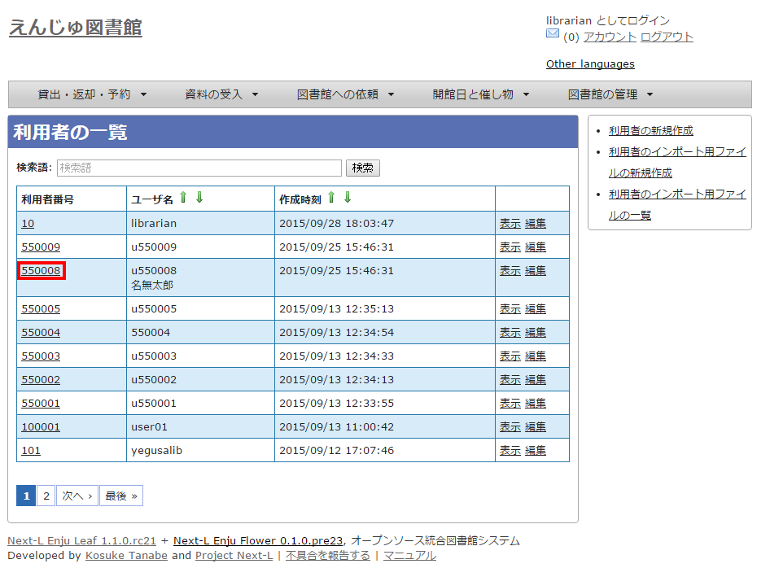
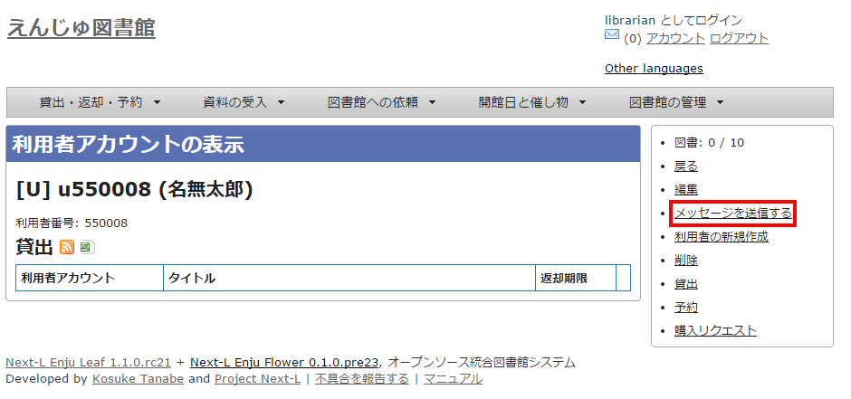
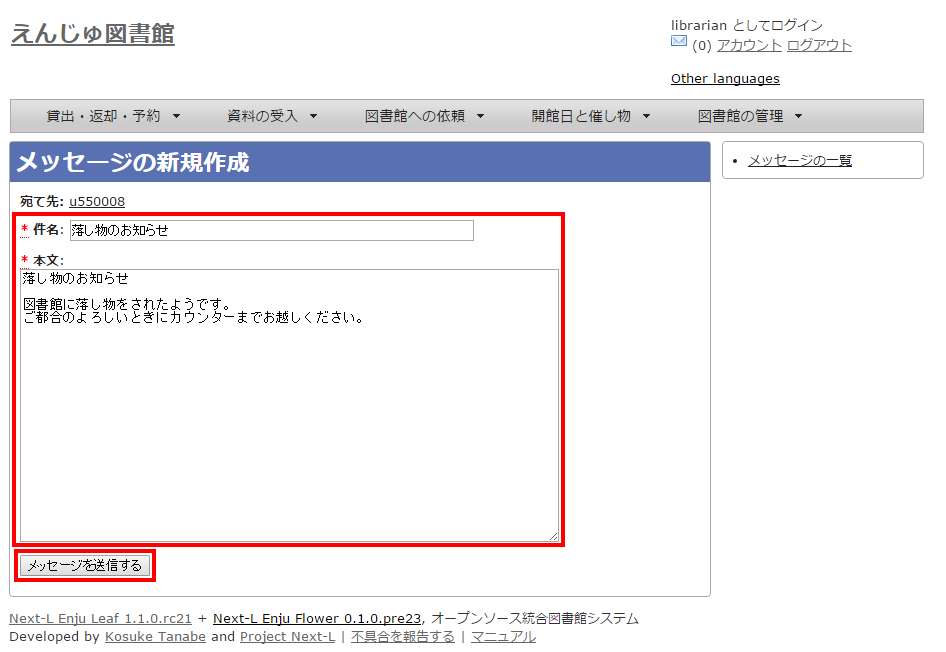
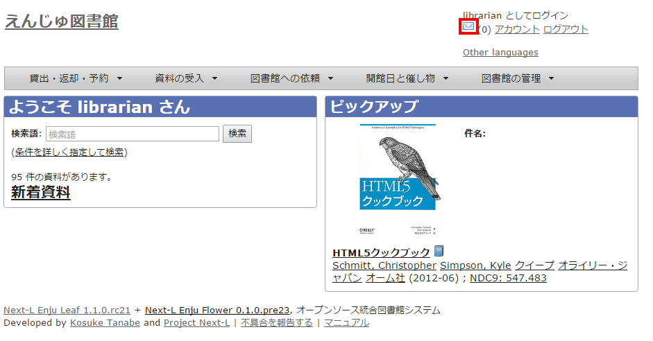
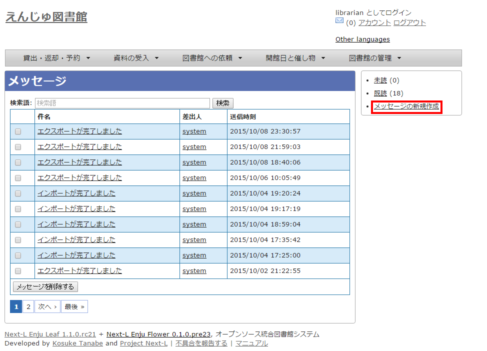
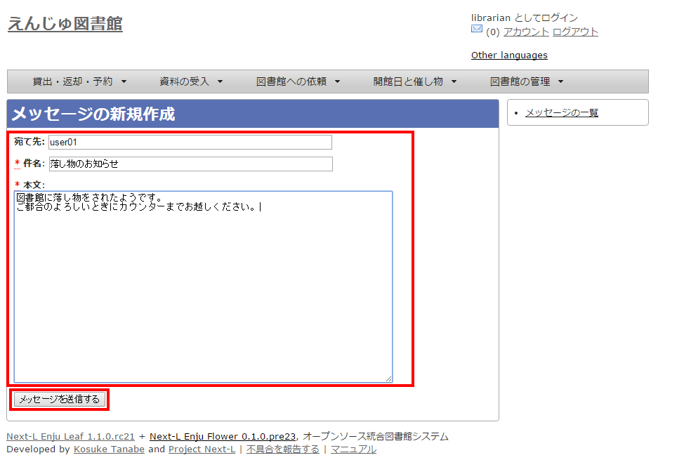

:toc: macro

toc::[]

== Enjuを利用する

Enjuの利用を始めるにあたり、次のような作業を行います。

* ユーザーアカウントの作成
* ログイン／ログアウト
* ユーザーアカウントの編集

Enjuは、利用者にメッセージを送信する機能も搭載されています。

* メッセージの送信
* メッセージのログの一覧表示・印刷

////
{::comment}2-1 enju_operation/role.md {:/comment}
{::comment}2-2 enju_operation/login.md {:/comment}
{::comment}2-3 enju_operation/message.md {:/comment}
////

=== ユーザーアカウントの種類を知る

==== アカウント（ユーザー）の種類

Enjuを利用するには、アカウントを取得し、ログインします。アカウント（ユーザー）には次の3種類があります。

* Administrator（管理者）
* Librarian（図書館員）
* User（図書館利用者）

注：この3種類のことを、3つの権限と呼ぶこともあります。

注：検索するだけであれば、ログインしなくても、Enjuを利用可能です。 
Enju ではそのようなログインしないユーザーの権限のことをGuest権限と呼んでいます。

==== Librarian（図書館員）の権限で利用できる機能

Librarian（図書館員）の権限を持つアカウントでログインすると、Enjuで次のような機能を利用することができます。

* 図書館利用者としてのすべての機能
* 図書館利用者の登録
* 資料の受入
* 資料の貸出／返却／予約
* 催し物（お知らせ）の登録
* 開館日（休館日）の登録
* レファレンスの処理
* 統計機能
* 印刷その他の機能

[NOTE]
====
Librarian（図書館員）はアカウントの権限を変更することができません。権限の変更は、Administrator（管理者）権限を持つアカウントでログインして行います。
====

==== アカウントを編集する

アカウントの権限以外の項目の編集はLibrarian（図書館員）でも行うことができます。
操作の方法については、xref:enju_operation_3.adoc#update-user-info[「利用者情報を変更する（編集する）」]
を参照してください。

=== ログイン／ログアウトする

Enjuを利用するには、まずシステムにログインします。

==== ログインする

. Enjuにアクセスし、［ログイン］をクリックします。
+

. ユーザー名とパスワードを入力し［ログイン］をクリックします。
+
image::../assets/images/1.1/image_operation_005.png[Enjuログイン]

[NOTE]
====
ブラウザを閉じてもログイン状態を保持したい場合は、［ウィンドウを閉じてもログインしたままにする］をオンにします。
====

[NOTE]
====
[パスワードを忘れましたか？」のリンクをたどった先の画面で、
メールアドレス（Enjuに登録した自分のメールアドレス）を入れて、
[パスワードを再発行する]ボタンをクリックすると、
再発行されたパスワードがメールで送られてきます。
但し、xref:enju_install_vm_4.adoc#setup-mail-server[メールサーバーの設定（インストールマニュアル）]があらかじめ必要です。
====

. 自分のアカウントでログインされていることを確認します。
+

==== ログアウトする

. ［ログアウト］をクリックします。
+

. ログアウトされたこと（［ログイン］の表示に変わったこと）を画面で確認します。
+

【Memo】時間の経過にともなって自動ログアウトする機能は用意されていません。
Librarian（図書館員Librarian）は，
利用者の個人情報などを閲覧できる権限を持っているので，
パソコンを共有する時や離席時などには、
きちんとログアウトするよう心がけましょう。

==== パスワードを変更する

ログインしている本人のパスワードを変更する場合は、
xref:enju_setup_2.adoc#change-password[初期設定マニュアル「パスワードを変更する」]
を参照してください。

他の利用者のパスワードを変更する場合は、
xref:enju_operation_3#update-user-info[「利用者情報を変更する」]
を参照してください。

[[message-function]]
=== メッセージをやり取りする

Enjuのメッセージ機能を利用して、利用者にメッセージを送信することができます。

==== 利用者を検索してメッセージを送信する

. ［図書館の管理］メニューから［利用者の管理］を選択します。
+
image::../assets/images/1.1/image_operation_user.png[利用者の管理]

. メッセージを送りたいユーザのユーザ名をクリックします。
+

【Memo】［検索語］にユーザ名や利用者番号を入力して、ユーザを検索することもできます。

. 右メニューの［メッセージを送信する］をクリックします。
+

. 件名、本文を入力し、［メッセージを送信する］ボタンをクリックします。
+

==== 利用者のユーザー名を入力してメッセージを送信する

. ［アカウント］の左にあるメールアイコンをクリックします。
+

. 右メニューの[メッセージの新規作成]をクリックします。
+

. 宛先（ユーザー名）、件名、本文を入力し、［メッセージを送信する］ボタンをクリックします。
+

【Memo】
右メニューの[メッセージの一覧]リンクをクリックするとメッセージの一覧に戻ります。

==== 受信したメッセージを読む

////
{::comment} 
注意！ ここの内容は 

_includes/enju_read_message.md と enju_read_message_admin.md

の内容を編集してください 
{:/comment}

include::enju_read_message.adoc[]

include::enju_read_message_admin.adoc[]
////

==== メッセージを削除する

////
{::comment} 
注意！ ここの内容は 

_includes/enju_rm_message.md

の内容を編集してください 
{:/comment}

include::enju_rm_message.adoc[]
////

include::enju_operation_toc.adoc[]
