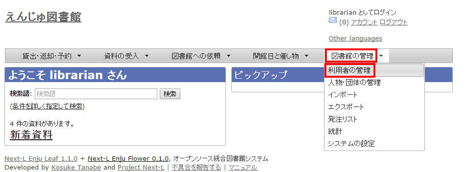
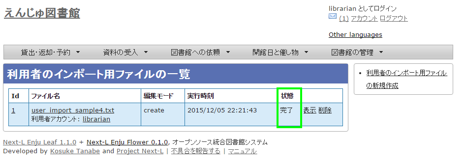

:toc: macro

toc::[]

== 利用者情報を管理する

図書館の利用者情報管理には、次のような機能があります。

* 利用者情報を新規作成する
* 既存のデータから利用者情報をインポートする
* 利用者情報を変更する（編集する）
* 利用者情報を削除する
* 利用者情報を表示する
* 利用者を検索する
* 利用者情報を別システムで管理する
* 利用者情報のエクスポートをする

利用者情報で入力できる項目は、次の表に示す通りです。
表の「新規」列に○があるものは新規作成で入力できる項目です。
「編集」列に○や◎があるものは変更（編集）の際に入力できる項目です。
◎があるものは一般ユーザーが自身の利用者情報編集機能で入力できる項目です。
「権限」項目はAdministrator権限でログインした時のみ入力できる項目なので△になっています。

////
* アカウント情報
  利用者番号、ユーザ名、有効期限、利用者グループ、権限、既定の図書館、情報参照権限、言語
* プロフィール情報（バージョンによっては入力できないものもあります）
  メールアドレス、フルネーム（漢字）、フルネーム（ヨミ）、生年月日、住所等（郵便番号、住所、電話番号、FAX番号
////

[.table.table-bordered.table-condensed.table-striped,cols="1,1,4,9"]
.利用者情報
|===
|新規|編集|項目|説明

|○
|
|ユーザ名
|任意のユーザ名です。半角英数で入力します。

|○
|◎
|メールアドレス
|連絡先メールアドレスを入力します。メールアドレスを登録しておくと、パスワードを忘れた時に、再設定されたパスワードを送信する機能が使えるようになります。予約の取り置きのメールのお知らせがくるようになります(※ Enju Leaf 1.1.0 ではこの機能は動作しません（詳細 https://github.com/next-l/enju_leaf/issues/1016[issue #1016])。 書誌詳細（「書誌情報を電子メールで送信する」リンク）で書誌をメールに送れるようになります。インポート・エクスポート・利用統計の集計の完了通知が来るようになります（管理者権限のみ）。

|
|○
|パスワードの自動生成
|自動生成したパスワードを設定するかどうか。チェックをいれて[更新する]とすると、自動生成したパスワードを設定し、更新後の画面で表示します。

|○
|○
|有効期限
|ユーザの有効期限です。書式：yyyy-mm-dd

|
|○
|利用不可
|ユーザアカウントを有効にするかどうかです。チェックを入れると利用不可になります。

|
|△
|権限
|User, Librarian, Administratorがあります。Administrator権限でログインしたときのみ権限の変更ができます。

|○
|◎
|フルネーム
|利用者の氏名を入力します。表示に使われます（主に、図書館職員の管理用に用いられます）。

|○
|◎
|フルネーム（ヨミ）
|利用者の氏名のヨミをカタカナで入力します。

|○
|○
|利用者グループ
|貸出冊数や期間などの条件を設定した利用者グループです。利用者グループを選択します。例えば、一般利用者、在勤・在学利用者、団体利用者など。利用者グループの作成や詳細については、xref:enju_setup_3.adoc#setup-user-groups[初期設定マニュアル「利用者グループを設定する」]を参照してください。

|○
|○
|利用者番号
|利用者番号です。一般的には、利用者カードのバーコード番号などに利用します。

|○
|○
|図書館
|利用者既定の図書館名を設定します。書誌詳細で請求記号の背ラベル表示の際に使用されます。Librarian権限以上の場合は、書誌・所蔵・イベント・利用者情報等のインポートファイルのデフォルト所属図書館の指定に利用されます。

|
|○
|参照に必要な情報
|プロフィールをどの権限の利用者にまで公開するかを指定します。

|○
|◎
|言語
|表示する言語を選ぶことができます。標準では、日本語と英語が選択可能です。

|
|◎
|キーワードリスト
|ログインしたときに表示される「ピックアップ」資料は、このキーワードリストに入れたキーワードに関連したものを優先して表示します。

|
|◎
|貸出期限通知用のicalendar url
|貸出期限通知に利用するicalendarのURL（リセットまたは削除）。デフォルトは未設定です。こちらを「リセット」して表示して表示したURLを使うことで、自身のカレンダーソフトに「貸出期限」などが表示されるように設定できます。アクセスに認証をともなわないので、このURLを他者に知られないように注意する必要があります。

|○
|◎
|貸出の履歴を保存する
|チェックを入れると、現在借りている本だけでなく、返却した本の記録を閲覧できるようになります。ただし、チェックを入れる前の返却本は表示されません。

|○
|○
|注記
|注記です。備考等を入力します。
|===

////
3-1  enju_operation/user_new.md
3-2  enju_operation/user_import.md
3-3  enju_operation/user_edit.md
3-4  enju_operation/user_profile.md
3-5  enju_operation/user_delete.md
3-6  enju_operation/user_search.md
3-7  enju_operation/user.md
////

=== 利用者情報を新規作成する

利用者情報を１件ずつ登録するには、利用者の新規作成を行います。［図書館の管理］メニューから行います。

. ［図書館の管理］メニューから［利用者の管理］を選択します。
+

. 右メニューの［利用者の新規作成］をクリックします。
+
image::../assets/images/1.1/image_operation_031.png[利用者の新規作成]

. 必要事項を入力して［利用者を登録する（取り消しはできません）］ボタンをクリックします。
+
image::../assets/images/1.2/image_operation_033.png[利用者を登録する]
+
[NOTE]
====
「*」のマークが付いた項目は入力必須項目です。また、登録の取り消しはできません。取り消しを行いたい場合は、利用者の削除を行います。（参照：<<remove-user-info,「利用者情報を削除する」>>
====

. 利用者が作成され、仮パスワードが発行されます。
+

[[import-user-data]]
=== 既存のデータから利用者情報をインポートする

既存の利用者データがファイルで存在する場合は、インポートと呼ぶ読み込みを行い、利用者情報に取り込めます。インポートするには、あらかじめファイルをTSV形式で作成しておく必要があります。

==== TSVファイルの作成

TSVファイルとは、項目をタブで区切ったテキストファイルです。サンプルファイルは、 https://github.com/next-l/enju_leaf/blob/1.1/examples/user_import_file_sample.tsv を参照してください。Enjuで利用するTSVファイルでは、1行目にそれぞれの項目に関わるフィールド名を指定します。フィールド名および値は原則として " " で囲みます。
フィールド名とその意味については次の通りです。

////

////

[.table.table-bordered.table-condensed.table-striped,cols="3,1,5,4"]
.利用者情報のTSV入力項目
|===
|フィールド名|データ形式|内容|未入力の場合（作成時）

|username
|ascii
|ユーザ名（入力必須）
|（インポートが「失敗」になる）

|password
|ascii
|パスワード（入力推奨）：登録しなければ、登録 直後は利用不能／後日adminが指定するしかない
|未設定

|full_name
|utf8
|フルネーム
|未設定

|full_name_transcription
|utf8
|フルネーム（ヨミ）
|未設定

|user_number
|ascii
|利用者番号（数字以外にアルファベットも使用可能）
|未設定

|email
|ascii
|メールアドレス：2つ以上入力したい場合は注記（note）に書くしかない
|未設定

|library
|code
|既定の図書館
|インポート時に「既定の図書館」として指定した図書館

|user_group
|code
|利用者グループ※1
|インポート時に「既定の利用者グループ」として指定した利用者グループ

|locale
|code
|（使用）言語(日本語の場合：ja,　英語の場合：en) ※2
|ja

|role
|code
|権限（Guest, User, Librarian, Administrator ）
|User

|expired_at
|ISO8601
|有効期限（2011-01-30　のような形式）
|未設定

|checkout_icalendar_token
|ascii
|貸出期限のicalendar urlに使うトークン
|未設定

|save_checkout_history
|ascii
|貸出の履歴を保存するかどうか。t または　TRUE または trueなら真（保存する）。
|FALSE

|locked
|ascii
|利用不可のアカウントにするかどうか。t または　TRUE または trueなら真（利用不可にする）。
|FALSE

|required_role
|code
|参照に必要な権限（Guest, User, Librarian, Administrator ）
|Librarian

|keyword_list
|utf8
|キーワードリスト。//で区切る。
|未設定

|share_bookmarks
|ascii
|ブックマークが他のユーザから参照できるかどうか。t または　TRUE または trueなら真（参照可にする）。
|FALSE

|note
|utf8
|注記
|未設定

|dummy
|utf8
|ダミー行の指定（なにかを書いているとその行は無視する行と判定される）
|（読み込まれる行と判定される）
|===

※1 利用者のグループの[名前]についてはxref:enju_setup_3.adoc#setup-user-groups[初期設定マニュアル「利用者グループを設定する」]を参照ください。

※2 環境によっては異なることがあります。
使用できるものに何があるかは，xref:enju_setup_7.adoc#show-sysytem-info[初期設定マニュアル「システムの基本的な情報の表示機能」]でわかります。

////
==== ■個人情報に関わる項目

////

==== TSVファイルのインポート

. ［図書館の管理］メニューから［インポート］を選択します。
+
image::../assets/images/1.1/image_operation_import.png[利用者の管理]

. ［利用者アカウント］をクリックします。
+
image::../assets/images/1.1/image_operation_037.png[利用者のTSVファイルからのインポート]

.  右メニューの[利用者のインポート用ファイルの新規作成]を選択します。
+
image::../assets/images/1.1/image_operation_037_2.png[利用者のTSVファイルからのインポート（新規作成）]

. ［ファイルを選択］ボタンをクリックしてインポート用のファイルを選択します。
+
image::../assets/images/1.1/image_operation_039_1.png[利用者のTSVファイルを選択]

. [編集モード]、[文字コード]、[既定の利用者グループ]、[既定の図書館]を選択して［インポートを開始］ボタンをクリックします。
+

+
[NOTE]
====
［編集］モードで［更新］を選択すると、TSVファイルで利用者情報をまとめて更新できます。TSVファイルに必要なのは、更新したい利用者のユーザ名（<code>username</code>）と、更新したいフィールドの内容になります。また、［削除］を選択すると、TSVファイルで利用者情報をまとめて削除できます。この場合は、TSVファイルに必要なのは、削除したい利用者のユーザ名（<code>username</code>）のみです。
====
+
[NOTE]
====
[文字コード]は基本的には自動判別でよいですが、うまくいかない場合は、文字コードを指定するようにしてください。
====
+
[NOTE]
====
[既定の利用者グループ]や[既定の図書館]は、TSVファイルに[利用者グループ]（user_group列）や[図書館]（library列）の値がない場合やTSVファイルで当該値に無効な値を指定していた場合に登録される値となります。TSVファイルに有効な値が指定されていた場合はTSVファイルを優先します。プルダウンメニューのデフォルト値は、現在ログイン中のユーザの利用者グループと図書館です。 
====

. 「利用者のインポート用ファイルは正常に作成されました。」のメッセージが表示され、利用者のデータがインポートの準備が整います。 右の[利用者のインポート用ファイルの一覧] をクリックします。
+
image::../assets/images/1.1/image_operation_040_2.png[利用者のインポート用ファイルの表示]

. 今までのインポート結果の一覧が表示されます。[状態]を見ると処理結果がわかります。インポートが完了したものは[完了]と表示されます。[処理待ち]のものは現在、実行中です。インポート完了時にはEnjuのメッセージ機能にてお知らせします（「インポートが完了しました」というメッセージが送られてきます）。注）Next-L Enju Leaf 1.1.0.rc12以前のバージョンの場合は毎時0分にインポート処理が開始します。 
+

+
[NOTE]
====
この画面は[図書館の管理]メニュー→[インポート]→[利用者アカウント]とすればいつでも閲覧できます。
====

==== 失敗した場合について

TSVファイルになんらかのエラーがありインポートの状態が[失敗]となることがあります。状態が[失敗]となった場合は、[表示]をクリックしてエラーメッセージを確認してください。「エラーメッセージ」にエラーのあった行とその理由が記述されています。エラーのあった行のレコードは登録されていませんので、エラーのあった行のみを抜き出してエラーを修正して再度登録する必要があります。

. ［図書館の管理］メニューから［インポート］を選択します。
+
image::../assets/images/1.1/image_operation_import.png[利用者の管理]

. ［利用者アカウント］をクリックします。
+
image::../assets/images/1.1/image_operation_037.png[利用者のTSVファイルからのインポート]

. インポートの状態が[失敗]の[表示]をクリックします。
+
image::../assets/images/1.1/image_operation_041_2.png[TSVインポートに失敗]

. [エラーメッセージ]にエラーの行とエラーの内容が表示されていますので、内容を確認します。次の例では3行目のレコードにどこか問題があるようです。[ファイル名]をクリックしてTSVファイルをダウンロードします。
+
image::../assets/images/1.1/image_operation_041_3.png[エラーメッセージ]

. 該当行のエラーを修正し、ヘッダ行とエラーのあった行以降のレコードが入ったTSVファイルを作成し、インポートをします。

[[update-user-info]]
=== 利用者情報を変更する（編集する）

登録した利用者情報は、必要に応じてあとから変更できます。ただし、Librarian権限でログインしている場合は権限の変更は行えません。

[NOTE]
====
編集したい利用者情報が書かれたTSVファイルを用いて、複数の利用者情報をまとめて編集することもできます。TSVを用いた利用者情報の編集のやり方の詳細については、[「3-2 既存のデータから利用者情報をインポートする 」](#section3-2)を参照してください。
====

. ［図書館の管理］メニューから［利用者の管理］を選択します。
+

. 情報を変更したい利用者の［編集］をクリックします。
+

+
[NOTE]
====
利用者番号や、[表示]をクリックした先の画面の右メニューの[編集]をクリックすることでも編集画面に遷移します。
====

. 属性を編集し［更新する］をクリックします。
+

+
[NOTE]
====
「*」のマークが付いた項目は入力必須項目です。
====

. 「利用者は正常に更新されました。」のメッセージが表示され、利用者の情報が変更されます。 [自動生成したパスワードを設定する]にチェックをいれていた場合は、自動生成したパスワードが表示されます。
+
image::../assets/images/1.1/image_operation_048.png[利用者情報の更新結果]

////

Enju Leaf 1.1.0 ではプロフィール情報として独立した画面ではないので、
ここはコメントアウトしておく。

利用者のプロフィール情報を変更する {#section3-x}
----------------------------------------------------

利用者の氏名や生年月日などを登録したり変更したりする機能です。

[NOTE]

Next-L Enju Leaf x.x.x.x 以降ではこの機能はありません
開発予定はありますが、開発時期は未定です。

登録した利用者のプロフィール情報は、必要に応じてあとから変更できます。変更できるプロフィール情報は次の通りです。

* 姓（漢字と読み）	姓と姓のよみ
* 名（漢字と読み）	名と名のよみ
* フルネーム（漢字と読み）	フルネームとフルネームのよみ
* 生年月日／没年月日	生年月日と没年月日
* 言語	使用する言語
* 国と地域	国と地域
* 電子メール	電子メールアドレス
* URL	ブログやホームページのURL
* 参照に必要な権限	参照に必要な権限
* 郵便番号（最大2つ）	［他の住所］をクリックすると、最大2つまで登録可能
* 住所（最大2つ）	［他の住所］をクリックすると、最大2つまで登録可能
* ファックス番号（最大2つ）	［他の住所］をクリックすると、最大2つまで登録可能
* 注記	注記

1. ［図書館の管理］メニューから［利用者の管理］を選択します。
+

2. 属性を変更したいユーザの［プロフィールの編集］をクリックします。
+

3. 姓、名などを編集します。
+

+
[NOTE]

「*」のマークが付いた項目は入力必須項目です。生年月日や没年月日は「YY-MM-DD」の6桁の数字で入力します。

4. 住所などの情報も編集し、［更新する］をクリックします。
+

+
[NOTE]

Librarianがプロフィールを変更できるのはUser権限のユーザのみです。

5. 「利用者は正常に更新されました。」のメッセージが表示され、利用者のプロフィール情報が変更されます。
+
image::../assets/images/1.1/image_operation_054.jpg[利用者は正常に更新されました]
+
[NOTE]

[図書館の管理] → [インポート] → [利用者]の画面の［編集］モードで［更新］を選択すると、TSVファイルでプロフィール情報をまとめて変更できます。この場合、TSVファイルでは更新したい利用者の利用者番号（user_number）と更新したいフィールドの内容のみを埋めておくようにします。

////

[[remove-user-info]]
==== 利用者情報を削除する

登録した利用者情報は、不要になった際に削除できます。

[NOTE]
====
削除したい利用者情報が書かれたTSVファイルを用いて、複数の利用者情報をまとめて削除することもできます。TSVを用いた利用者情報の削除のやり方の詳細については、[「3-2 既存のデータから利用者情報をインポートする 」](#section3-2)を参照してください。
====

. ［図書館の管理］メニューから［利用者の管理］を選択します。
+

. 削除したい利用者の［編集］をクリックします。
+
image::../assets/images/1.1/image_operation_057.png[利用者情報の編集]

. 右メニューの［削除］をクリックします。
+
image::../assets/images/1.1/image_operation_059.png[削除]

. メッセージが表示されたら［OK］をクリックします。
+

////

[NOTE]

利用者情報を削除しても、人物・団体としての情報は削除されません>。いったん削除した利用者が新たに利用登録を行う場合は、利用者番号を再度割り振ります。利用者番号を再度割り振るには、再>登録を行いたい人物のプロフィール情報を表示し、右メニューの［利用者として登録する］をクリックします。

////

[[show-user-info]]
==== 利用者情報を表示する

利用者の一覧を、画面上で表示し、利用者情報を表示することができます。

. ［図書館の管理］メニューから［利用者の管理］を選択します。
+

. 利用者一覧が表示されます。詳細を知りたい利用者の[利用者番号]のリンクをクリックします。一覧に利用者が表示されない場合は、検索することもできます。検索する方法は 次の節を参照してください。
+

. [[li:show-user-info]]当該利用者の利用者情報が表示されます。
+
image::../assets/images/1.2/image_operation_068_2.png[利用者の詳細情報]
+
[NOTE]
====
* 貸出の表には、貸出情報が表示されます。「貸出の履歴を保存する」にチェックが入っていた場合は、返却後の貸出履歴も表示されます。
* 右メニューにある「図書 : 1/ 10」は、「借りている本の数 / 借りられる上限数」を表しています。
* 右メニューの[編集]リンクをたどると、編集画面へ遷移します。本表示画面に表示されていない項目（メールアドレスなど）も編集画面で内容を確かめることができるものがあります。
* 右メニューの[利用者の一覧]リンクをたどると、「利用者の一覧画面」に遷移します。
* 右メニューの[貸出の新規作成]をクリックするとこの利用者の利用者番号が入った状態の貸出の新規作成画面に遷移し、すぐに貸出処理を進めることができます。※利用者番号が入力されていない場合はこのリンクが出現しません。
* 右メニューの[メッセージを送信する]リンクをたどると、当該利用者へのメッセージ送信画面へ遷移します。
* 右メニューの[利用者の新規作成]リンクをたどると、利用者の新規作成画面へ遷移します。
* 右メニューの[削除]リンクをたどると、当該利用者情報を削除します。貸出中の資料がある利用者情報の表示の場合は[削除]リンクは表示されません。
* 右メニューの[貸出の一覧]リンクをたどると、貸出の一覧画面へ遷移します。
* 右メニューの[予約の一覧]リンクをたどると、予約の一覧画面へ遷移します。
* 右メニューの[購入リクエストの一覧]リンクをたどると、購入リクエストの一覧画面へ遷移します。
====

==== 利用者を検索する

Enjuに登録されている利用者は、検索語（キーワード）で検索することができます。

. ［図書館の管理］メニューから［利用者の管理］を選択します。
+

. 検索語を入力して［検索］をクリックします（ユーザ名や利用者番号は完全一致するものがヒットします。フルネームは部分一致するものがヒットします）。
+
image::../assets/images/1.1/image_operation_064.png[検索]

. 該当する利用者が表示されます。
+

==== 利用者情報を別システムで管理する

Enjuで扱えない利用者情報を別のシステムで管理して、別システムで検索した利用者情報から、Enjuの利用者詳細画面につなげる方法を説明します。
Enjuのカスタマイズをすることなく、必要な利用者情報を管理できるようになります。

ここでは簡便なやり方として、MS Excelを使ったやり方を説明しますが、Accessや他のアプリケーションでも同様にできます。（注意：Excelファイルにパスワードを掛けるなど、漏えい対策に気を付けてください）

. 利用者情報のExcel ファイルを作ります。
+
例えば、Excelでこのようなファイルを作ります。
+
image::../assets/images/1.1/image_userinfo_local_001.png[Excelファイルの例]
+
このファイルで、生年月日や住所などEnjuに入力していない情報で利用者の情報を検索して、本人確認のための利用者情報を調べることができますし、URLのリンクをたどれば、その利用者のページにたどりつけます。
+
サンプルファイルは、
[Next-L公式サイト https://www.next-l.jp/?page=etc%5Ffiles&file=userinfo%5Flocalfile%5Fsample%2Exlsx&action=ATTACH
にありますので、参考にしてください。ここで用いている情報は架空のものです。
+
例えば、「ユーザ名」が 「u550001」 であれば、以下のようなURLを書けば
そのユーザ名の詳細画面に行くリンクになります。「localhost:8080」のところは適宜、書き換えてください。
（例えば、デモサーバーであれば、 「enju.next-l.jp」になります。）
+
    http://localhost:8080/profiles?username=u550001

. 作成したExcelファイルを使い、利用者情報の閲覧し、リンクをたどる
+
作成した、Excelファイルを使って、利用者の生年月日等で本人確認を行い、
ユーザ名を知ることができます。
+
「リンク」列の当該「ユーザ名」のリンクをたどります。
+
image::../assets/images/1.1/image_userinfo_local_001_2.png[リンクをたどる]

. Enjuの当該利用者の情報の画面に遷移できます。
+
右メニューの[貸出の新規作成]をクリックして
当該利用者の利用者番号の入った貸出画面に行くこともできます
（詳細：<<li:show-user-info,「利用者情報を表示する」の 3.>>）。
+

. トラブルシューティング：リンクをクリックしてもトップページに飛んでしまう場合
+
Enjuのサーバーの設定が必要です。1回だけ必要です。
+
    $ cd enju
    $ vi Gemfile
+
として、Gemfile の最後に以下の行を追加
+
    gem "fix_microsoft_links"
+
ファイルを保存
+
    $ bundle update
    $ sudo restart enju_leaf
+
として、Enjuを再起動。

==== 利用者情報のエクスポートをする

Administrator権限のユーザーでログインしている場合は、
登録されている全ての利用者情報をTSVとしてエクスポートすることができます。

. ［図書館の管理］メニューから［エクスポート］を選択します。
+
image::../assets/images/1.1/image_operation_export_admin.png[エクスポート]
+
※ Administrator 権限でログインしておく必要があります。

. [利用者情報のエクスポート]リンクをクリックします。
+

+
※　Administrator 権限ログインしていない場合は[利用者情報のエクスポート]リンクが表示されません。

. 右メニューの[利用者情報のエクスポートの新規作成]リンクをクリックします。
+

. [エクスポート]ボタンをクリックします。
+
image::../assets/images/1.1/image_operation_export_user_3.png[エクスポート]

. 「利用者情報のエクスポート処理は正常に作成されました」のメッセージが表示され、利用者情報のデータエクスポートの準備が整いました。右の[利用者情報蔵のエクスポートの一覧]をクリックします。 
+

. 今までのエクスポート結果の一覧が表示されます。[状態]を見ると処理結果がわかります。エクスポートが完了したものは[完了]と表示されます。[開始]のものは現在、実行中です。エクスポート完了時には[メッセージ機能（2-3節参照）](enju_operation_2.html#section2-3)にてお知らせします（「エクスポートが完了しました」というメッセージが送られてきます）。
+
image::../assets/images/1.1/image_operation_export_user_5.png[エクスポート結果の一覧表示]
+
[NOTE]
====
この画面は[図書館の管理]メニュー->[エクスポート]->[利用者情報のエクスポート]とすればいつでも閲覧できます。
====

. ファイル名のリンクから作成されたTSVファイルをダウンロードすることができます。
+

==== 【Column】TSVファイル

次の項目が入っています(Enju Leaf 1.1.0)。

* username
* full_name
* full_name_transcription
* email
* user_number
* role
* user_group
* library
* locale
* locked
* required_role
* created_at
* updated_at
* expired_at
* keyword_list
* note
* checkout_icalendar_token
* save_checkout_history

include::enju_operation_toc.adoc[]
