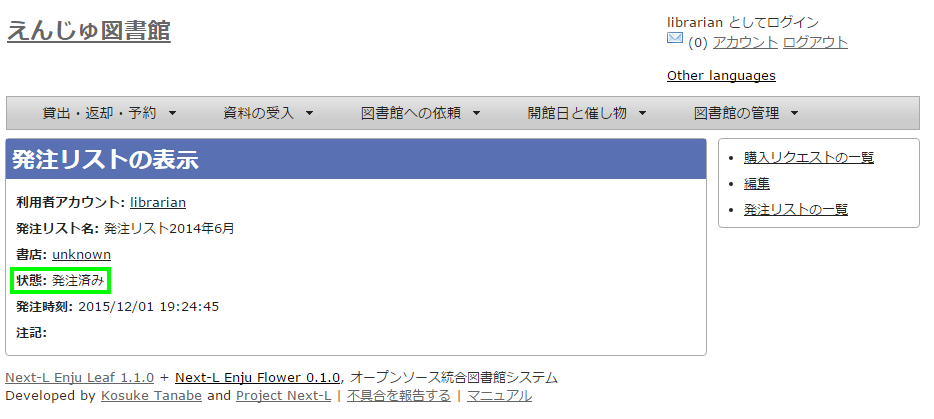
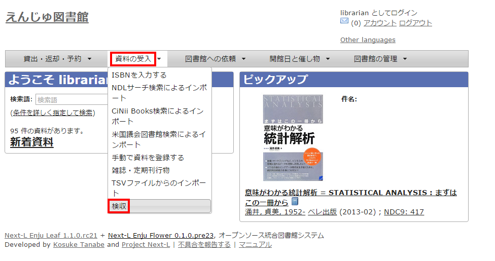
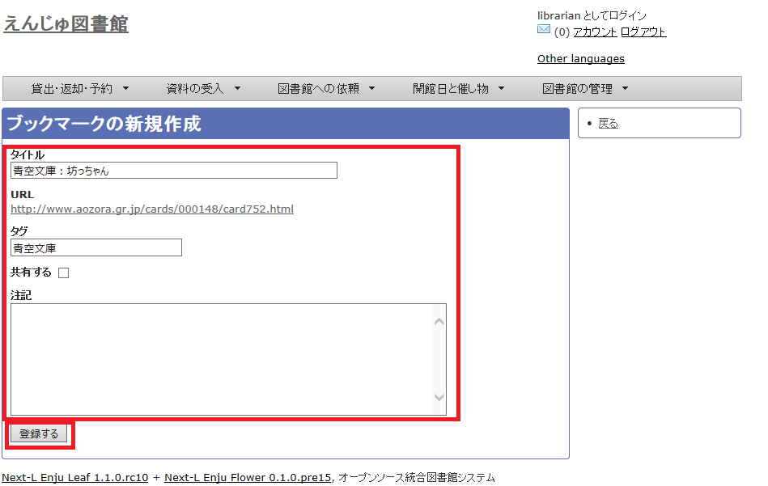
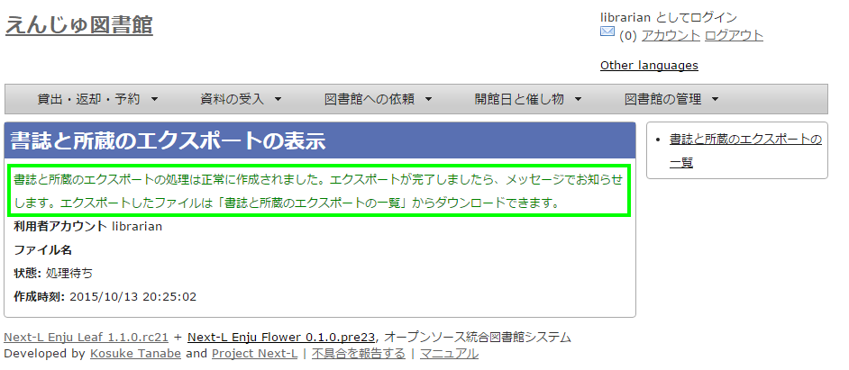

:toc: macro
:toclevels: 3

toc::[]

== 図書の受入をする

図書の受入では、次のような作業を行えます。

* 図書を発注する
* 図書を登録する
* 所蔵情報を登録・一覧表示する
* 図書を検収する
* 図書を除籍する
* 新着図書の一覧を表示・印刷する
* 画像を登録する
* 書誌と所蔵をエクスポートする
* 図書に関係する人物・団体情報を登録する

また、図書の受入に際し、次のような機能を利用することもできます。

////
* Webページを登録する
  Webページを資料として受入します
////

* 画像を登録する表紙画像のデータを、受入した図書にリンクさせます。

////
{::comment}4-1  enju_operation/order.md {:/comment}
{::comment}4-2  enju_operation/create_manifestation.md {:/comment}
{::comment}4-3  enju_operation/create_item.md {:/comment}
{::comment}4-4  enju_operation/accept_item.md {:/comment}
{::comment}4-5  enju_operation/delete_item.md {:/comment}
{::comment}4-6  enju_operation/list_new_item.md {:/comment}
{::comment}4-7 old  include  enju_operation/create_web_page.md  {:/comment}
{::comment}4-7  enju_operation/add_image.md {:/comment}
////

=== 図書を発注する

==== 購入リクエストを作成する

購入したい図書の購入リクエストを作成します。

. ［図書館への依頼］メニューから［購入リクエスト］を選択します。
+
image::../assets/images/1.1/image_operation_purchase_req.png[購入リクエスト]

. 右メニューの［購入リクエストの新規作成］をクリックします。
+
image::../assets/images/1.1/image_operation_078.png[購入リクエストの新規作成]

[NOTE]
====
【Memo】

* 右メニューの[RSS]をクリックすると購入リクエストをRSS表示します。
* 右メニューの[TSV]をクリックすると購入リクエストをTSV表示します。
* 右メニューの「図書館の購入依頼に追加」は、購入リクエストのためのブックマークレットです。このリンク先のURLをブックマークレットとしてブラウザのブックマークにあらかじめ登録しておきます。amazonなどで購入リクエストしたい図書の画面を出した後、このブックマークレットを使用すると、当該図書の情報が入力された購入リクエスト登録画面が表示されます。
====

. タイトルや著者などを入力し、［登録する］ボタンをクリックします。
+
image::../assets/images/1.1/image_operation_079.png[購入リクエスト作成]

. 購入リクエストが作成されました。
+
image::../assets/images/1.1/image_operation_083.png[購入リクエスト作成結果]

==== 発注リストを作成する

複数の購入候補の図書を一つの発注リストにまとめるために、
まずは、空の発注リストを新規作成します。

. ［図書館の管理］メニューから［発注リスト］を選択します。
+
image::../assets/images/1.1/image_operation_order.png[発注リスト]

. 右メニューの［発注リストの新規作成］をクリックします。
+
image::../assets/images/1.1/image_operation_072.png[発注リストの新規作成]

. リストのタイトルを入力し、書店を選択したら［登録する］ボタンをクリックします。
+

. 「発注リストは正常に作成されました。」と表示され、発注リストが作成されます。
+

==== 発注したい図書（購入リクエスト）を発注リストに登録する

作成した発注リストに、発注したい図書（購入リクエスト）を加えていきます。

. ［図書館への依頼］メニューから［購入リクエスト］を選択します。
+
image::../assets/images/1.1/image_operation_purchase_req.png[購入リクエスト]

. 発注リストに登録したい図書のタイトルのリンクをクリックします。
+
image::../assets/images/1.1/image_operation_078_2.png[購入リクエストの選択]

[NOTE]
====
【Memo】

* 右メニューの[発注済み]をクリックすると発注済みの購入リクエストのみを表示します※。
* 右メニューの[未発注]をクリックすると未発注の購入リクエストのみを表示します※。
* 右メニューの[全ての購入依頼]をクリックすると全ての購入リクエストを表示します。

※注意 2025年1月現在、この機能にバグがあり、[未発注]や[発注済み]などの絞り込みは動作しません（link:https://github.com/next-l/enju_leaf/issues/444[参照 #issue444]）
====

. 購入リクエストの表示画面に切り替わったら、右メニューの［発注リストに追加する］をクリックします。
+

. 発注リストを選択し、［登録する］ボタンをクリックします。
+
image::../assets/images/1.1/image_operation_085.png[発注を作成]

==== 発注リストを確定し「発注済み」にする

. ［図書館の管理］メニューから［発注リスト］を選択します。
+
image::../assets/images/1.1/image_operation_order.png[発注リスト]

. 確定したい発注リストの発注リスト名をクリックします。
+

. 右メニューの［購入リクエストの一覧］をクリックします。
+

. 右メニューの［発注票を作成する］リンクをクリックします。
+

. 注記などを入力し［発注票を作成する］ボタンをクリックします。
+

. 発注リストが更新されました。
+
image::../assets/images/1.1/image_operation_091_5.png[発注リストが更新されました]

[NOTE]
====
【Memo】この処理をすると発注リストの状態が「発注済み」に変更されます。

====

==== 発注済みリストのTSVをダウンロードする

発注が確定した発注リスト（発注済みリスト）は、TSVファイルとしてダウンロードし、印刷等に利用することができます。

. ［図書館の管理］メニューから［発注リスト］を選択します。
+
image::../assets/images/1.1/image_operation_order.png[発注リスト]

. 発注リストをクリックします。
+
image::../assets/images/1.1/image_operation_088.png[発注リストの選択]

. 右メニューの［購入リクエストの一覧］リンクをクリックします。
+

. 右メニューの［TSV］をクリックします。
+
image::../assets/images/1.1/image_operation_091.png[TSVリンク]

. TSVが表示されます。
+
image::../assets/images/1.1/image_operation_091_2.png[TSV]

==== 発注済みリストのRSSを表示する

発注が確定した発注リスト（発注済みリスト）は、RSSを表示できます。

. 上述のTSVダウンロードの1～3. を実行します。

. 右メニューの［RSS］をクリックします。
+
image::../assets/images/1.1/image_operation_091_RSS.png[RSSリンク]

. RSSが表示されます。
+
image::../assets/images/1.1/image_operation_091_2_RSS.png[RSS]

=== 図書を登録する

発注した図書が届いたら、資料としてEnjuに登録します。
Enjuへの登録は、TSVファイルを読み込んで一括登録する方法、
ISBNコードで1件ずつ行う方法、
NDLサーチなどを検索して1件ずつ登録する
手動ですべての項目を入力する方法などがあります。

==== 入力項目

注意の必要な項目のみ説明します。

* （カスタム項目）：例えば、「検定年」など自由に設定した入力項目ができます。「内容細目」の上にフォームが表示されます。設定方法などの詳細は xref:enju_setup_5#section-bib-custom[「書誌のカスタム項目を設定する」節]を参照してください。
* 内容細目：目次などを入力します。改行を入れた入力もできます。
* 業務メモ：業務上必要なメモを入力します。利用者には表示されません（AdministratorかLibrarian権限時にのみ表示されます）。

[[manifestation-tsv-import]]
==== TSVファイルを読み込んで登録する

. TSVファイルを用意します。TSVファイルの作り方の詳細については、<<manifestation-import-format,「TSVファイルの作り方」>>を参照してください。

. ［資料の受入］メニューから［TSVファイルからのインポート］を選択します。
+
image::../assets/images/1.1/image_operation_093.png[TSVファイルからのインポート]

. ［ファイルを選択］ボタンをクリックしてインポート用のファイルを選択します。
+

. [編集モード]が[作成]となっていることを確認し、[文字コード]、[既定の本棚]を選択して［インポートを開始］ボタンをクリックします。
+
image::../assets/images/1.1/image_operation_095.png[インポートされる資料のファイルを作成]
+
[NOTE]
====
【Memo】
他の「編集モード」の使い方は別の章で説明します。
====
+
[NOTE]
====
【Memo】[文字コード]は基本的には自動判別でよいですが、うまくいかない場合は、文字コードを指定するようにしてください。
====
+
[NOTE]
====
【Memo】[既定の本棚]は、TSVファイルに[本棚]を指定しない場合やTSVファイルで不正な本棚を指定していた場合に登録される本棚となります。TSVファイルに正しい[本棚]が指定されていた場合はTSVファイルを優先します。
====

. 「資料のインポート用ファイルは正常に作成されました。」のメッセージが表示され、資料のデータインポートの準備が整いました。右の[資料のインポート用ファイルの一覧]をクリックします。
+
image::../assets/images/1.1/image_operation_095_2.png[インポート結果]

. 今までのインポート結果の一覧が表示されます。[状態]を見ると処理結果がわかります。
+
インポートが完了したものは[完了]と表示されます。
[開始]や[処理待ち]のものは現在、実行中です。
[失敗]のものは何らかのエラーがありますので、
[表示]リンクをクリックした先の画面でエラーを確認し、
エラーの発生した行を修正するなどします。
+
インポート完了時にはxref:enju_operation_2#message-function[メッセージ機能]にてお知らせします
（「インポートが完了しました」というメッセージが送られてきます）。
+
image:../assets/images/1.1/image_operation_095_3.png[インポート結果の一覧表示]
+
[NOTE]
====
【Memo】この画面は[資料の受入]メニュー->[TSVファイルからのインポート]->
右メニューの[資料のインポート用ファイルの一覧]とすればいつでも閲覧できます。
====
+
[NOTE]
====
【Memo】注）Next-L Enju Leaf 1.1.0.rc12以前のバージョンの場合は毎時0分にインポート処理が開始します。
====

. インポートした結果を確かめるために、インポートの結果の一覧を表示させます。そのために、［資料の受入］メニューから［TSVファイルからのインポート］を選択します。
+
image::../assets/images/1.1/image_operation_093.png[TSVファイルからのインポート]

. 右メニューの[資料のインポート用ファイルの一覧]のリンクをたどります。
+
image::../assets/images/1.1/image_operation_095_4.png[インポート結果の一覧表示]

. 確認したいインポートの[表示]をクリックします。
+

. 結果やエラーメッセージを確認します。表の「資料」の列で2行目以降※で、なにも表示されていない行はエラーのあった行なので[表示]をクリックする。
+
（※一行目はヘッダの行なので、資料の列にはなにも表示されていない）
+
image::../assets/images/1.1/image_operation_095_6.png[インポート結果の一覧表示の表示]
+
[NOTE]
====
【Memo】以下の例は、列名が間違っていて無視された例です。

image::../assets/images/1.1/image_operation_095_2_2.png[TSVファイルからのインポート]
====

. エラーメッセージなどを確認して、個別に登録する。個別に登録する方法は次の<<isbn-import,「ISBNコードを入力して1件づつ登録する」節>>や<<manual-import,「手動で資料を登録する」節>>の方法などを参照してください。
+

==== ISBNファイル（または国立国会図書館書誌IDファイル）を読み込んで登録する

ISBNコードもしくは国立国会図書館書誌IDが分かっている場合は、
タイトルや著者などほかのフィールド情報をTSVファイルに入力しておかなくても、
ISBNコードもしくは国立国会図書館書誌IDから国立国会図書館のデータを参照して、
自動的に空白の項目が埋められます。

. ISBNもしくは国立国会図書館書誌IDの項目だけ入力したTSVファイルを用意し、前述の操作に従ってTSVファイルを読み込んで登録します。
+
ISBNの場合は、列名は「`isbn`」、国立国会図書館書誌IDの場合は、列名は「`ndl_bib_id`」とします。TSVファイルの作り方の詳細については、<<manifestation-import-format,「TSVファイルの作り方」>> を参照してください。
+
[NOTE]
====
【Memo】
注：タイトル(`original_title`)項目がある場合は、国立国会図書館のデータを参照せずに、TSVファイルの内容を優先します。
タイトル(`original_title`）項目がなく、ISBNもしくは国立国会図書館書誌IDがある場合は、国立国会図書館のデータを優先してインポートします。
====

. 個々のレコードの登録の成否を確認します。 やり方は <<tsv-import,「TSVファイルを読み込んで登録する」>> の 6. 以降の手順と同様です。

[[isbn-import]]
==== ISBNコードを入力して1件ずつ登録する

ISBNコードから国立国会図書館のデータを参照して、資料を登録します。

. ［資料の受入］メニューから［ISBNを入力する］を選択します。
+

. ISBNコードを入力し、［登録する］をクリックします。
+
image::../assets/images/1.2/image_operation_108.png[インポートのリクエストを作成]

. 「インポートのリクエストは正常に作成されました。」と表示され、登録が完了します。
+
image::../assets/images/1.2/image_operation_109.png[登録完了]
+
[NOTE]
====
【Memo】
右メニューの[所蔵を編集]の右の[ (新規作成)]リンクをたどることで，
続けて所蔵情報を登録することができます。
詳細は <<add-item,「所蔵情報を新規登録する」>>を参照ください。
====
+
[NOTE]
====
【Memo】過去のISBNレコードの登録の成否を確認する方法を紹介します。

その場で、画面上で判明することですので、必要になることは基本的にはありません。
過去の記録※を知りたいときに必要になる機能です。
※TSVファイルを読み込んで登録する際の記録はこちらには出力されません

.  [資料の受入］メニューから［ISBNを入力する］を選択します。
+

. 右メニューの［ISBNインポートリクエストの一覧］を選択します。
+
image::../assets/images/1.1/image_operation_109_2.png[ISBNインポートリクエストの一覧]

. ISBNインポートのリクエストの一覧が表示されます。
+
[状態]の列をみれば、登録状況がわかります。[完了]となっていれば、
登録されたことを示します。
[処理待ち]や[失敗]は登録されていません。
+
image::../assets/images/1.1/image_operation_109_3.png[ISBNインポートリクエストの一覧表示]
====

[[ndl-search-import]]
==== NDLサーチを検索して1件ずつ登録する

NDLサーチ（国立国会図書館サーチ <https://ndlsearch.ndl.go.jp/>）で検索した資料を登録することができます。
ISBNが不明な場合やISBNで登録でできなかった場合などに使用します。
（ISBNで登録できない例：9784834005288）

. ［資料の受入］メニューから［NDLサーチ検索によるインポート］を選択します。
+

. 登録したい資料を検索します。検索語に登録したい資料のJP番号などを入力し、［検索］ボタンをクリックします。
+
image::../assets/images/1.1/image_operation_107_ndl.png[NDLサーチ検索の検索]
+
[NOTE]
====
【Memo】
任意のキーワードで検索することもできますが、
多くヒットしてしまい選びにくいことが想定されますので、
あらかじめ、NDLサーチ（国立国会図書館サーチ <https://ndlsearch.ndl.go.jp/>）
のサービス上で検索して、
当該資料の「JP番号」を調べておき、
その「JP番号」を使うとよいでしょう。
====

. 登録したい資料の[追加]をクリックします
+
image::../assets/images/1.2/image_operation_108_ndl.png[資料の追加]
+
[NOTE]
====
【Memo】

* 原題のリンク先はNDLサーチの書誌詳細画面になっていますので、書誌詳細を確認できます。
* 右メニューの「同じ検索語でNDLサーチを検索する」をたどると、同じ検索語でNDLサーチを検索した結果の画面が表示されますので、たくさんヒットしすぎたときなどに便利です。
====
+
[NOTE]
====
【Memo】
500件以上ヒットした場合は、500件目以降のレコードを、インポートすることができません
（参照：link:https://github.com/next-l/enju_leaf/issues/624[Issue #624]）。
====

. [追加]ボタンが[保存中...]に変わりますので，画面が切り替わるまでしばらく待ちます。
+
image::../assets/images/1.2/image_operation_108_2_ndl.png[資料の保存中]

. 「資料は正常に作成されました。」と表示され、登録が完了します。
+
image::../assets/images/1.2/image_operation_109_ndl.png[登録完了]

[NOTE]
====
【Memo】
右メニューの[所蔵を編集]の右の[ (新規作成)]リンクをたどることで，
続けて所蔵情報を登録することができます。
詳細は <<add-item,「所蔵情報を新規登録する」>>を参照ください。
====

==== 米国議会図書館を検索して1件ずつ登録する

米国議会図書館（<https://catalog.loc.gov/>）の蔵書を検索した資料を
登録することができます。ISBNやキーワードなどで検索できます。

. ［資料の受入］メニューから［米国議会図書館検索によるインポート］を選択します。
+
image::../assets/images/1.1/image_operation_loc_1.png[米国議会図書館検索によるインポート]

. 以降は、<<ndl-search-import,「NDLサーチを検索して1件ずつ登録する」節>> の 2. 以降の手順と同様です。

==== CiNii Booksを検索して1件ずつ登録する

CiNii Books（<https://ci.nii.ac.jp/books/>）を検索した資料を
登録することができます。ISBNやキーワードなどで検索できます。

. ［資料の受入］メニューから［CiNii Books検索によるインポート］を選択します。
+

. 以降は、<<ndl-search-import,「NDLサーチを検索して1件ずつ登録する」節>> の 2.以降の手順と同様です。

[[manual-import]]
==== 手動で資料を登録する

. ［資料の受入］メニューから［手動で登録する］を選択します。
+
image::../assets/images/1.1/image_operation_input_manually_manifestation.png[手動で登録する]

. 原題のほか必要な項目を入力し、[登録する]ボタンをクリックします。
+
image::../assets/images/1.2/image_operation_100.png[原題のほか必要な項目を入力し登録]
+
[NOTE]
====
【Memo】

* 「*」のマークが付いた項目は入力必須項目です。
* 「ページ数」と「最初のページ」「最後のページ」の両方を入力した場合、「資料の表示」に表示されるのは「ページ数」になります。
* 「大きさ」と「高さ」の両方を入力した場合、「資料の表示」に表示されるのは「大きさ」になります。
====
+
[NOTE]
====
【Memo】著者については、入力し始めると、すでに登録されている著者の候補が出てくるので、同じものがあれば、そのメニューから選んで決定することができます。

image::../assets/images/1.2/image_operation_author_auto.png[著者名の自動補完方法]
====

. 「資料は正常に作成されました。」のメッセージが表示され、図書が登録されます。
+

==== 図書の書誌を編集（修正）する

. 書誌を編集したい本の名前を検索語に入力し、［検索］をクリックします。
+

. 書誌を編集したい本が検索されたら、［編集］をクリックします。
+
image::../assets/images/1.1/image_operation_bib_ed_2.png[編集]
+
[NOTE]
====
【Memo】ここで、本のタイトルのリンクをたどり、その先の資料の表示画面の右メニュー[編集]をクリックすることでも編集画面に移動します。

====

. 編集をし、［更新する］ボタンをクリックします。
+
image::../assets/images/1.2/image_operation_bib_ed_4.png[更新する]

. 「資料は正常に更新されました。」と表示され、書誌が更新されます。
+

==== TSVファイルを読み込んで更新する

. TSVファイルを用意します。
+
更新したい資料のManifestation ID(`manifestation_id`)か、 ローカル識別子（`manifestation_identifier`） と更新したいフィールドの内容が記述されたファイルを作成します。

. <<manifestation-tsv-import,「TSVファイルを読み込んで登録する」>> の 1. 以降と同じ手順を実行し、3. の時に、[更新]を選ぶと書誌情報が更新できます。

////
{::comment} 

#805, #806 が解決したらコメントアウトをはずす

=== 4-2-xx TSVファイルを読み込んで削除する {#section4-2-xx}

基本的に、所蔵情報をTSVファイルで一括で削除することはめったにないと想定されますが、TSVファイルを使った一括削除機能も用意されています。

. TSVファイルを用意します。

削除したい資料のManifestation ID(manifestation_id)か、 ローカル識別子（manifestation_identifier） のみ記述されたファイルを作成します。

. [「4-2-1 TSVファイルを読み込んで登録する」](#section4-2-1)の 1. 以降と同じ手順を実行し、3. の時に、[削除]を表示させ、[削除]を選びます。

※ 間違えて[削除]を選択してしまわないよう、通常、[削除]ボタンが表示されていません。ブラウザの開発ツールを使って、[削除]ボタンのコメントアウトを外して[削除]ボタンを表示させて使用してください。やり方は[[削除]ボタンを表示させるやり方の例（Chromeの例）](#remove_button)を参考にしてください。

{:/comment}
////

// 

[[manifestation-import-format]]
==== ※TSVファイルの作り方（書誌（図書）情報）

TSVとは、Tab-Separated Valuesの略です。
TSVファイルとは、それぞれのフィールドが、タブ（Tab）で区切られたプレインテキストファイルのことをさします。
ファイル名に使う拡張子は、 .txt や .tsv のどちらでも良いです。

1行目に、それぞれの項目に関わるフィールド名を指定します。
フィールド名とその意味については次の通りです。

.図書のフィールド項目名と対応する内容
[.alert.alert-success.memo]
[.table.table-bordered.table-condensed.table-striped,cols="1,1,2,2",options=header]
|===
|フィールド名 | 日本語名称 | 入力ルール及び説明 | 例

|manifestation_id
|Manifestation ID
|半角数字のみ。システムが自動付与するID。「資料の表示」画面のURL末尾にある数値。更新や削除に使用します。※新規作成時には使用しないでください。
// <!-- ( #872 ) いずれ：新規作成時にはこの列は無視されます。--></td>
|4

|manifestation_identifier
|ローカル識別子
|文字列、インポート時に付与する書誌に対する任意の識別子。
|999001
//<!--（#issue372）-->

|original_title
|原題
|文字列
|Rによるやさしい統計学

|title_transcription
|タイトルのヨミ
|文字列
|R ニ ヨル ヤサシイ トウケイガク

|title_alternative
|代替タイトル
|文字列
|Rの操作手順と統計学の基礎が身に付く

|title_alternative_transcription
|代替タイトルのヨミ
|文字列
|R ノ ソウサテジュン ト トウケイガク ノ キソ ガ ミ ニ ツク

|statement_of_responsibility
|責任表示
|文字列
|山田剛史, 杉澤武俊, 村井潤一郎 共著

|periodical
|逐次刊行物フラグ
|フラグ（t または TRUEなら真）
|TRUE

|edition_string
|版
|文字列
|初版

|edition
|版（数字）
|半角数字のみ
|1

|volume_number_string
|巻
|文字列
|一

|volume_number
|巻（数字）
|半角数字のみ
|1

|issue_number_string
|号
|文字列
|二

|issue_number
|号（数字）
|半角数字のみ
|3

|serial_number
|通号
|半角数字のみ
|2

|series_original_title
|シリーズ名
|文字列（複数ある場合は//で区切る）
|理工学専門書シリーズ//数学//1

|series_title_transcription
|シリーズ名のヨミ
|文字列（複数ある場合は//で区切る）, <<tsv_series_titles,（詳細）>>
|リコウガクセンモンショ シリーズ//スウガク//1

|series_volume_number_string
|シリーズ巻号
|文字列，<<tsv_series_titles,（詳細）>>
|二

|series_creator_string
|シリーズ著者
|文字列，<<tsv_series_titles,（詳細）>>
|統計

|creator
|著者（フルネーム）
|文字列<<creator,（特定書式：別記）>>
|山田, 剛史, 1970-\|\|author//杉澤, 武俊\|\|author

|creator_transcription
|著者ヨミ（フルネームヨミ）
|文字列（複数ある場合は//で区切る）
|ヤマモト, タケシ//スギサワ, タケトシ

|contributor
|協力者・編者
|文字列
|山田, 剛史

|contributor_transcription
|協力者・編者(ヨミ)
|文字列
|ヤマモト, タケシ

|publisher
|出版者
|文字列
|オーム社

|publisher_transcription
|出版者のヨミ
|文字列
|オームシャ

|publication_place
|出版地
|文字列
|東京

|pub_date
|出版日
|ISO8601（年まで、月まででも可）
|2014-01

|content_type
|資料の内容の種類
|code<<content_type,（詳細）>>
|text

|carrier_type
|資料の形態
|code<<carrier_type,（詳細）>>
|volume

|frequency
|発行頻度
|code<<frequency,（詳細）>>
|monthly

|language
|言語
|code<<language,（詳細）>>
|jpn

|isbn
|ISBN
|半角文字のみ、ハイフンあり/なし/9桁/13桁はどの形式でも受け付ける。国際標準逐次刊行物番号。<<tsv_id,（詳細）>>
|9784274067105

|ndl_bib_id
|国立国会図書館書誌ID
|半角文字のみ。
|000002844874

|issn
|ISSN
|半角文字のみ, ハイフンはあってもなくてもよい。国際標準逐次刊行物番号。<<tsv_id,（詳細）>>
|0917-1436

|jpno
|JPNO
|半角文字のみ. 全国書誌番号。<<tsv_id,（詳細）>>
|21366221

|lccn
|LCCN
|半角文字のみ. 米国議会図書館管理番号。<<tsv_id,（詳細）>>
|1255667

|doi
|DOI
|文字列，https://doi.org/は記入しない。<<tsv_id,（詳細）>>
|10.2964/jsik.23_219

|ncid
|NCID
|半角文字のみ. NCID(NACSIS-CAT ID，NII書誌ID)。<<tsv_id,（詳細）>>
|BA84620103

|subject:[件名標目の種類]<<tsv_subject,（詳細）>>
|件名
|文字列（複数ある場合は//で区切る）
|ウェブアプリケーション//インターネット

|classification:[分類の種類] <<tsv_classification,（詳細）>>
|分類
|文字列（複数ある場合は//で区切る）
|007//007.58

|start_page
|最初のページ
|半角数字のみ(#342)
|1

|end_page
|最後のページ
|半角数字のみ
|404

|extent
|ページ数
|文字列
|xi, 125 pages

|dimensions
|大きさ
|文字列
|21cm

|height
|高さ（cm）
|半角数字のみ
|20

|width
|幅（cm）
|半角数字のみ
|15

|depth
|奥行き（cm）
|半角数字のみ
|1.5

|manifestation_price
|販売価格
|半角数字のみ
|2000

|access_address
|アクセスアドレス
|半角文字のみ
|https://www.amazon.co.jp/dp/4274067106/

|fulltext_content
|リポジトリコンテンツ
|フラグ（t または　TRUEなら真）
|TRUE

|required_role_name
|参照に必要な権限
|code<<required_role_name,（詳細）>>
|Guest

|abstract
|内容細目
|文字列。Enju Leaf 1.3.6よりインポート可能。
|1. サイタ +
2. ヒラク

|description
|説明
|文字列。
|本書は、統計学の理論を簡潔に解説しながら、Rの手順・アウトプットの解釈を丁寧に行う。具体的には...

|note
|注記
|文字列。改行は「\n」とする。
|版表示は奥付より。付属資料: CD-ROM（1枚, 12cm）

|manifestation_memo
|業務メモ（書誌）
|文字列。Enju Leaf 1.3.6よりインポート可能。<<manifestation_memo,（詳細）>>
|

|dummy
|インポート省略
|文字列。この列に入力されていると、その行全体をインポート対象から除外します。
|
|===

[[tsv_id]]
===== isbn などの識別子

複数の識別子（ISBNなど）がある場合は、`//` で区切ります。どんな識別子があるかについては、xref:enju_setup_6#setup-identifiers[初期設定マニュアル「識別子の種類を設定する」] を参照してください。

[NOTE]
====
注意！ISBNが複数ある場合、ISBNを用いて国立国会図書館のデータを参照して、 自動的に空白の項目が埋められることはありません。必ず、`original_title`等の項目を記入しておく必要があります。
====

[[tsv_series_titles]]
===== シリーズタイトル関連情報

シリーズのタイトル(`series_original_title`)がTSVファイルで指定されている必要があります。指定されていない場合はこの項目の値は無視されます。

[[creator]]
===== creator

	書式: 著者名||役割//著者名||役割
	例：山田, 剛史, 1970-||author//杉澤, 武俊||author//大木, 太郎||illustrator

役割は一括インポート・エクスポート可能になってはいますが、資料の表示画面で表示したり、資料の編集画面で編集できるようにはできていません（開発予定ですが、開発時期は未定です）。 
//<!-- issue #1520 にて-->

[NOTE]
====
Enjuで利用できる使える役割については、「著者の関係」機能の「名称」に一覧されています。

Enju Leaf 1.3.4 現在、「著者の関係」はどこからもリンクないですが `/create_types` をEnjuが稼働するサーバのベースURLに追加するとアクセスできます（例：デモサーバーでは https://enju.next-l.jp/create_types ）。ここから新しい役割を追加することもできます。
//<!-- issue #1522 にて-->
====

[[content_type]]
===== content_type

「資料の内容の種別」の[名前]を値とします（例：文字であれば `text` など）。
設定値やその内容について、xref:enju_setup_5#content_type[初期設定マニュアル「資料の内容の種別の作成」] を参照してください。

[[carrier_type]]
===== carrier_type

「資料の形態」の[名前]を値とします（例：冊子体であれば `volume` など）。
設定値やその内容について、xref:enju_setup_5#carrier_type[初期設定マニュアル「資料の形態の作成」] を参照してください。
未入力の場合は `valume` が設定されます。

[[frequency]]
===== frequency

「発行頻度」の[名前]を値とします（例： `daily`, `monthly` など）。
設定値やその内容について、xref:enju_setup_5#frequency[初期設定マニュアル「発行頻度を編集する」] を参照してください。未入力の場合は `unknown` が設定されます。

[[language]]
===== language

日本語の場合は `jpn`, 英語の場合は `eng` になります。その他の言語については、「言語」の[Iso 639 2]を参照してください。
設定値やその内容について、xref:enju_setup_5#language[初期設定マニュアル「言語を編集する」] を参照してください。

[[tsv_subject]]
===== subject:[件名標目の種類]

件名標目の種類ごとに別の列になります。
フィールド名は subject:[件名標目の種類] となります。
例えば、件名標目NDLSHの値は、subject:ndlshの列に書くことになります。
フィールド名に使う[件名標目の種類]は、「件名標目の種類」の[名前]を使います
件名標目の種類については、xref:enju_setup_4#setup-subject[初期設定マニュアル「件名標目の種類を設定する」]を参照してください 。

同じ件名標目で複数の件名を割り当てる場合は、`//` で区切ります。

具体的には以下のように記述します。

* 例：NDLSHで「ウェブアプリケーション」と「インターネット」が付与されている書誌レコードの場合:

	subject:ndlsh
	ウェブアプリケーション//インターネット
	
* 例：NDLSHが「インターネット」、LCSHが "Internet" のとき:

	subject:ndlsh	subject:lcsh
	インターネット	Internet

[[tsv_classification]]
===== classification:[分類の種類]

分類の種類ごとに別の列になります。
フィールド名はclassification:[分類の種類] となります。
例えば、NDC9の分類記号は、`classification:ndc9` の列に書くことになります。
フィールド名に使う[分類の種類]は、「分類の種類」の[名前]を使います
分類の種類については、xref:enju_setup_4#setup-classification[初期設定マニュアル「分類の種類を設定する」]を参照してください。

同じ分類の種類で複数の分類がある場合は、`//` で区切ります。

具体的には以下のように記述します。

* 例：NDC9の分類で、007と007.58が付与されているレコードの場合:

	classification:ndc9
	007//007.58
	
* 例：NDC9が"007", NDLCが"AZ-463"のとき:

	classification:ndc9	classification:ndlc
	007	AZ-463

[[required_role_name]]
===== required_role_name

この書誌を参照可能な権限を設定します。
以下の4つから選びます。なにも記入しなければ、Guest になります。
 
* Administrator（管理者）
* Librarian（図書館員）
* User（図書館利用者）
* Guest （誰でも）

[[manifestation_memo]]
===== manifestation_memo

Administrator権限、Librarian権限のときのみ出力する項目です。
一般利用者には見せないが、業務上必要なデータを残したい場合などに使用します。

[[input-and-show-holdings]]
=== 所蔵情報を登録・一覧表示する

登録された資料を、図書館の蔵書として登録します。
請求記号やバーコード番号（所蔵情報ID）など個々の資料の情報を登録します。

==== 入力項目

注意の必要な項目のみ説明します。

* 「URL」項目: URLに入力したアドレスは「所蔵情報の表示」画面からリンクされます（Enju Leaf 1.3.6より）。
* 「業務メモ」項目: 業務上必要なメモを入力します。利用者には表示されません（AdministratorかLibrarian権限時にのみ表示されます）。

[[add-item]]
==== 所蔵情報を新規登録する

. 登録したい資料を検索します。トップページの検索語に登録したい資料のキーワードを入力し、［検索］ボタンをクリックします。
+
image::../assets/images/1.1/image_operation_111.png[検索]

. 所蔵情報を登録したい資料の[所蔵作成]をクリックします。
+
image::../assets/images/1.2/image_operation_113.png[資料]
+
[NOTE]
====
資料のタイトルをクリックした先の画面の右メニューの［（新規作成）］をクリックしてもできます。 

image::../assets/images/1.1/image_operation_119.png[所蔵情報の新規作成]
====

. 図書館や貸出状態などを設定して、［登録する］ボタンをクリックします。
+
image::../assets/images/1.1/image_operation_121.png[所蔵情報を作成]
+
[NOTE]
====
【Memo】

* 右メニューの[戻る]をクリックすると前の画面に戻ります。
====
+
[NOTE]
====
【Column】寄贈を受け付ける

資料が寄贈されたものであることを示したい場合は、［予算種別］に「寄贈」種別を登録し、選ぶことで区別できるようになります。
予算種別の登録方法は xref:enju_setup_3#setup-budget[初期設定マニュアル「予算種別を設定する」]を参照してください。
寄贈者などの情報を残したい場合は注記に入力します。
====

. 「所蔵情報は正常に作成されました。」のメッセージが表示され、所蔵情報が登録されます。
+

[NOTE]
====
【Memo】

* 右メニューの[所蔵の一覧]をクリックするとEnjuに登録されている全所蔵情報の一覧が表示されます。
* 右メニューの[編集]のリンクをクリックするとこの所蔵情報が編集できます
* 右メニューの[削除]をクリックすると、この所蔵情報を削除することができます。削除は、重複登録など、本入力そのものが間違いだったときなどに使います。除籍のばあいには除籍機能を使います。
// * 右メニューの[貸出規則の一覧]については後日説明します（[#issue 1047](https://github.com/next-l/enju_leaf/issues/1047)）。
* 右メニューの[貸出履歴]をクリックするとこの所蔵の貸出履歴の一覧が表示されます。
====

==== すでに登録された所蔵情報を修正登録する

. 修正登録したい資料を検索します。トップページの検索語に登録したい資料の所蔵情報ID（バーコード番号）などを入力し、［検索］ボタンをクリックします。
+
image::../assets/images/1.1/image_operation_111_u.png[検索]

. 所蔵情報を登録したい資料の[（所蔵）]リンクをクリックします。
+
image::../assets/images/1.1/image_operation_112_u.png[（所蔵)]

. 所蔵情報を修正したい資料の[所蔵情報ID]のリンクをクリックします。
+

. 右メニューの［編集］をクリックします。
+
image::../assets/images/1.3/image_operation_114_u.png[所蔵情報の編集]
+
[NOTE]
====
【Memo】

* 右メニューの[削除]をクリックすると、この所蔵情報を削除することができます。削除は、重複登録
など、本入力そのものが間違いだったときなどに使います。除籍のばあいには除籍機能を使います。
====

. 図書館や貸出状態など修正したい部分を修正して、［登録する］ボタンをクリックします。
+

+
[NOTE]
====
【Memo】

* 右メニューの[表示]をクリックするとこの所蔵の表示画面に遷移します。
* 右メニューの[削除]をクリックすると、この所蔵情報を削除することができます。削除は、重複登録など、本入力そのものが間違いだったときなどに使います。除籍のばあいには除籍機能を使います。
* 右メニューの[戻る]をクリックすると前の画面に戻ります。
====

. 「所蔵情報は正常に更新されました。」のメッセージが表示され、所蔵情報が登録されます。
+

[[list-items]]
==== 所蔵情報を一覧表示する

. ［図書館の管理］メニューから［システムの設定］を選択します。
+
image::../assets/images/1.1/image_operation_system_setup.png[システムの設定]

. ［資料］グループの［全ての所蔵情報］をクリックします。
+

. 所蔵情報の一覧が表示されます。
+
image::../assets/images/1.1/image_operation_125.png[所蔵情報の一覧]
+
[NOTE]
====
【Memo】

* 検索語に所蔵情報IDを入力して検索すると、所蔵情報IDを使った検索ができます。
* 受入日に受入日を入力して、検索をクリックすると、受入日を指定した検索ができます。
* 所蔵情報IDの列の番号のリンクをクリックすると、クリックした所蔵情報IDの表示画面に遷移します。
====

. 右メニューの貸出状態（例：[除籍済み]）のリンクをクリックします。
+

. クリックした貸出状態のものに絞り込んで表示します。絞り込みを解除し、すべてを表示するには、[この絞り込みを解除する]リンクをクリックします。
+
image::../assets/images/1.1/image_operation_125_3.png[所蔵情報の一覧の絞り込みを解除]

[[item-tsv-import]]
==== TSVファイルを読み込んで登録する

所蔵情報は、TSVファイルを読み込んで一括登録することもできます。

. TSVファイルを用意します。
+
例えば、ISBN と 所蔵情報（所蔵情報のTSVの詳細：<<item-import-format,「TSVファイルの作り方（所蔵情報）」>>）を書いたTSVを用意します。
+
image::../assets/images/1.1/image_operation_item_tsv.png[所蔵情報の一覧]
+
[NOTE]
====
Enju Leafでは、`item_identifier` （所蔵情報ID）か `call_number` （請求記号）のどちらかが必ず必要です。
これらの項目が無い場合は所蔵情報が登録されません。
====
+
ISBNが入力されている場合で、かつ、書誌情報が未登録の資料の場合は、国立国会図書館蔵書検索の結果から書誌データをインポートし、かつ所蔵情報を登録することになります。
+
ISBNの代わりに、`manifestation_id` や `manifestation_identifier` を入力することでも対応できます。
この場合は、既にシステムに登録済みの書誌情報に対して所蔵情報を追加します。
+
[NOTE]
====
所蔵情報と書誌情報を同時に登録することも可能です。 その場合は、所蔵情報と<<manifestation-import-format,「TSVファイルの作り方（書誌）」>>のフィールドを書いたTSVを用意します。
====

. <<item-tsv-import,「TSVファイルを読み込んで登録する」節>>の 1. 以降と同じ手順を実行し、所蔵情報を登録できます。

==== TSVファイルを読み込んで更新する

. TSVファイルを用意します。
+
更新したい所蔵情報の 所蔵情報ID（`item_identifier`）もしくは所蔵データID（`item_id` : システムが自動付与するIDで所蔵情報の表示のURLに使用されるもの） とともに、更新したいフィールドの内容が記述されたファイルを作成します。
+
[NOTE]
====
注：`item_identifier` と `item_id` が同時に指定されていた場合、`item_identifier` が優先されます。
====

. <<item-tsv-import,「TSVファイルを読み込んで登録する」>> の 1. 以降と同じ手順を実行し、3. の時に、[更新]を選ぶと所蔵情報が更新できます。

==== TSVファイルを読み込んで所蔵情報を他の書誌につけかえる

間違えて、他の書誌に所蔵情報をつけてしまったときなどに使います。

. TSVファイルを用意します。
+
所蔵情報ID（`item_identifier`） と、
つけ替えたい書誌のManifestation ID（`manifestation_id`） もしくは、
ローカル識別子（`manifestation_identifier`） 
のみが記述されたファイルを作成します。

. <<item-tsv-import,「TSVファイルを読み込んで登録する」>> の 1. 以降と同じ手順を実行し、3. の時に、[関連を更新する]を選びます。

==== TSVファイルを読み込んで削除する

基本的に、所蔵情報をTSVファイルで一括で削除することはめったにないと想定されますが、TSVを使った一括削除機能も用意されています。

. TSVファイルを用意します。
+
削除したい 所蔵情報ID（`item_identifier`） のみが記述されたファイルを作成します。

. <<add-item,「TSVファイルを読み込んで登録する」>> の 1. 以降と同じ手順を実行し、3. の時に、[削除]を表示させ、[削除]を選びます。
+
※ 間違えて[削除]を選択してしまわないよう、通常、[削除]ボタンが表示されていません。ブラウザの開発ツールを使って、[削除]ボタンのコメントアウトを外して[削除]ボタンを表示させて使用してください。

[NOTE,remove_button]
====
【Memo】[削除]ボタンを表示させるやり方の例（Chromeの例）：

関連を更新を選択し、その上で右をクリックし、「要素を検証」を選びます。

image::../assets/images/1.1/image_operation_item_tsv_rm_001.png[要素を検証]

「削除」のあたりで右クリックし、「Edit as HTML」を選びます。

HTMLのコメントアウトコマンド（赤四角した部分）を消します。

[削除]ボタンが表示されます

====

[[item-import-format]]
==== TSVファイルの作り方（所蔵情報）

1行目に、それぞれの項目に関わるフィールド名を指定します。
フィールド名とその意味については次の通りです。

[.alert.alert-success.memo]
[.table.table-bordered.table-condensed.table-striped,cols="1,1,2,2",options=header]
.所蔵情報のフィールド項目名と対応する内容
|===
|フィールド名
|日本語名称
|入力ルール及び説明
|例

|item_id
|所蔵データID(自動付与）
|半角数字のみ, システムが自動付与するID, 「所蔵情報の表示」画面のURLにある数値
|

|shelf
|本棚
|code<<shelf,（詳細）>>
|first_shelf

|checkout_type
|貸出区分
|code<<checkout_type,（詳細）>>
|book

|circulation_status
|貸出状態
|code<<circulation_status,（詳細）>>
|Available On Shelf

|use_restriction
|利用制限
|code<<use_restriction,（詳細）>>
|Limited Circulation, Normal Loan Period

|include_supplements
|付録を含む
|真偽値（t または　TRUEなら真）
|TRUE

|call_number
|請求記号
|文字列
|547.483||A||ル

|budget_type
|予算種別
|code<<budget_type,（詳細）>>
|資料費

|bookstore
|書店
|code<<bookstore,（詳細）>>
|今井書店

|item_price
|購入価格
|半角数字のみ
|2

|item_url
|URL（item）
|文字列
|https://www.amazon.co.jp/dp/4274067106/

|required_role
|参照に必要な権限
|code<<required_role,（詳細）>>
|User

|acquired_at
|受入日
|ISO8601
|2014-06-20

|binding_call_number
|製本後の請求記号
|文字列
|547.483||A||ルs

|binded_at
|製本日
|ISO8601
|2014-08-15

|binding_item_identifier
|製本後の所蔵情報ID
|文字列
|999501

|item_note
|注記（item)
|文字列。改行は「\n」とする。
|汚れあり。水濡れあり。

|item_identifier
|所蔵情報ID
|半角の数値とアルファベットのみ
|100502

|item_memo
|業務メモ（所蔵）
|文字列。Enju Leaf 1.3.6よりインポート可能。<<item_memo,（詳細）>>
|

|dummy
|インポート省略
|文字列（ここになにかあれば無視する行）
|t
|===

[[shelf]]
===== shelf

「本棚」の[名前]を値とします（例："first_shelf"や"web"など）。見方については、xref:enju_setup_3#setup-shelf[初期設定マニュアル「本棚を設定する」]を参照してください。

[[checkout_type]]
===== checkout_type

「貸出区分」の[名前]を値とします（例："book"）。見方については、xref:enju_setup_3#setup-checkup_type[初期設定マニュアル「貸出区分を設定する」] を参照してください。

[[circulation_status]]
===== circulation_status

「貸出状態」の[名前]を値とします（例：[在架（利用可能）]なら"Available On Shelf"）。見方については、xref:enju_setup_5#setup-circulation_status[初期設定マニュアル「貸出状態を編集作成する」] を参照してください。

[[use_restriction]]
===== use_restriction

以下の2種類のいずれかを指定します。

* Not For Loan
  * 貸出不可
* Limited Circulation, Normal Loan Period
  * 通常期間貸出

[[budget_type]]
===== budget_type

「予算種別」の[名前]を値とします。見方については、xref:enju_setup_3#setup-budget[初期設定マニュアル「予算種別を設定する」] を参照してください。

[[bookstore]]
===== bookstore

「書店」の[名前]を値とします。見方については、xref:enju_setup_3#setup-bookstore[初期設定マニュアル「書店を設定する」] を参照してください。

[[required_role]]
===== required_role

所蔵情報を見るために必要な権限を設定します。
以下の4つから選びます。なにも記入しなければ、Guest になります。
 
* Administrator（管理者アカウント）
* Librarian（図書館員アカウント）
* User（図書館利用者アカウント）
* Guest （誰でも：ログイン不要）

[[item_memo]]
===== item_memo

Administrator権限、Librarian権限のときのみ出力する項目です。
一般利用者には見せないが、業務上必要なデータを残したい場合などに使用します。

=== 図書を検収する

図書を検収する機能です。 
検収すると、該当資料の以下の所蔵情報が変更になります。

* [貸出状態]が「作業中」から「在架（利用可能）」に変更される 
* [利用制限]が「貸出不可」から「通常期間貸出」に変更される
* [検収時刻]が記録される（システムで自動的に[検収]ボタンをクリックした日時を記録します）

書誌情報や所蔵情報を作業中のステータスとしていったん登録したのちに、
複数の資料をまとめて利用可能なステータスに変更にする機能です。
書誌情報や所蔵情報を登録してから、
書架に並べるまで時間がかかる場合などに便利な機能です。
書架に並べる直前にこの検収機能を使うことになります。

. ［資料の受入］メニューから［検収］を選択します。
+

. ［所蔵情報ID］を入力し（所蔵情報IDのバーコードをスキャンなど）、[検収]ボタンをクリックします。
+
image::../assets/images/1.1/image_operation_accept_1.png[所蔵情報IDの入力と検収]

. 「この資料は正常に検収されました」と表示され検収が完了します。2 を繰り返すことで、続けて他の資料を検収できます。詳しい内容を確認したい場合は、[所蔵情報ID]のリンクをクリックします。
+
image::../assets/images/1.1/image_operation_accept_3.png[検収結果]

. [貸出情報]、[利用制限]、[検収時刻]が変わったことを確認できます。 
+
image::../assets/images/1.1/image_operation_accept_4.png[所蔵情報の確認]

[NOTE]
====
【Memo】
利用者の検索結果一覧で「（所蔵）」や[予約]リンク（User権限以上のみ）が表示されるようになります。
[予約]リンクはログインユーザが「延滞」していると表示されません。

// ※Enju 1.1.0時点では、原因不明の理由で、User権限でログインした時に、[予約]リンクが出現しない現象を確認しています。現在、原因究明中です（詳細: link:https://github.com/next-l/enju_leaf/issues/868[#issue868]）。

image::../assets/images/1.1/image_operation_accept_5.png[検索結果一覧]

なお、予約が出る条件は以下の3点によります：

チェックするのは以下の3点です（参照 link:https://github.com/next-l/enju_leaf/issues/867#issuecomment-147685332[Issue #867]）。

* 所蔵の貸出状態が「在架」になっているかどうか
* ユーザの権限が図書館員か一般利用者か
* 一般利用者の場合、「対象の資料の所蔵数」と「所蔵数 - そのユーザの延滞冊数」が等しいか
====

=== 図書を除籍する

所蔵情報が登録された図書を、除籍状態にすることもできます。
古くなる、破損するなどして、資料を廃棄する場合に使用します。

除籍をすると、該当資料の以下の所蔵情報が変更になります。

* [貸出状態]が「在架（利用可能）」から「除籍済み」に変更される 
* [利用制限]が「通常期間貸出」から「貸出不可」に変更される
* [所蔵情報の更新日]が記録される（[除籍]ボタンをクリックした日時（もしくは除籍済みに変更した時間）をシステムで自動的に記録します）

除籍にする方法は3通りあります。

* 連続除籍機能を使う
* 所蔵情報の編集機能を使う
* TSVファイルを読み込んで更新する

==== 連続除籍機能を使う

複数の資料の所蔵情報IDのバーコードを連続で読み取って除籍する機能です。

. ［図書館の管理］メニューから［システムの設定］を選択します。
+
image::../assets/images/1.1/image_operation_system_setup.png[システムの設定]

. [連続除籍]をクリックします。 
+
image::../assets/images/1.1/image_operation_withdraw_001.png[連続除籍]

. ［所蔵情報ID］を入力し（所蔵情報IDのバーコードをスキャンなど）、[除籍]ボタンをクリックします。
+
image::../assets/images/1.1/image_operation_withdraw_003.png[所蔵情報IDの入力と除籍]

. 「この資料は正常に除籍されました」と表示され除籍が完了します。2 を繰り返すことで、続けて他の資料を除籍できます。詳しい内容を確認したい場合は、[所蔵情報ID]のリンクをクリックします。
+

+
[NOTE]
====
【Memo】「貸出中」や「取り置き中」などのように除籍してはいけない状態だった場合、「更新する」をクリック後に次のようなエラーが表示されます（以下の例は予約されている資料の場合のエラーです）。エラーが出た場合は、資料の状態を除籍ができる処理をしてください（貸出中なら返却処理をするなど）。

====

. [貸出状態]、[利用制限]、[更新時刻]が変わったことを確認できます。 
+
image::../assets/images/1.1/image_operation_withdraw_007.png[所蔵情報の確認]

==== 所蔵情報の編集機能を使う

「連続除籍機能」で除籍できないときなどに使用します（例：一度、連続除籍機能で除籍した後に、除籍から元に戻して、再度、除籍したいときなど）。

. [「4-3-2 すでに登録された所蔵情報を修正登録する」](#section4-3-2)の1～4を実行します。
+
注意！右メニューで[削除]をクリックしてしまうと、所蔵がもともとなかったことに（完全に削除されてしまう）ので、除籍したという記録が残りません。[削除]は所蔵を間違えてつけてしまったときなどに利用します。

. 貸出状態を「除籍済み」に変更し、利用制限を「貸出不可」に変更し、「更新する」をクリックします。
+
image::../assets/images/1.1/image_operation_132.png[貸出状態と利用制限を修正]

[NOTE]
====
【Memo】「貸出中」や「取り置き中」などのように除籍してはいけない状態だった場合、「更新する」をクリック後に次のようなエラーが表示されます（以下の例は予約されている資料の場合のエラーです）。エラーが出た場合は、資料の状態を除籍ができる処理をしてください（貸出中なら返却処理をするなど）。

====

==== TSVファイルを読み込んで更新する

. TSVファイルを作成します。
+
次の3列を記述したTSVファイルを作成します。

* 「item_identifier」列に、除籍したい図書の所蔵情報ID（資料のバーコードの番号）
* 「use_restriction」列に、「Not For Loan」
* 「circulation_status」列に、「Removed」

. <<item-tsv-import,「TSVファイルを読み込んで登録する」>> の 1. 以降と同じ手順を実行し、3. の時に、 [更新]を選ぶと所蔵情報が更新できます。

==== 除籍済みの検索結果一覧での表示のされ方

AdministratorやLibrarian権限でログインしている場合は、貸出状態が「除籍済み」と表示されるようになり、除籍した資料がわかるようになります。

image::../assets/images/1.1/image_operation_132-2.png[Librarian権限以上での検索結果一覧での削除済み資料の表示]

ログインしていない、User権限でログインしている場合は、除籍したものは所蔵が表示されないようになります。

image::../assets/images/1.1/image_operation_132-3.png[User権限以下での検索結果一覧での削除済み資料の表示]

==== 除籍した資料のリストをTSV形式のテキストファイルで入手する方法

. <<export,「書誌と所蔵のエクスポートをする」>> を実行します。
+
全ての書誌と所蔵の情報がTSV形式のテキストファイルとして，
エクスポートができます。

. このファイルの「circulation_status」（貸出状態）の列の「Removed」の行を抜き出します。
+
除籍した資料をリストアップすることができます。
「item_updated_at」をみれば除籍した日※を知ることができます。
+
※厳密には、所蔵情報を更新した日ですので、除籍したあとに所蔵情報を変更した場合は除籍した日ではなくなりますが、除籍後に所蔵情報を変更することはほとんどないとおもわれますので、所蔵情報の更新した日で代用できる場合がほとんどです。

==== 除籍した資料の一覧を表示する

. ［図書館の管理］メニューから［システムの設定］を選択します。
+
image::../assets/images/1.1/image_operation_system_setup.png[システムの設定]

. [連続除籍]をクリックします。 
+
image::../assets/images/1.1/image_operation_withdraw_001.png[連続除籍]

. [除籍済みの所蔵情報の一覧]をクリックします。
+

+
[NOTE]
====
【Memo】[連続除籍の一覧]をクリックすると、連続除籍機能で除籍した資料のみの一覧が閲覧できます。
====

. 除籍済みの資料の一覧が表示されます。
+

+
[NOTE]
====
【Memo】
<<list-items,「所蔵情報を一覧表示する」>> で、「所蔵情報の一覧」画面の右メニューの[除籍済み]リンクを使うことでも同じ画面が表示されます。
====

=== 図書を製本する

複数の図書を製本して1冊にした場合に、製本後の請求記号などを記録しておくことができます。
Enju Leaf 1.1系では、所蔵データとして「製本後の請求記号」「製本日」「製本後の所蔵情報ID」
を記録できるようになっています。※記録ができるのみで表示や検索などには対応していません。

==== TSVファイルを使って一括インポートする

. TSVファイルを用意します。
+
例えば、以下のような項目についてかいてあるTSVファイルを用意します。
+
* 所蔵情報ID（item_identifier）・・・製本する雑誌の各号の所蔵情報IDを書きます
* 製本後の請求記号（binding_call_number）・・・製本後の1冊にしたときの請求記号を書きます
* 製本日（binded_at）・・・製本日を書きます
* 製本後の所蔵情報ID（binding_item_identifier）・・・製本後の1冊にしたときの所蔵情報IDを書きます
* 本棚（shelf）・・・製本後に配架する本棚を書きます
+
TSVファイルの作り方の詳細については、<<manifestation-import-format,「TSVファイルの作り方 」>>を参照してください。

. <<item-tsv-import,「TSVファイルを読み込んで登録する」>> の 1. 以降と同じ手順を実行し、3. の時に、[更新]を選ぶと製本に関する所蔵情報が更新できます。

=== 新着資料の一覧を表示する

////
注意！ ここの内容は _includes/enju_newbook.mdの内容を編集してください 
////

include::../_includes/enju_newbooks.adoc[]

////
{::comment}

=== Webページを資料として登録する

Enjuでは、ブックマークレットを利用してWebページやWeb上のPDFなどを資料として登録することができます。

. トップページの［ブックマーク］をクリックします。
+
image::../assets/images/1.1/image_operation_bookmark.png[ブックマーク]

【Memo】もし、[ブックマーク]がない場合は、[enju_bookmark]モジュールを
インストール必要があります。
インストール方法については[インストールマニュアル「5-2 [enju_bookmark]モジュール（ブックマーク機能）」](enju_install_vm.html#section5-2)
の章を参照ください。

. 右メニューの［図書館のブックマークに追加する］を右クリックし、［お気に入りに追加］をクリックします。
+

【Memo】ここから4までの手順については、ブラウザによって多少やり方が異なります。例えば、ここの手順については、Firefoxであれば、右メニューの［図書館のブックマークに追加する］を右クリックし、［このリンクをブックマーク]をクリックします。Chromeであれば、[図書館のブックマークに追加する]をメニューバーにドラックアンドドロップします。2～4の手順では、Internet Explorer11でのやり方を示しています。

. お気に入りに登録します。
+
image::../assets/images/1.1/image_operation_139.png[お気に入りに登録]

. 資料として登録したいページを表示し、お気に入りから［図書館のブックマークに追加する］を選択します。
+
image::../assets/images/1.1/image_operation_141.png[図書館のブックマークに追加する]

. Enjuのブックマークの新規作成画面が表示されるので、内容を確認して必要であれば適宜修正して、［登録する］ボタンをクリックします。
+

. 「ブックマークは正常に作成されました。」のメッセージが表示され、資料が登録されます。
+

. 次回以降は手順4.以降を行い、資料を登録します。

【Memo】登録されたWebページやPDFの一覧は、トップページの［ブックマーク］をクリックした先の「ブックマークの一覧」画面で表示されます。

8. ブックマークにはせず、ただの資料として登録しておきたい場合は、「ブックマークの一覧」で該当の資料の［削除］をクリックします。

image::../assets/images/1.1/image_operation_142_3.png[削除]

{:/comment}
////

=== 画像を登録する

Enjuでは、画像（図書の表紙など）を登録し、資料に関連づけることができます。

==== 画像の登録

. 画像を登録したい資料を検索します。トップページの検索語に登録したい資料のキーワードを入力し、［検索］ボタンをクリックします。
+
image::../assets/images/1.1/image_operation_145.png[検索]

. 画像をアップロードしたい資料をクリックします。
+
image::../assets/images/1.1/image_operation_147.png[画像アップロードしたい資料をクリック]

. 右メニューの［画像ファイルの新規作成］をクリックします。
+
image::../assets/images/1.1/image_operation_149.png[画像ファイルの新規作成]

. ［ファイルを選択］ボタンをクリックしてアップしたい画像ファイルを選択するか、写真を撮ります（例：iPadやiPhoneでは［ファイルを選択］ボタンをクリックすると「写真またはビデオを撮る」が選択して撮影できます）。
+

+
[NOTE]
====
【Memo】右メニューの[戻る]をクリックすると前の画面に戻ります。
====

. ［登録する］ボタンをクリックします。
+
image::../assets/images/1.1/image_operation_151_2.png[画像ファイルを作成]

. 「画像ファイルは正常に作成されました。」というメッセージが表示され、画像ファイルが登録されます。[添付先]のリンク(Manifestation/xxx）をクリックします。
+
image::../assets/images/1.1/image_operation_151_3.png[画像ファイルを作成した結果]
+
[NOTE]
====
【Memo】右メニューの[編集]をクリックすると編集の画面に遷移します。[画像ファイルの一覧]をクリックすると画像ファイルの一覧に遷移します。
====

. 追加した画像が資料の表示の画面に表示されます。
+
image::../assets/images/1.1/image_operation_151_4.png[画像ファイルを追加した資料の表示]

==== 画像の一覧表示

. ［図書館の管理］メニューから［システムの設定］を選択します。
+
image::../assets/images/1.1/image_operation_system_setup.png[システムの設定]

. [資料]グループの[画像ファイル]をクリックします。
+
image::../assets/images/1.1/image_operation_151_5.png[画像ファイル]

. 画像ファイルの一覧が表示されます。添付した画像ファイルの一覧が閲覧できます。
+
image::../assets/images/1.1/image_operation_151_6.png[画像ファイル]

[NOTE]
====
【Memo】設定内容を変更する場合は［編集］を、削除する場合は［削除］をクリックします、詳細を見たい場合は[表示]をクリックします。[添付先]のリンクをたどれば、添付した資料の「資料の表示」画面にいきます。[ファイル名]をクリックすると画像ファイルが閲覧できます。右メニューにはそれぞれの一覧へ遷移するリンクがあります。
====

=== 書誌と所蔵のエクスポートをする

登録されている全ての資料の書誌や所蔵情報をTSVとしてエクスポートすることができます。

. ［図書館の管理］メニューから［エクスポート］を選択します。
+
image::../assets/images/1.1/image_operation_export.png[エクスポート]

. [書誌と所蔵のエクスポート]リンクをクリックします。
+

. 右メニューの[書誌と所蔵のエクスポートの新規作成]リンクをクリックします。
+
image::../assets/images/1.1/image_operation_export_bib_2.png[書誌と所蔵のエクスポートの新規作成]

. [エクスポート]ボタンをクリックします。
+
image::../assets/images/1.1/image_operation_export_bib_3.png[エクスポート]

. 「書誌と所蔵のエクスポート処理は正常に作成されました」のメッセージが表示され、書誌と所蔵のデータエクスポートの準備が整いました。右の[書誌と所蔵のエクスポートの一覧]をクリックします。 
+

. 今までのエクスポート結果の一覧が表示されます。
+
[状態]を見ると処理結果がわかります。エクスポートが完了したものは[完了]と表示されます。
[開始]のものは現在、実行中です。エクスポート完了時には xref:enju_operation_2#message-function[メッセージ機能] にてお知らせします（「エクスポートが完了しました」というメッセージが送られてきます）。xref:enju_user_3#profile-info[アカウントにメールアドレスの設定（利用者マニュアル「アカウントにメールアドレスの設定」参照）]をしておき、メールサーバーの設定がされていれば、メールでもお知らせが来ます。
+
image::../assets/images/1.1/image_operation_export_bib_5.png[エクスポート結果の一覧表示]
+
[NOTE]
====
【Memo】この画面は[図書館の管理]メニュー->[エクスポート]->[書誌と所蔵のエクスポート]とすればいつでも閲覧できます。
====

. ファイル名のリンクから作成されたTSVファイルをダウンロードすることができます。
+
image::../assets/images/1.1/image_operation_export_bib_6.png[エクスポートファイルのダウンロード]
+
[NOTE]
====
【Memo】[削除]とするとこのエクスポートファイルを削除することができます。
====

[[bib_tsv_export]]
==== 【Column】TSVファイルで出力される項目

xref:enju_webapi_1.adoc#bib_tsv_export[Web APIマニュアル「書誌と所蔵のTSVの項目」]を参照してください。

=== 人物・団体情報を登録する

人物・団体情報は、書誌を登録するさいに自動的に登録されますので、
この機能を使って人物・団体情報を新たに作成する必要がでることは基本的にはありません。ここでは，人物・団体情報を修正する方法について説明します。

==== 設定項目

* 人物・団体の種類：▼をクリックして一覧から選びます。
ここで表示されるリストは、xref:enju_setup_5.adoc#setup-agent[初期設定マニュアル「人物・団体の種類を編集する」]で設定します。
* 姓
* 姓（ヨミ）
* 名
* 名（ヨミ）
* フルネーム（必須入力）
* フルネーム（ヨミ）
* フルネーム（代替）
* 生年月日
* 没年月日
* 言語
* 国と地域
* 電子メール
* URL
* 参照に必要な権限
* 注記

==== 設定方法

. ［図書館の管理］メニューから［人物・団体の管理］を選択します。
+
image::../assets/images/1.1/image_operation_agent_1.png[システムの設定]

. 修正したい人物もしくは団体の名前を検索語に入力し、［検索］をクリックします。
+

+
[NOTE]
====
【Memo】

* 右メニューの［人物・団体を追加する］をクリックすると新規に作成することができます。
* [派生人物・団体を追加]をクリックすると派生人物・団体の追加登録ができます（詳細な説明については準備中です）。
* 右メニューの[統合する（取り消しはできません）]をクリックすると人物・団体情報の統合ができます。取消はできませんので注意してください（詳細な説明については準備中です）。
====

. 修正したい人物もしくは団体が検索されたら、［編集］をクリックします。
+
image::../assets/images/1.1/image_operation_agent_3.png[編集]

. 必要な情報を修正入力し、［更新する］ボタンをクリックします。
+

include::enju_operation_toc.adoc[]
