:toc: macro

toc::[]

== 雑誌の受入をする

////
{::comment}5-1  enju_operation/create_serials.md {:/comment}
{::comment}5-2  enju_operation/create_serials_manifestation.md {:/comment}
{::comment}5-3  enju_operation/create_serials_import.md {:/comment}
////

Enjuを使い、雑誌の受入に関して、次のような作業が行えます。

* 雑誌のタイトル単位の書誌を登録する
* 雑誌の各号の書誌を登録する
* 雑誌の各号の所蔵を登録する

Enjuにおける雑誌情報は，「逐次刊行物」フラッグと「シリーズ情報」の2つで管理しています。

書誌を登録する際に「逐次刊行物」フラグが付いた雑誌の各号にあたる書誌は，検索結果において各号単位ではなく，雑誌タイトル単位で表示されることになります。
雑誌タイトル単位の情報は，各号にあたる書誌情報では「シリーズ情報」として追加登録されます。
Enjuへの雑誌登録を行う際はこれらの基本的な仕組みを理解しておく必要があります。

=== 雑誌登録の基本的な仕組み

. 次の図は，検索結果一覧を示しています。検索結果一覧では，雑誌タイトル単位でまとめて一行として表示されます（例：「情報の科学と技術」）。ここである雑誌タイトルを選んでみます。
+
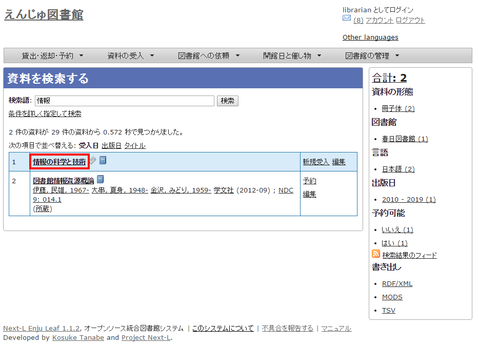

. すると選んだ雑誌タイトルの各号単位の書誌が一覧されます。どれか特定の号のリンクをクリックしてみます。
+
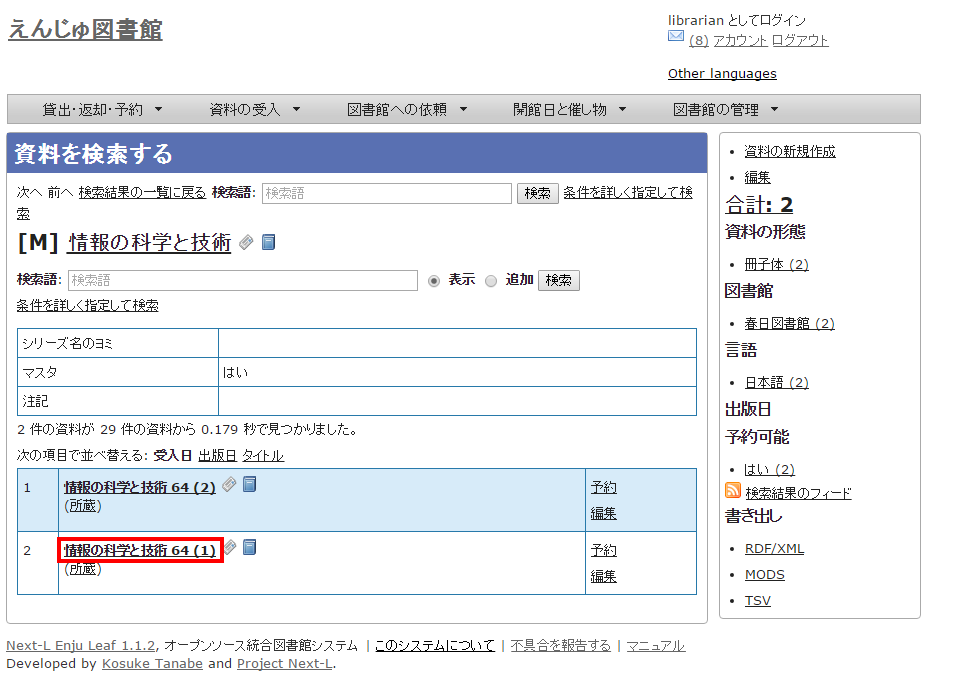
+
[NOTE]
======
* 右メニューの[資料の新規作成]をクリックすると個々の雑誌の号を登録する画面に遷移します。
* 右メニューの[編集]をクリックするとこの雑誌の情報を編集できます。
* 右メニューの図書館、言語、出版日、予約可能については、xref:enju_user_1.adoc#refine-search-results[利用者マニュアル 「検索結果を絞り込む」]を参照ください。
* 右メニューの検索結果のフィード、書き出しについては、xref:enju_webapi_1.adoc[Web APIマニュアル 「1章 検索結果一覧を取得する」]を参照ください。
======

. 各号の情報が表示されます。
+
image::../assets/images/1.1/serials_series_child.png[各号単位の情報が表示される画面]
+
[NOTE]
======
* 右メニューの画像ファイルの新規作成は表紙画像が登録できます（詳細 xref:enju_operation_4.adoc#add-image[「画像を登録する」]
* 右メニューの[この資料を予約する]はこの資料の予約画面へ遷移します。
* 右メニューの[(x人の予約待ち)]はこの資料の予約の一覧が表示されます。
* 右メニューの[編集]はこの資料を編集できます。
* 右メニューの[所蔵を編集]はこの資料の所蔵の一覧を表示します。
* 右メニューの[（新規作成）]はこの資料の所蔵を新規作成します。
* 右メニューの[派生資料を追加]はこの資料の派生資料を追加します（この説明の詳細は準備中です https://github.com/next-l/enju_leaf/issues/1060[issue #1060]
* 右メニューの書き出しについてはxref:enju_webapi_2.adoc[Web API マニュアル「第2 章　検索結果詳細を取得する」]を参照してください。
======

=== 雑誌（シリーズ）を登録する

雑誌を登録する場合は、まず雑誌タイトル単位のシリーズ情報を登録しておきます。

登録の方法は次の2種類があります。

* （推奨）<<add-search-ndlsearch,NDLサーチを検索して登録する方法>>
* <<add-manual,手動で資料を登録する方法>>

があります。

[[add-search-ndlsearch]]
==== NDLサーチを検索して登録する

NDLサーチ（国立国会図書館サーチ https://ndlsearch.ndl.go.jp/ ）で
検索した資料を登録することができます。

. ［資料の受入］メニューから［NDLサーチ検索によるインポート］を選択します。
+
image::../assets/images/1.1/image_operation_106_ndl.png[NDLサーチ検索によるインポート]

. 登録したい資料を検索します。検索語に登録したい資料の「JP番号」などを入力し、［検索］ボタンをクリックします。
+
[NOTE]
====
多くヒットしてしまい選びにくいことが想定されますので、
あらかじめ、NDLサーチ（国立国会図書館サーチ https://ndlsearch.ndl.go.jp/ ）
のサービス上で検索して、
当該資料の「JP番号」を調べておき、
その「JP番号」を使うとよいでしょう。
====
+
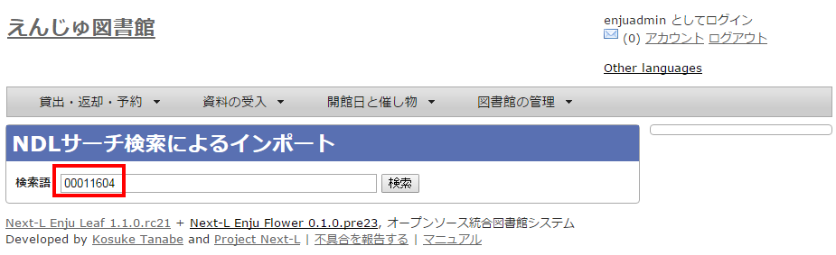

. 登録したい資料の[追加]をクリックします
+
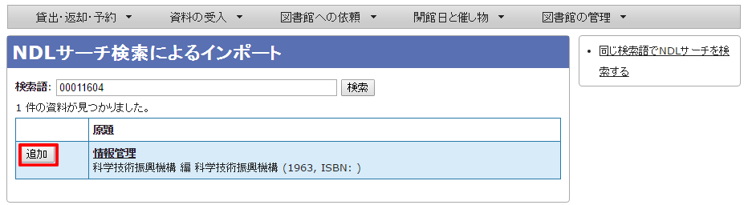

. 「資料は正常に作成されました。」と表示され、登録が完了します。
+
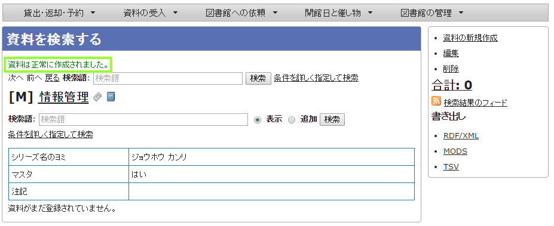

[[add-manual]]
==== 手動で資料を登録する

国立国会図書館に納本されていない雑誌など、<<add-search-ndlsearch,NDLサーチを検索して登録する>>方法が使えない場合には、
手動で資料を登録します。

. ［資料の受入］メニューから［手動で登録する］を選択します。
+
image::../assets/images/1.1/image_operation_input_manually_manifestation.png[手動で登録する]

. 原題にタイトル名称等を入力し、[逐次刊行物]にチェックを入れます。ここで入力した原題は検索結果一覧で表示されるものになります。[シリーズ情報]下の[別のシリーズ情報を追加する]リンクをクリックします。
+
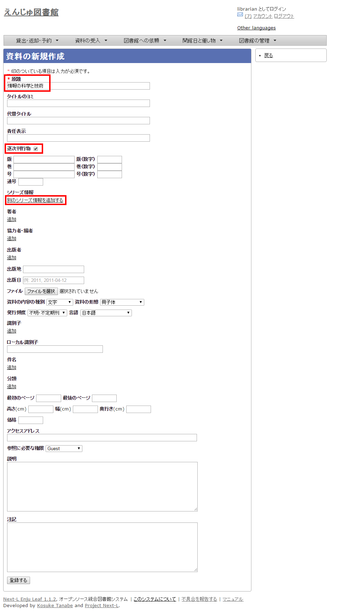
+
[NOTE]
======
* 右メニューの[戻る]をクリックすると資料の検索結果が表示されます（検索語になにもいれずに検索ボタンをクリックしたときの画面）。
======

. シリーズ情報を入力するためのテキストボックスが表示されるので、[シリーズ情報]内の[シリーズ名]等を入力し(シリーズ名は基本的には原題と同じものを入力します)、「マスタ」にチェックを入れ、[更新する]ボタンをクリックします。
+
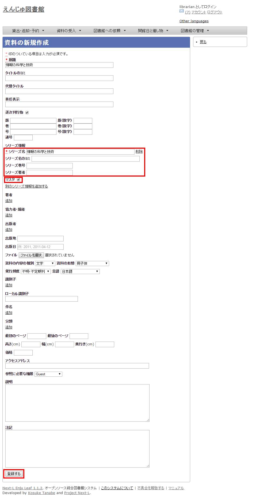

. 雑誌タイトル単位のシリーズ情報が作成されます。
+
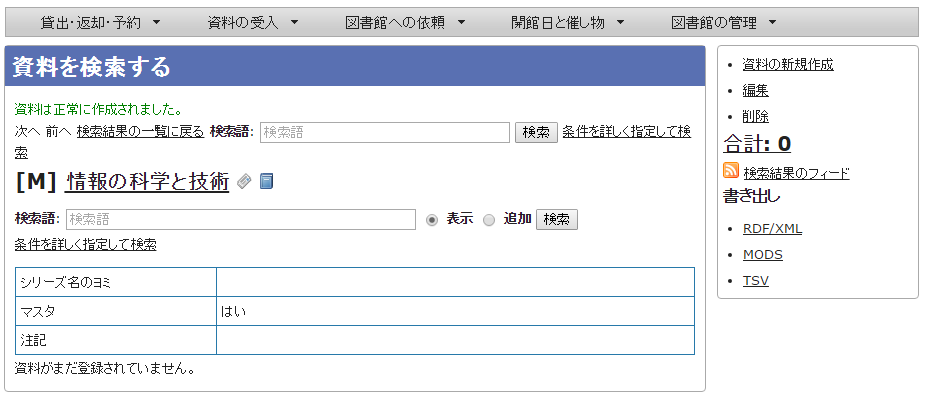
+
[NOTE]
======
* 右メニューの[資料の新規作成]をクリックすると個々の雑誌を登録する画面に遷移します。
* 右メニューの[編集]をクリックするとこの雑誌の情報を編集できます。
* 右メニューの[削除]をクリックするとこの雑誌の情報を削除できます。
======

=== 個々の雑誌を登録する

雑誌マスタ（シリーズ）を登録したら、各号単位の雑誌を登録します。
ここでは例として，雑誌「情報の科学と技術」の64巻1号を登録するものとして説明します。

追加したい雑誌のマスタレコードを探します。

. ［資料の受入］メニューから［雑誌・定期刊行物］を選択します。
+
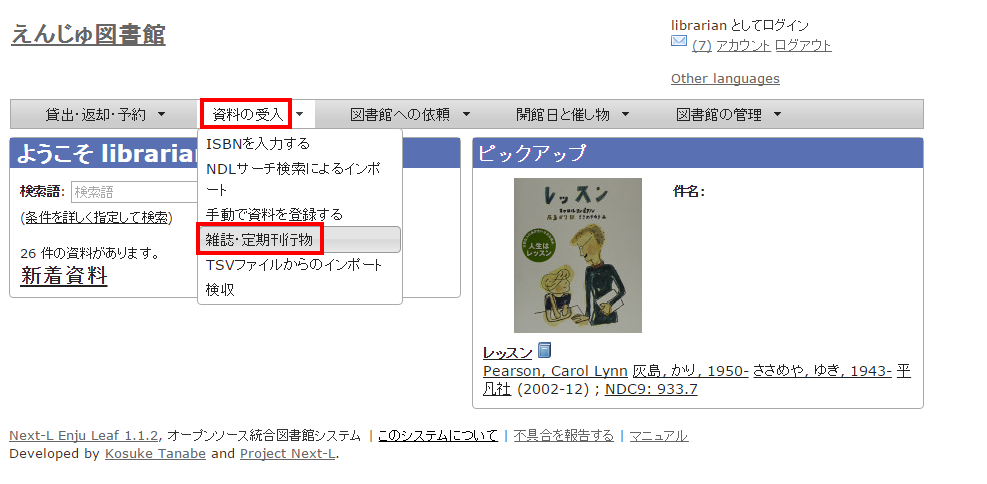
 
. 登録したい雑誌（シリーズ）の[新規受入]をクリックします。
+
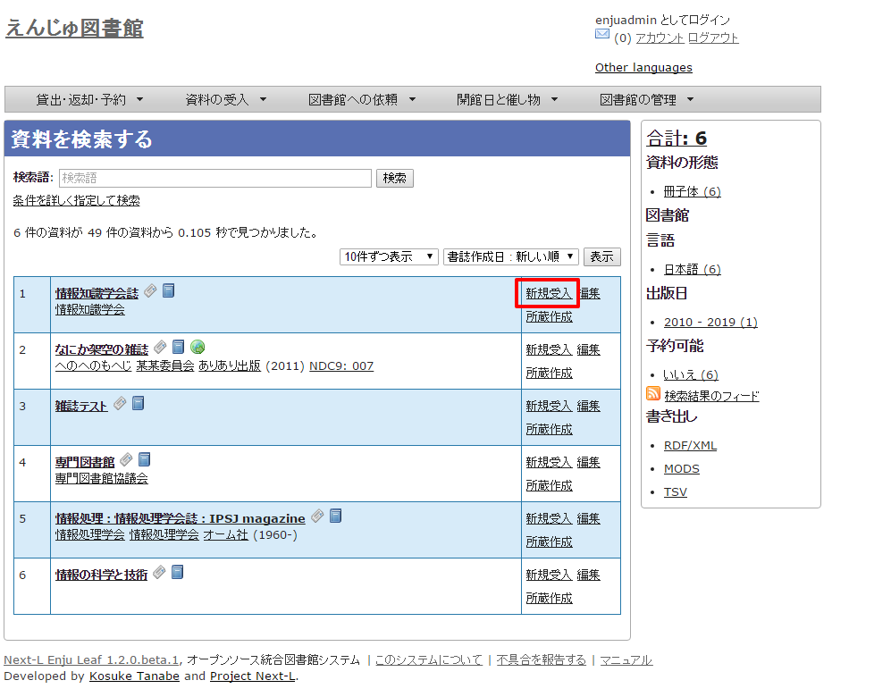
 
. シリーズ名や原題などは雑誌マスタの情報がコピーされるので、巻数や号など追加で必要な情報を入力し、[登録する]ボタンをクリックします。
+
※ コピーされる項目：原題、タイトルのヨミ、代替タイトル、責任表示、
逐次刊行物フラグ、著者、協力者・編者、出版者、出版地、発行頻度、
言語、件名、分類、高さ、幅、奥行き、価格、アクセスアドレス、参照に必要な権限
+
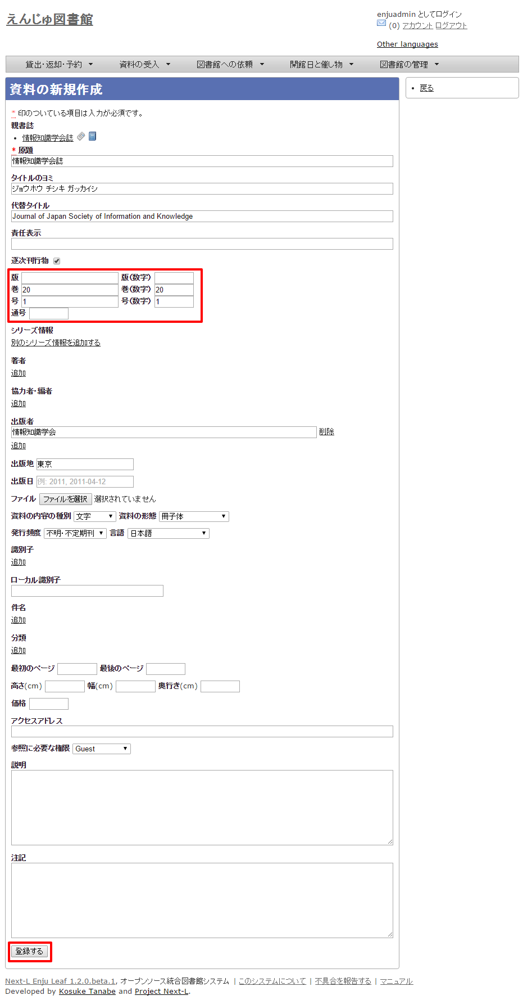
 
. 「資料は正常に作成されました。」のメッセージが表示され、雑誌が資料として登録されます。右メニューの「（新規作成）」のリンクをクッリクして所蔵情報の登録に進みます。
+
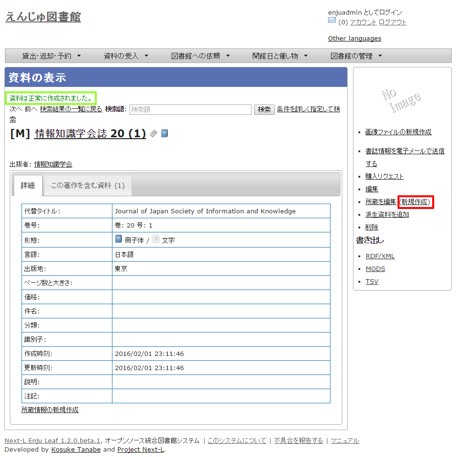
 
. xref:enju_operation_4.adoc#input-value[「所蔵情報を新規登録する」の「図書館や貸出状態などを設定して、［登録する］ボタンをクリックします。」]からの手順に従い、資料の所蔵情報を登録します。

////
[NOTE]
======
雑誌の場合、次の号を資料として登録しようとすると、「通号」などのデータが前回のデータを参照して自動的に更新されます。
======
////
 
=== TSVファイルを読み込んで登録する

[NOTE]
======
Next-L Enju Leaf 1.1.0 現在、
雑誌情報のTSVファイルを通じたインポート機能は
未実装です(開発予定はあります）（ https://github.com/next-l/enju_leaf/issues/721[issue #721] https://github.com/next-l/enju_leaf/issues/731[issue #731]）。
======

////

. 「図書を登録する」のxref:enju_operation_4.adoc#manifestation-tsv-import[「TSVファイルを読み込んで登録する」]の手順に従い、TSVファイルを使った一括インポートを行います。
+
[NOTE]
======
====== 【Column】TSVファイルの作り方
1行目に、それぞれの項目に関わるフィールド名を（できれば " " で囲って）指定します。
フィールド名とその意味については次の通りです。

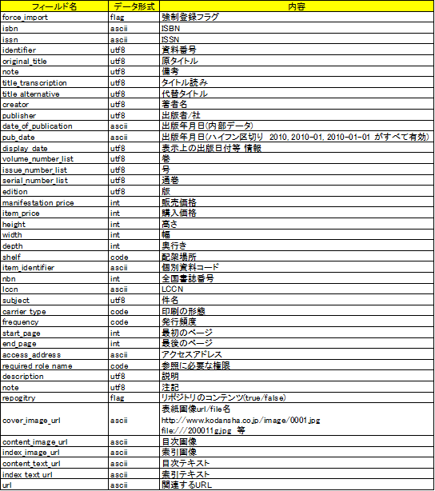

内部的に存在するもの

image::../assets/images/1.1/image_operation_104.png[内部的に存在するもの]
======

////

include::enju_operation_toc.adoc[]
