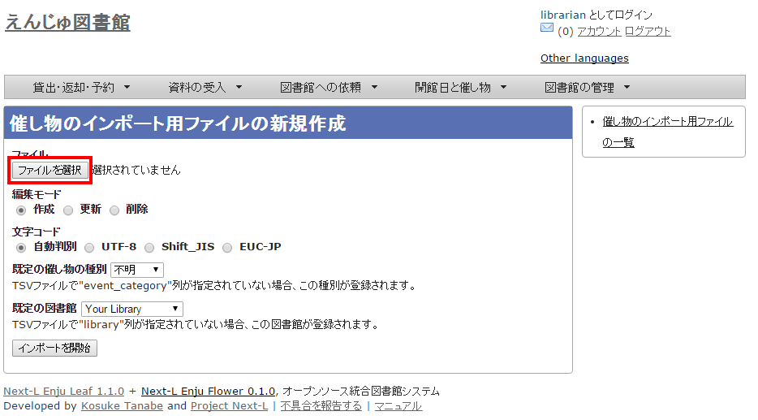

:toc: macro

toc::[]

[[add-closed-days-events]]
== 休館日と催し物を登録する

Enjuでは、休館日の登録に関して、次のような機能があります。

* 休館日を登録する
  図書館の休館日を登録します。

催し物（お知らせ）の登録には、次のような機能があります。

* 催し物（お知らせ）を登録する
* カレンダーを表示する
* 休館日や催し物を表示する

////
{::comment}7-1  enju_operation/holiday.md {:/comment}
{::comment}7-2  enju_operation/event.md {:/comment}
{::comment}7-3  enju_operation/calendar.md {:/comment}
////

=== 休館日を登録する

Enjuでは、図書館の休館日を登録することができます。

1. ［開館日と催し物］メニューから［全ての催し物］を選択します。
+
image::../assets/images/1.1/image_operation_event.png[全ての催し物]
+ 
[NOTE]
======
他の行き方：［図書館の管理］メニューから［システムの設定］を選択し、[開館日と催し物]のリンクをクリックでも可。
======
 
2. 右メニューの［開催日と催し物の新規作成］をクリックします。
+
image::../assets/images/1.1/image_operation_event_new.png[開催日と催し物の新規作成]

3. 催し物の種別で「休館日」を選択し、開始時刻で休館日の年・月・日を選択、名前に「休館日」と入力し、［終日］にチェックを入れて［登録する］ボタンをクリックします。
+
image::../assets/images/1.1/image_operation_event_edit.png[開催日と催し物の新規作成]

4. 「開館日と催し物は正常に作成されました。」のメッセージが表示され、休館日が登録されます。
+
image::../assets/images/1.1/image_operation_event_new_success.png[休館日登録]
+
[NOTE]
======
休館日を登録しておくことにより、資料を貸し出す際の返却日を1日ずらすよう設定できます。設定方法はxref:enju_setup_3.adoc#setup-user-group-checkup_type[初期設定マニュアル「利用者グループと貸出区分の関係を設定する」]をご覧ください。
======

=== 催し物を登録する

Enjuでは、図書館で行われるさまざまな催し物を登録し、カレンダーに表示できます。

==== 手動で催し物を登録する

1. ［開館日と催し物］メニューから［全ての催し物］を選択します。
+
image::../assets/images/1.1/image_operation_event.png[全ての催し物]
+
[NOTE]
======
他の行き方：［図書館の管理］メニューから［システムの設定］を選択し、[開館日と催し物]のリンクをクリックでも可。
======

2. 右メニューの［開催日と催し物の新規作成］をクリックします。
+
image::../assets/images/1.1/image_operation_event_new.png[開催日と催し物の新規作成]

3. 催し物の種別で「不明」を選択し、名前や開始時刻、終了時刻などを設定して、［登録する］ボタンをクリックします。
+
image::../assets/images/1.1/image_operation_event_other_new.png[開催日と催し物の新規作成]
+
[NOTE]
======
催し物の種別を追加する方法はxref:enju_setup_3.adoc#setup-event-type[初期設定マニュアル「催し物の種別を設定する」]をご覧ください。
======

4. 「開館日と催し物は正常に作成されました。」のメッセージが表示され、催し物が登録されます。
+
image::../assets/images/1.1/image_operation_event_other_new_success.png[催し物登録]

[[import-event-data]]
==== 催し物のデータをインポートする

既存のデータファイルを指定して読み込む「インポート」を行うと，一度に複数のデータを登録することができます。インポートするには，あらかじめデータファイルをTSV形式で作成しておきます(参照：<<event-tsv-import,「TSV形式のデータファイルの作り方」>>]（本節の最後に記載）)。

1. ［開館日と催し物］メニューから［インポート］を選択します。
+
image::../assets/images/1.1/image_operation_220.png[インポート]

2. ［ファイルを選択］ボタンをクリックしてインポートしたいファイルを選択します。
+

3. [編集モード]、[文字コード]、[既定の催し物の種別]、[既定の図書館]を選択して［インポートを開始］ボタンをクリックします。
+
image::../assets/images/1.1/image_operation_222_2.png[催し物ファイルのインポートを作成]
+
[NOTE]
======
［編集］モードで［更新］を選択すると、TSVファイルで催し物情報をまとめて更新できます。TSVファイルに必要なのは、更新したい催し物のID（id）と、更新したいフィールドの内容になります。また、［削除］を選択すると、TSVファイルで催し物情報をまとめて削除できます。この場合は、TSVファイルに必要なのは、削除したい催し物のID（<code>id</code>）のみです。
======
+
[NOTE]
======
[文字コード]は基本的には自動判別でよいですが、うまくいかない場合は、文字コードを指定するようにしてください。
======
+
[NOTE]
======
[既定の図書館]は、TSVファイルに[図書館]（library列）の値がない場合やTSVファイルで当該値に無効な値を指定していた場合に登録される値となります。TSVファイルに有効な値が指定されていた場合はTSVファイルを優先します。プルダウンメニューのデフォルト値は、現在ログイン中のユーザの図書館です。 
======

4. 「催し物のインポート用ファイルは正常に作成されました。」のメッセージが表示され、催し物のデータがインポート準備が整います。右の[催し物のインポート用ファイルの一覧] をクリックします。
+
image::../assets/images/1.1/image_operation_223.png[催し物ファイルのインポート]

5. 今までのインポート結果の一覧が表示されます。[状態]を見ると処理結果がわかります。インポートが完了したものは[完了]と表示されます。[処理待ち]のものは現在、実行中です。インポート完了時にはEnjuのメッセージ機能にてお知らせします（「インポートが完了しました」いうメッセージが送られてきます）。注）Next-L Enju Leaf 1.1.0.rc12以前のバージョンの場合は毎時0分にインポート処理が開始します。 
+
image::../assets/images/1.1/image_operation_223_2.png[催し物ファイルのインポート一覧]
+
[NOTE]
======
この画面は[図書館の管理]メニュー→[インポート]→[開催日と催し物]とすればいつでも閲覧できます。
======

[[event-tsv-import]]
==== 【Column】TSV形式のデータファイルの作り方
TSV形式のデータファイル（TSVファイル）とは、項目をタブで区切ったテキストファイルです。Enjuで利用するTSVファイルでは、1行目にそれぞれの項目に関わるフィールド名を指定します。フィールド名および値は原則として &ldquo; &ldquo; で囲みます。
フィールド名とその意味については次の通りです。

[.table.table-bordered.table-condensed.table-striped,cols="1,1,1,6,4"]
.開館日や催し物などの情報に関わる項目
|===
|必須/任意|フィールド名|データ形式|内容|未入力の場合（確認中）

|任意
|id
|int
|ID(新規作成のときは無視される、更新・削除では必須)
|自動設定

|必須
|name
|utf8
|名前（イベントの名称）
|インポートが「失敗」になる

|任意
|display_name
|utf8
|イベントの表示名
|nameに入力したものが使用される

|任意
|event_category
|code
|催し物の種別。「催し物の種別」の[名前]を値とします(例：休館日であれば"closed"など）。見方については、xref:enju_setup_3.adoc#setup-event-type[初期設定マニュアル「催し物の種別を設定する」] を参照してください。
|インポート時に「既定の催し物の種別」として指定した種別

|任意
|library
|code
|図書館。「図書館の一覧」の[名前]を値とします(例："yours"など）。見方については、xref:enju_setup_3.adoc#configure-libraries[初期設定マニュアル「3-2 個々の図書館を設定する」]を参照してください。
|インポート時に「既定の図書館」として指定した図書館

|必須
|start_at
|ISO8601
|開始時刻（例：2014-06-24 15:00:00 +0900 もしくは 2014-06-24）、all_dayがTRUEの場合は時刻が無視される。
|インポートが「失敗」になる

|必須
|end_at
|ISO8601
|終了時刻（例：2014-06-24 15:00:00 +0900 もしくは 2014-06-24）、all_dayがTRUEの場合時刻は無視される。
|インポートが「失敗」になる

|任意
|all_day
|真偽
|終日かどうか。TRUE or FALSE
|FALSE

|任意
|note
|utf8
|注記
|未設定

|任意
|dummy
|utf8
|ダミー行（なにかを書いていると無視する行）
|(読み込む行だと判定される）
|===

[.table.table-bordered.table-condensed.table-striped,cols="1,1,1,1,1,1,1,1"]
.＊設定例
|===
|"name"|"event_category"|"library"|"start_at"|"end_at"|"all_day"|"note"|"dummy"

|"名前（イベントの名称）"
|"催し物の種別"
|"図書館"
|"開始時刻"
|"終了時刻"
|"終日"
|"注記"
|"この行はダミー行"

|必須
|任意
|任意
|必須
|必須
|任意
|任意
|任意

|"おはなし会"
|"story_telling"
|"kiri"
|"2009-04-05 15:00:00 +0900"
|"2009-04-05 16:00:00 +0900"
|FALSE
|"短めのお話会です"
|

|"蔵書点検"
|
|"tachibana"
|"39904"
|"39905"
|
|
|

|"休館日"
|"closed"
|"tachibana"
|"40634"
|"40636"
|
|"蔵書点検のため長めです"
|
|===

==== カレンダーを利用する

開館日や催し物などの情報を、カレンダーとして表示することができます。

1. ［開館日と催し物］メニューから［カレンダー］を選択します。
+
image::../assets/images/1.1/image_operation_224.png[カレンダー]

2. カレンダーが表示されます。
+
image::../assets/images/1.1/image_operation_225.png[カレンダー表示]
 
[NOTE]
======
* 各催し物をクリックするとその催し物の詳細が表示されます。
* [今日]をクリックすると今日のカレンダーに移動します。
* [＜]をクリックすると前の月に移動します。
* [＞]をクリックすると次の月に移動します。
* 右メニューの[一覧表示]をクリックすると休館日や催し物を一覧表示します。
* その他の右メニューについては、<<show-closed-days-event,「休館日や催し物を表示する」>>と同様です。
======

[[show-closed-days-event]]
==== 休館日や催し物を表示する

図書館の休館日や催し物を表示することができます。

1. ［開館日と催し物］メニューから［全ての催し物］を選択します。
+
image::../assets/images/1.1/image_operation_event.png[全ての催し物]
+ 
[NOTE]
======
他の行き方：［図書館の管理］メニューから［システムの設定］を選択し、[開館日と催し物]のリンクをクリックでも可。
======
 
2. 詳細をみたい休館日や催し物の名前のリンクをクリックします。
+
image::../assets/images/1.1/image_operation_event_browse.png[開催日と催し物の名前のリンク]
+
[NOTE]
======
* この画面では、すでに登録済みの休館日や催し物が一覧されています。
* [編集]リンクをクリックすると、登録済みの休館日や催し物を修正できます。
* [削除]リンクをクリックすると、登録済みの休館日や催し物を削除できます。
* 検索語にキーワードを入れて、検索ボタンをクリックするとヒットした休館日や催し物のみを表示します。
* [今後の催し物]をクリックすると、今後の休館日や催し物のみを表示します。
* [過去の催し物]をクリックすると、過去のの休館日や催し物のみを表示します。
* 図書館のリンクをたどるとその図書館の情報ページを表示します。
* 名前のリンクをたどるとその休館日や催し物の詳細を表示します。
* 右メニューの[カレンダー表示]をクリックすると登録済みの休館日や催し物をカレンダー形式で表示します。
* 右メニューの[催し物のインポート]をクリックすると催し物のインポートファイルの一覧の画面に遷移します（参照：<<import-event-data,「催し物のデータをインポートする」>>の5.の画面）
* 右メニューの図書館名のリンクをクリックするとその図書館の休館日や催し物のみを表示します。
* 右メニューの[RSS]リンクをクリックするとRSS形式で登録済みの休館日や催し物を表示します(参照：<<event-rss,「【Column】 休館日や催し物のRSS」（本節の最後に記載）>>）。
* 右メニューの[TSV]リンクをクリックするとTSV形式で登録済みの休館日や催し物を表示します(参照：<<event-tsv,「【Column】 休館日や催し物のTSV」（本節の最後に記載）>>)。
* 右メニューの[iCalendar]リンクをクリックするとiCalendar形式で登録済みの休館日や催し物をダウンロードできます(参照：<<event-icalendar,「【Column】 休館日や催し物のiCalendar」（本節の最後に記載）>>)。他のカレンダーソフトやカレンダーサービスに登録済みの休館日や催し物を読み込むことができます。
======

3. 休館日や催し物の詳細が表示されます。
+
image::../assets/images/1.1/image_operation_event_browse_2.png[開催日と催し物の詳細]
+
[NOTE]
======
* 右メニューの[編集]リンクをクリックすると、登録済みの休館日や催し物を修正できます。
* 右メニューの[削除]リンクをクリックすると、登録済みの休館日や催し物を削除できます。
* 右メニューの[開催日と催し物の一覧]リンクをクリックすると、登録済みの休館日や催し物の一覧を表示します。
======

[[event-rss]]
=== 【Column】 休館日や催し物のRSS

[[event-tsv]]
=== 【Column】 休館日や催し物のTSV

[source,tsv]
----
library	name	note	start_at	end_at
"Your Library"	"休館日"	""	"2015-12-07 00:00:00 +0900"	"2015-12-07 23:59:59 +0900"
"Your Library"	"休館日"	""	"2015-11-05 00:00:00 +0900"	"2015-11-05 23:59:59 +0900"
----

[[event-icalendar]]
=== 【Column】 休館日や催し物のiCalendar

[source,iCalendar]
----
BEGIN:VCALENDAR
PRODID;X-RICAL-TZSOURCE=TZINFO:-//com.denhaven2/NONSGML ri_cal gem//EN
CALSCALE:GREGORIAN
VERSION:2.0
BEGIN:VTIMEZONE
TZID;X-RICAL-TZSOURCE=TZINFO:Asia/Tokyo
BEGIN:STANDARD
DTSTART:19510908T020000
RDATE:19510908T020000
TZOFFSETFROM:+1000
TZOFFSETTO:+0900
TZNAME:JST
END:STANDARD
END:VTIMEZONE
BEGIN:VEVENT
DTEND;TZID=Asia/Tokyo;VALUE=DATE-TIME:20151207T235959
DTSTART;TZID=Asia/Tokyo;VALUE=DATE-TIME:20151207T000000
DESCRIPTION:休館日
LOCATION:IbarakiTsukuba
END:VEVENT
BEGIN:VEVENT
DTEND;TZID=Asia/Tokyo;VALUE=DATE-TIME:20151105T235959
DTSTART;TZID=Asia/Tokyo;VALUE=DATE-TIME:20151105T000000
DESCRIPTION:休館日
LOCATION:IbarakiTsukuba
END:VEVENT
END:VCALENDAR
----

include::enju_operation_toc.adoc[]
