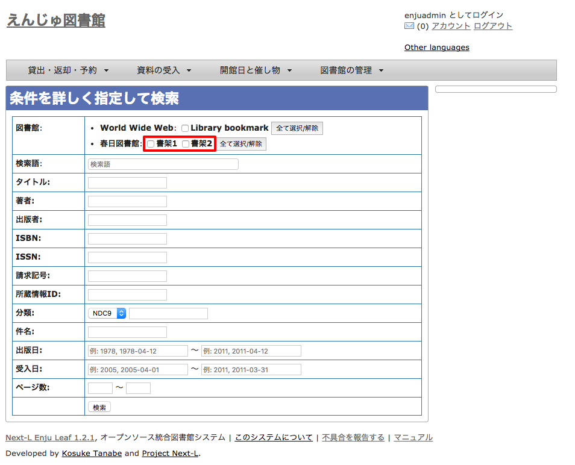
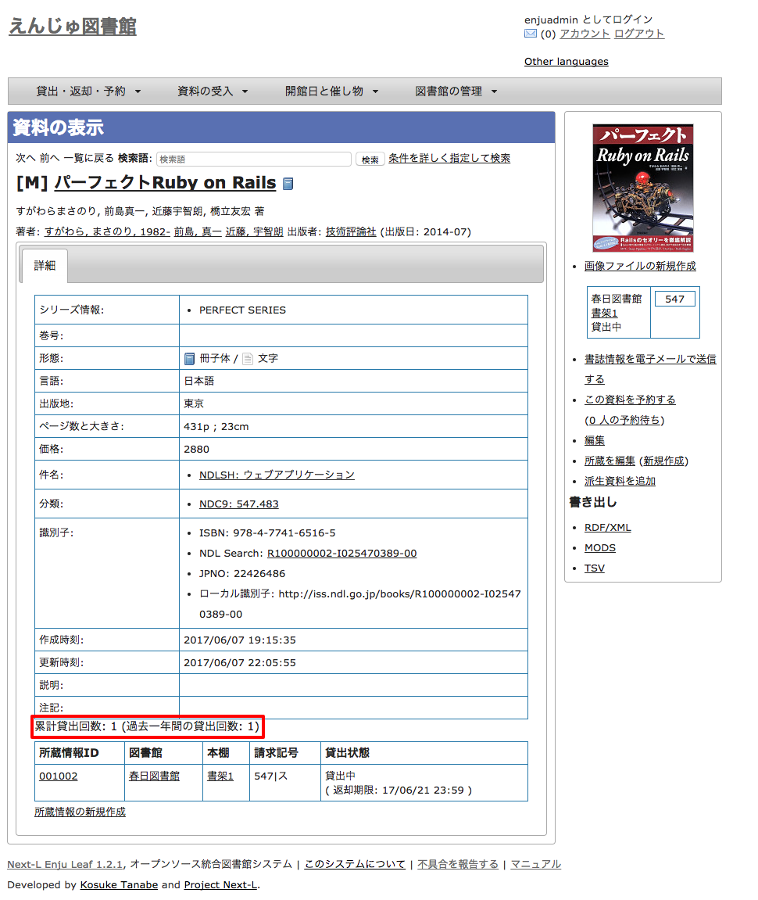

:toc: macro

toc::[]

== 資料を検索する

Enjuを利用した資料の検索方法には、演算子やフィールド名を直接入力して検索する方法と、該当のテキストボックスに検索語入力する方法があります。

基本的な使い方については、 xref:enju_user_1.adoc[利用者マニュアル「第1章 資料を検索する」] を
参照してください。

ここでは、Library権限とAdministrator権限でログインした時にのみ利用できる機能について説明します。

=== 本棚を指定した検索

xref:enju_user_1.adoc#advanced-search[利用者マニュアル 「条件を詳しく指定して検索する」]の
「条件を詳しく指定して検索」の画面にて、本棚を指定して検索ができます（User権限やGuest権限の場合は本棚のチェックボックスは表示されません）。

=== 個別の資料の貸出回数を確認する

「資料の表示」の画面
（xref:enju_user_1.adoc#show-item[利用者マニュアル「キーワードで検索する」の3. の資料の詳細画面]）
の下部に、資料の貸出回数が表示されます。

include::enju_operation_toc.adoc[]
