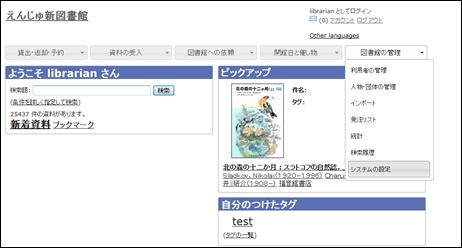
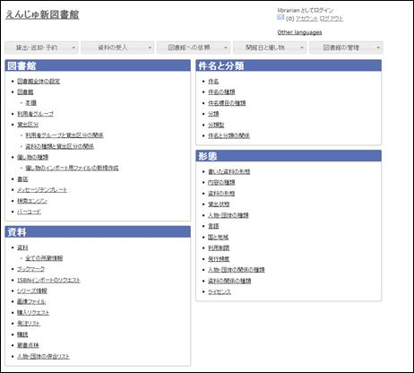
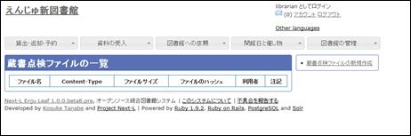
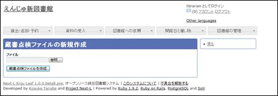

:toc: macro

toc::[]

//{::comment}10-1,2  enju_operation/inventory.md {:/comment}

書架のバーコードなどを読み込んで作成した蔵書点検用のファイルを、Enjuに登録されたデータと照合し、蔵書点検を行うことができます。

[NOTE]
====
【Memo】現在、開発中の機能です。リリースの目途はたっていません。
====

////
{::comment}

== 蔵書点検を行う

=== 蔵書点検ファイルを取り込む

書架のバーコードを読み込んで作成した蔵書点検用のファイルを、Enjuに取り込みます。

. ［図書館の管理］メニューから［システムの設定］を選択します。
+

. ［資料］グループの［蔵書点検］をクリックします。
+

. 右メニューの［蔵書点検ファイルの新規作成］を選択します。
+

. ［参照］ボタンをクリックします。
+

. インポートしたいファイルを指定し、［開く］をクリックします。

. ［蔵書点検ファイルを作成］ボタンをクリックします。
+

. 「蔵書点検ファイルは正常に作成されました。」のメッセージが表示され、蔵書点検ファイルが取り込まれます。

## 蔵書点検を行う

取り込んだ蔵書点検用のファイルのデータを、Enjuのデータと照合します。

. ［図書館の管理］メニューから［システムの設定］を選択します。
+
image::../assets/images/1.1/image_operation_255.jpg[システムの設定]

. ［資料］グループの［蔵書点検］をクリックします。
+

. 右メニューの［蔵書点検を行う］を選択します。

. ［参照］ボタンをクリックします。

. 蔵書点検ファイルを指定し、［開く］をクリックします。

. 蔵書点検を行う書架の範囲を設定します。

. ［蔵書点検を行う］ボタンをクリックします。

. 蔵書点検の結果が表示されます。

{:/comment}
////

include::enju_operation_toc.adoc[]
