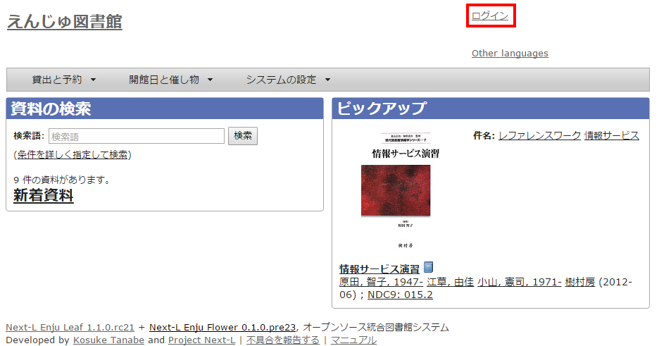
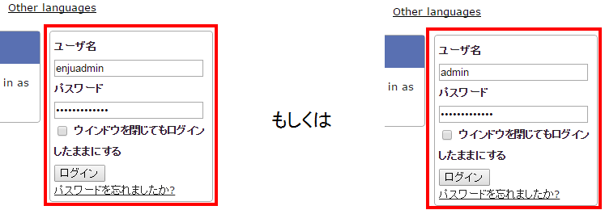
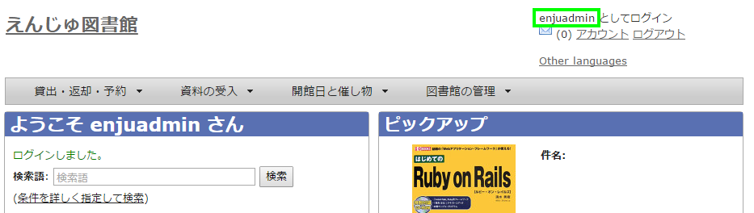
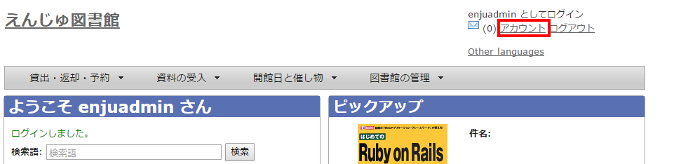
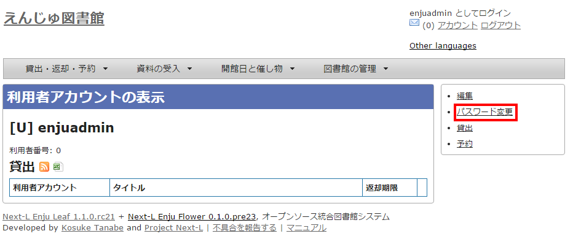
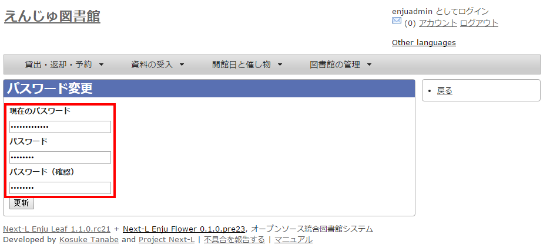
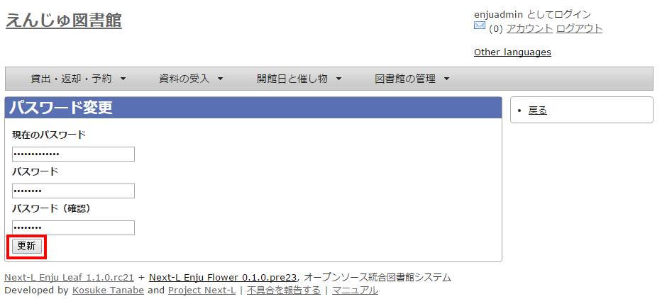
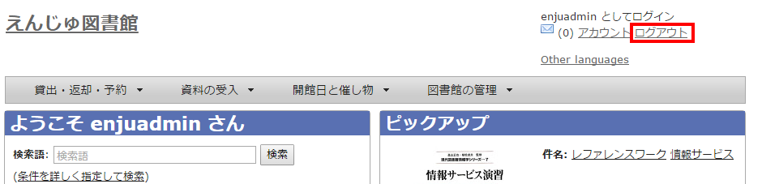

:toc: macro

toc::[]

== Enjuを利用する

Enjuの利用を始めるには，次の作業をします。

* ユーザーアカウントの作成
* ログイン／ログアウト
* ユーザーアカウントの編集

Enjuは，利用者同士のコミュニケーション機能も搭載されています。

* メッセージの送信
* メッセージのログの一覧表示・印刷

////
{::comment}2-1 enju_setup/role.md{:/comment}

{::comment}2-2 enju_setup/login.md{:/comment}
 
{::comment}2-3 enju_setup/message.md{:/comment}
////

=== ユーザーアカウントの種類を知る

==== アカウント（ユーザー）の種類

Enjuを利用するには，アカウントを取得し，ログインします。アカウント（ユーザー）には次の3種類があります。

* Administrator（管理者）
* Librarian（図書館員）
* User（図書館利用者）

注：この3種類のことを、3つの権限と呼ぶこともあります。

注：検索するだけであれば、ログインしなくても、Enjuを利用可能です。
Enju ではそのようなログインしないユーザーの権限のことをGuest権限と呼んでいます。

==== Administrator（管理者）の権限で利用できる機能

Administrator（管理者）の権限を持つアカウントでログインすると，Enjuで次の機能を利用することができます。

* 図書館利用者としてのすべての機能
* 図書館利用者の登録
* 資料の受入
* 資料の貸出／返却／予約
* 催し物（お知らせ）の登録
* 開館日（休館日）の登録
* レファレンスの処理
* 統計機能
* 印刷その他の機能
* アカウントの権限の変更

=== アカウントを編集する

アカウントの権限以外の項目の編集は，Librarian（図書館員）でも行うことができます。操作の方法については，xref:enju_operation_3.adoc#update-user-info[運用マニュアル「利用者情報を変更する（編集する）」]を参照してください。

=== ログイン／ログアウトする

Enjuを利用するには，まずシステムにログインします。

==== ログインする

. Enjuにアクセスし，［ログイン］をクリックします。  
+

. ユーザ名とパスワードを入力し［ログイン］をクリックします。  
+
インストール直後の場合には，Enjuのユーザとしては 「 enjuadmin 」 もしくは 「 admin 」だけが登録されており，その初期パスワードは「 adminpassword 」です。
+

+
[NOTE]
====
【Memo】ブラウザを閉じてもログイン状態を保持したい場合は，［ウィンドウを閉じてもログインしたままにする］をオンにします。
====

. 自分のアカウントでログインされていることを確認します。  
+

==== パスワードを変更する

. ［アカウント］をクリックします。  
+

. 右メニューの［パスワード変更］をクリックします。  
+

. ［現在のパスワード］と「パスワード」「パスワード(確認)」を入力します。パスワードは画面には表示されません。また「パスワード」と「パスワード(確認)」は同じものを入れてください。  
+

. ［更新］ボタンを押します。  
+

==== ログアウトする

. ［ログアウト］をクリックします。
+

. ログアウトされたこと（［ログイン］の表示に変わったこと）を画面で確認します。
+

[NOTE]
====
時間の経過にともなって自動ログアウトする機能は用意されていません。Administrator（管理者）は利用者の個人情報などを閲覧できる権限を持っているので，パソコンを共有する時や離席時などには，必ずログアウトしてください。
====

=== メッセージをやり取りする

Enjuのメッセージ機能を利用して，利用者にメッセージを送信することができます。
詳細については，
xref:enju_operation_2.adoc#message-function[運用マニュアル「メッセージをやり取りする」]
を参照してください。

include::enju_setup_toc.adoc[]
