== 各種形態や状態等に関するシステム設定を行う

:toc: macro

toc::[]

Enjuの利用を始めるにあたり，形態・状態等に関するシステム設定として，次のような設定作業を行います。

* 資料の形態の作成
* 貸出状態の編集
* 言語の編集
* 利用制限の編集作成
* 発行頻度の編集作成
* 資料の関係の種類の作成

////
{::comment}5-1 enju_setup/carrier_type.md {:/comment}

{::comment}5-2 enju_setup/ciculaion_status.md {:/comment}

{::comment}5-3 enju_setup/language.md {:/comment}

{::comment}5-4 enju_setup/use_restriction.md {:/comment}

{::comment}5-5 enju_setup/frequency.md {:/comment}

{::comment}5-6 enju_setup/manifestation_relationship_type.md {:/comment}
////

=== 資料の形態を作成する

資料の形態を設定します。

* 参考文献：
** RDA: "3.3.1.3 Recording Carrier Type"
** LCの https://www.loc.gov/standards/valuelist/rdacarrier.html["Term and Code List for RDA Carrier Types"]

==== 設定項目

* 名前：資料の形態を入力します。
* 表示名：画面に表示する名称を入力します。
* 資料の形態と貸出区分の関係：資料の形態と貸出区分の関係を入力します。（注：新規作成画面では設定できません。いったん、新規作成したあと、編集画面で設定します）
* ファイル：検索結果などに表示されるアイコンの画像ファイルを登録します。
* 注記：注意事項や特記事項などを入力します。

==== 設定方法

. ［図書館の管理］メニューから［システムの設定］を選択します。
+
image::../assets/images/1.1/image_system_setup.png[システムの設定]

. ［資料の形態］をクリックします。
+
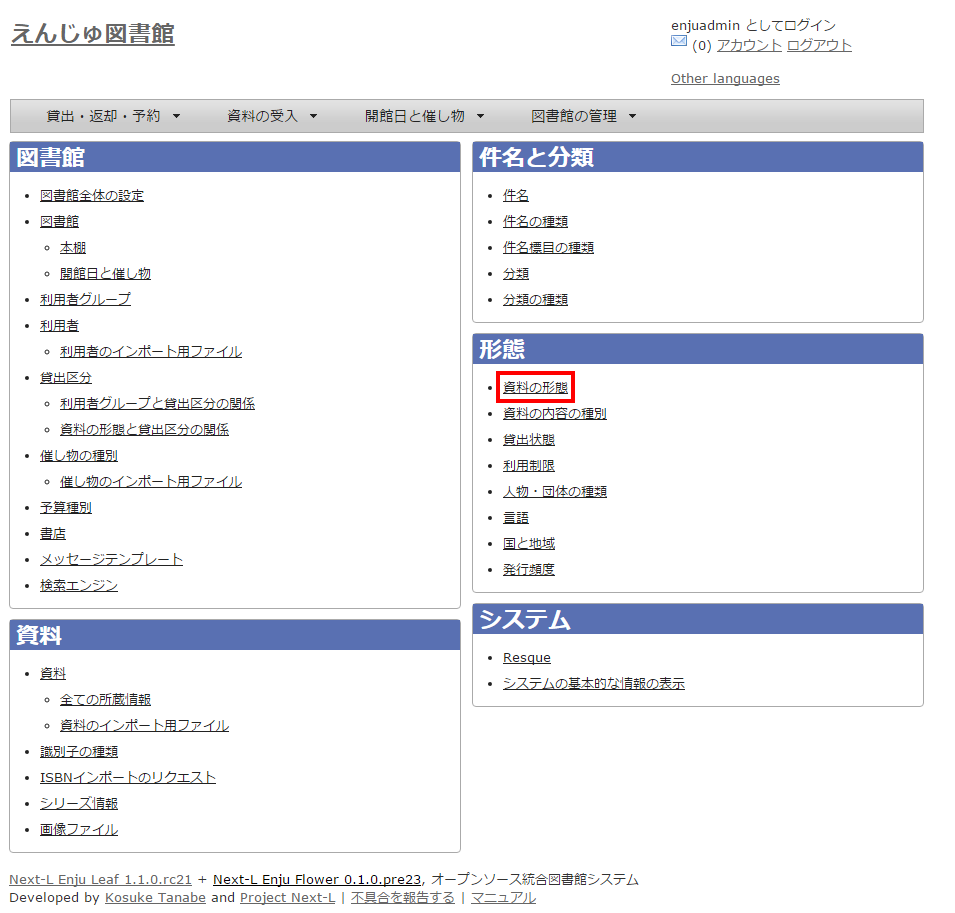

. 右メニューの［資料の形態の新規作成］をクリックします。
+
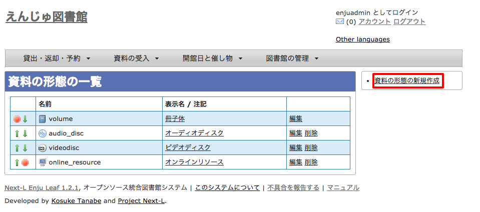
+
[NOTE]
====
【Memo】登録済みの資料の形態を修正したい場合は[編集]リンクをクリックします。順序を変更したい場合は、最左列の image:../assets/images/1.1/arrow_up.png[上矢印] や image:../assets/images/1.1/arrow_down.png[下矢印] をクリックすることで変更できます。
====
+
. 設定項目に必要事項を入力し、［登録する］ボタンをクリックして，設定内容を登録します。
+
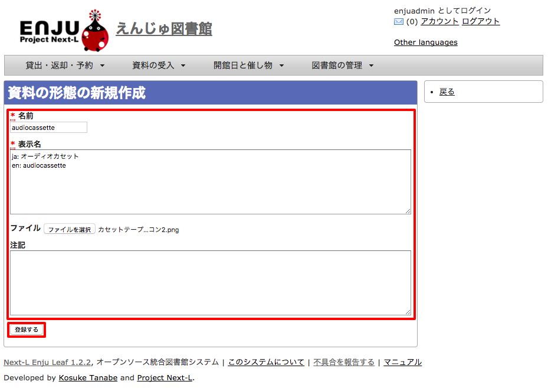

. 「資料の形態は正常に作成されました。」とメッセージが表示されます。貸出区分との関連付けを行うために右メニューの[編集]をクリックします（新規作成の場合、貸出区分との関連付けができないため）。
+
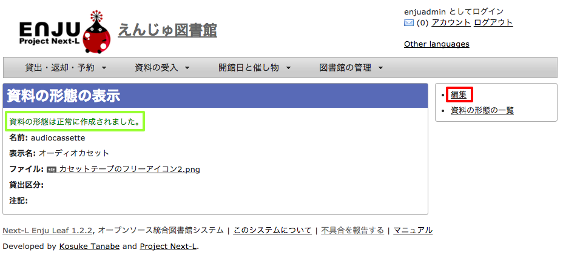

. 資料の形態と貸出区分の関係の[追加]リンクをクリックします。
+
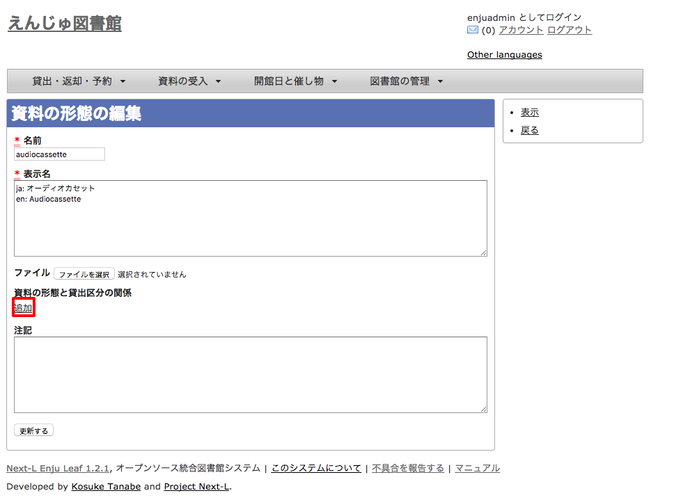

. 貸出区分のメニューを選びます（例では、CDを選んでいます）。
+
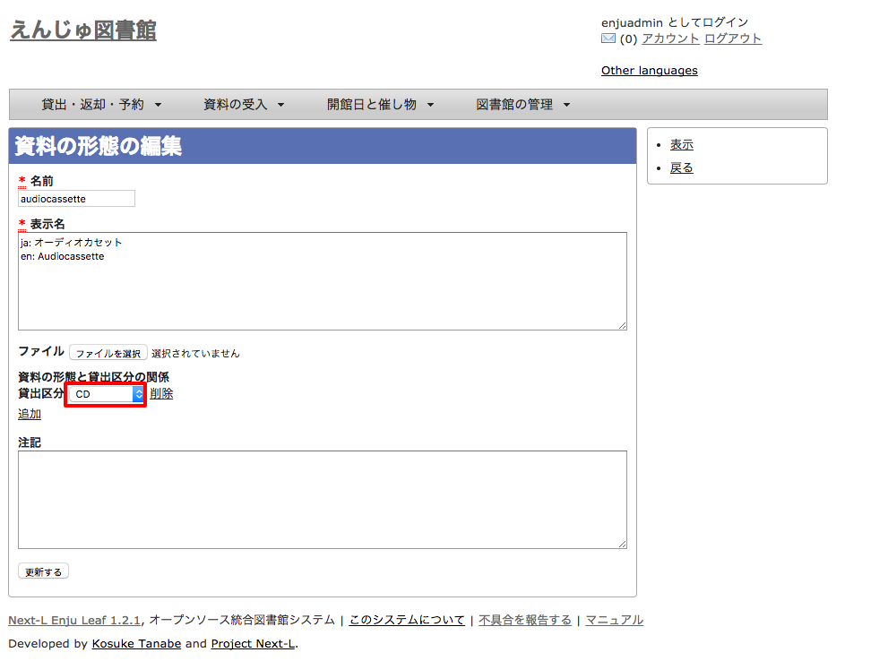
+
[NOTE]
====
【Memo】メニューに関連付けたい貸出区分がない場合は、貸出区分を新規作成します。作成方法は、xref:enju_setup_3.adoc#_貸出区分を設定する[]を参照してください。
====
+
. 貸出区分に先ほど選択した貸出区分が表示されているのを確認します（例ではCD）。これで、資料の形態が作成できました。
+
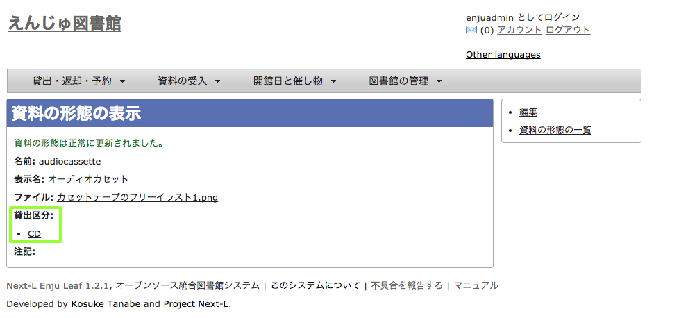
+
[NOTE]
====
【Memo】資料の形態と貸出区分の関係づけについては、[図書館の管理]->[システムの設定]->図書館の[資料の形態と貸出区分の関係]リンクをたどった先でもできます（-> 詳細：xref:enju_setup_3.adoc#_資料の形態と貸出区分の関係を設定する[資料の形態と貸出区分の関係を設定する]）。
====

=== 資料の内容の種別を作成する

資料の内容の種別を設定します。

* 参考文献：
** RDA："6.9.1.3 Recording Content Type"
** LCの https://www.loc.gov/standards/valuelist/rdacontent.html["Term and Code List for RDA Content Types"]

==== 設定項目

* 名前：資料の内容の種別を入力します。
* 表示名：画面に表示する名称を入力します。
* 注記：注意事項や特記事項などを入力します。

==== 設定方法

. ［図書館の管理］メニューから［システムの設定］を選択します。
+
image::../assets/images/1.1/image_system_setup.png[システムの設定]

. ［資料の形態］をクリックします。
+
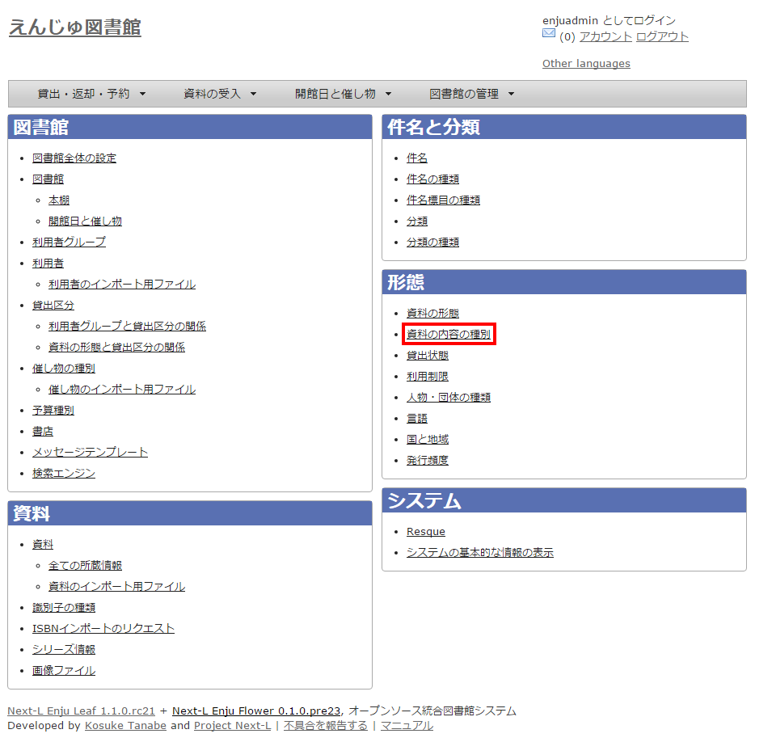

. 右メニューの［資料の内容の種別の新規作成］をクリックします。
+
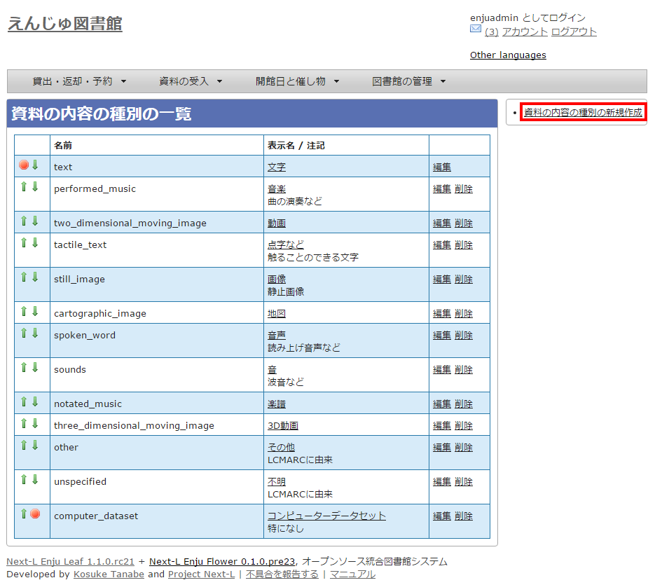
+
[NOTE]
====
【Memo】登録済みの資料の種別を修正したい場合は[編集]リンクをクリックします。削除したい場合は、[削除]リンクをクリックします。ただし、関連する書誌レコードがあるものについては[削除]リンクは表示されず、削除できません。順序を変更したい場合は、最左列の image:../assets/images/1.1/arrow_up.png[上矢印] や image:../assets/images/1.1/arrow_down.png[下矢印] をクリックすることで変更できます。
====
+
. 設定項目に必要事項を入力し、［登録する］ボタンをクリックして，設定内容を登録します。
+
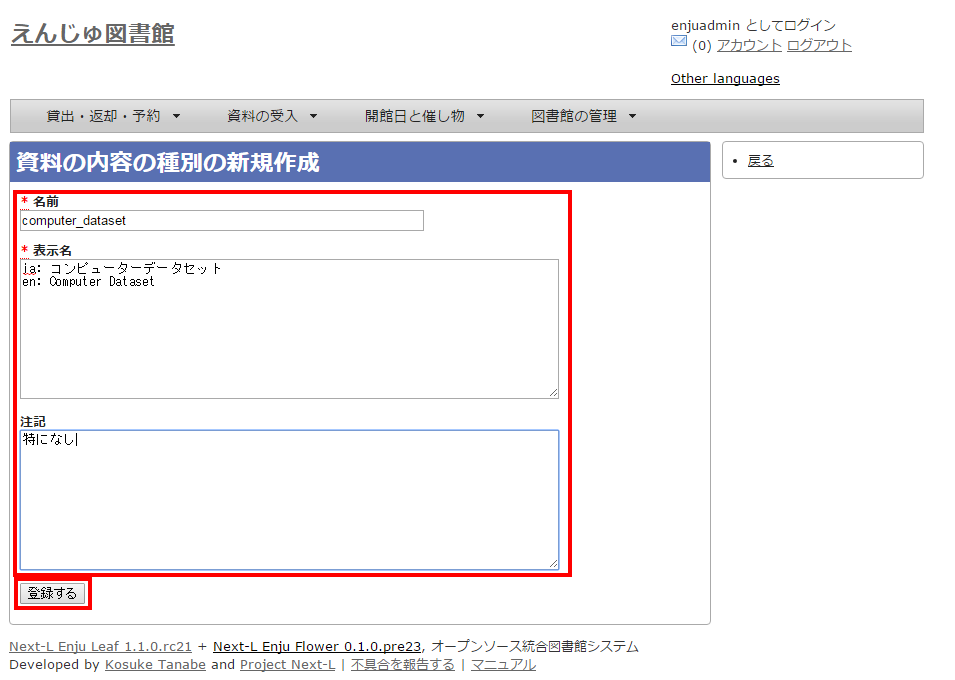

. 「資料の内容の種別は正常に作成されました。」とメッセージが表示されます。これで、資料の内容の種別が作成できました
+
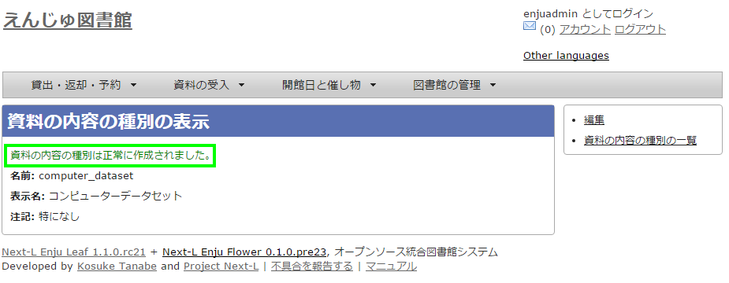

=== 貸出状態を編集作成する

システムの標準設定を変更する必要がでることは基本的にはありません。 所蔵情報登録の際に表示される[貸出状態]のメニューで表示される文言や、メニューの表示順序を変更したいときのみ編集の必要がでます。

==== 設定項目

* 名前：貸出状態の名称を入力します。
* 表示名：画面に表示する名称を入力します。
* 注記：注意事項や特記事項などを入力します。

==== 設定方法

1. ［図書館の管理］メニューから［システムの設定］を選択します。
+
image::../assets/images/1.1/image_system_setup.png[システムの設定]

2. ［貸出状態］をクリックします。
+
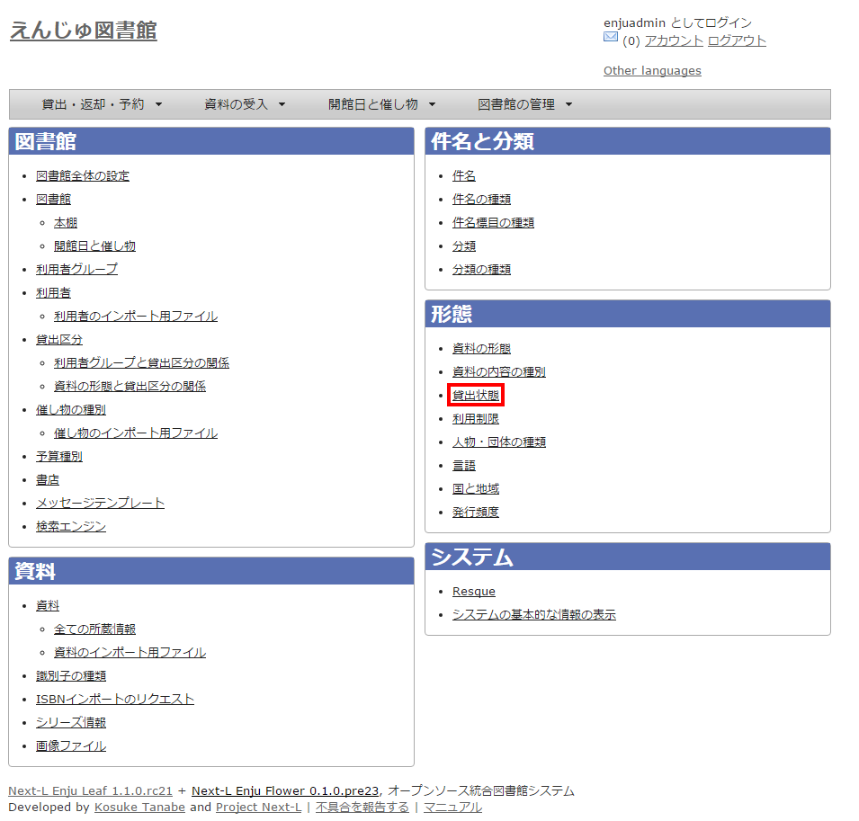

3. 設定したい項目の［編集］をクリックします。
+
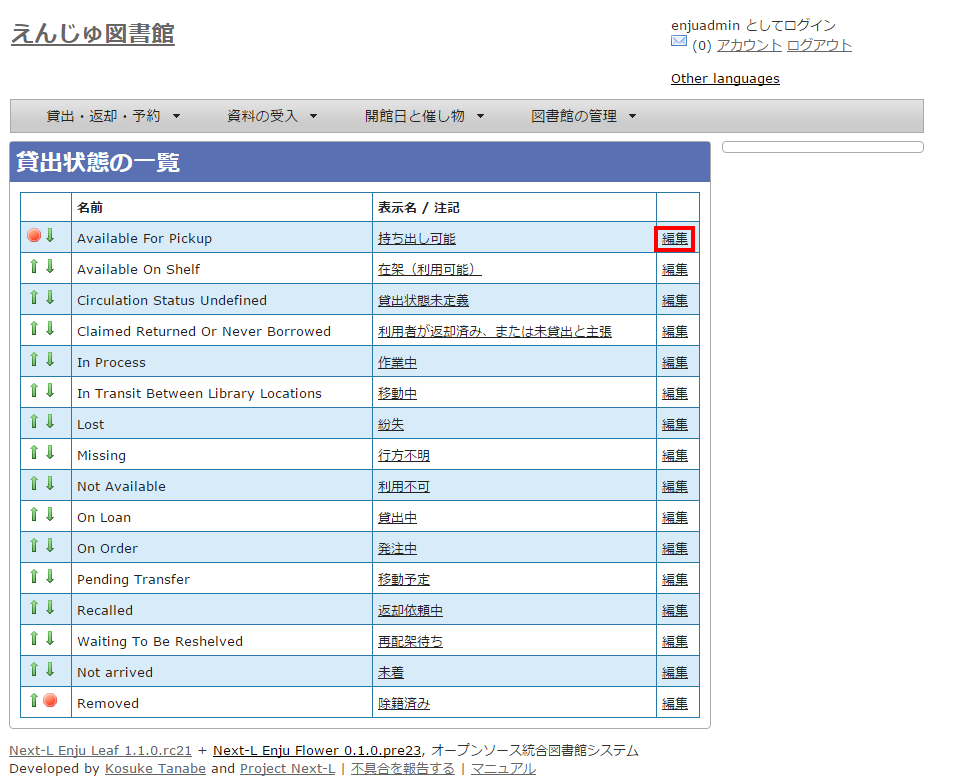
+
[NOTE]
====
【Memo】一覧の表示順序を変更するには，表の1列目に表示されている↑または↓をクリックして行を入れ替えます。
====
+
4. 設定項目に必要事項を入力し、［更新する］ボタンをクリックして，設定内容を更新します。
+
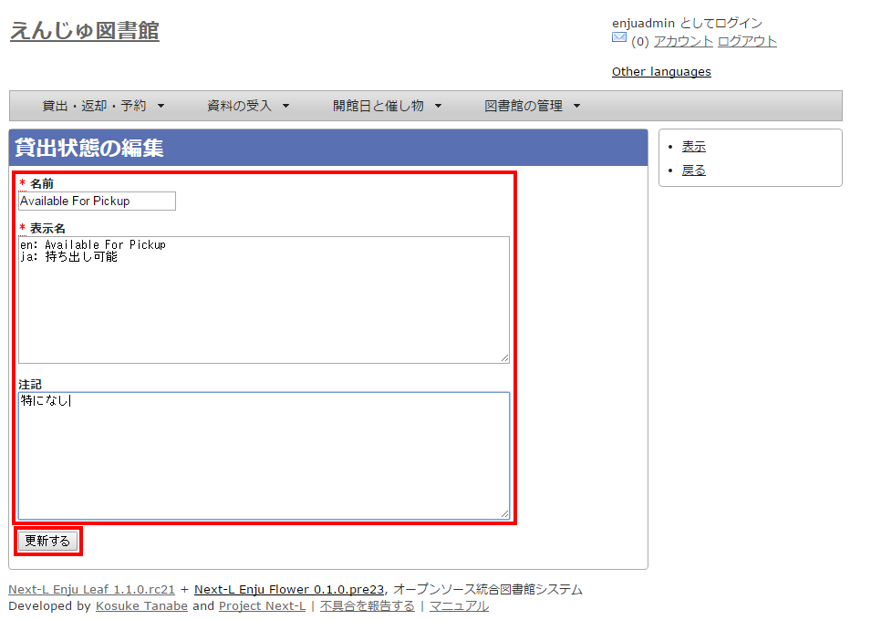

=== 利用制限を編集する

システムの標準設定を変更する必要がでることは基本的にはありません。
所蔵情報登録の際に表示される[利用制限]のメニューで表示される文言や、メニューの表示順序を変更したいときのみ編集の必要がでます。

==== 設定項目

* 名前：利用制限を入力します。
* 表示名：画面に表示する名称を入力します。（入力必須）
* 注記：注意事項や特記事項などを入力します。

==== 設定方法

1. ［図書館の管理］メニューから［システムの設定］を選択します。
+
image::../assets/images/1.1/image_system_setup.png[システムの設定]

2. ［利用制限］をクリックします。
+

3. 設定したい項目の［編集］をクリックします。
+
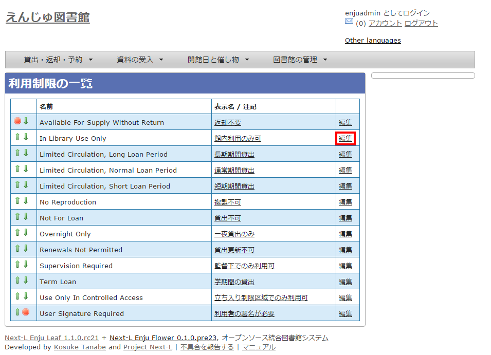
+
[NOTE]
====
【Memo】一覧の表示順序を変更するには，表の1列目に表示されている↑または↓をクリックして行を入れ替えます。
====
+
[NOTE]
====
【Memo】多くの利用制限が登録されてはいますが、Enju Leaf 1.1.0以下では「通常期間貸出」と「貸出不可」のみが利用できます。
====

4. 設定項目に必要事項を入力し、［更新する］ボタンをクリックして，設定内容を更新します。
+
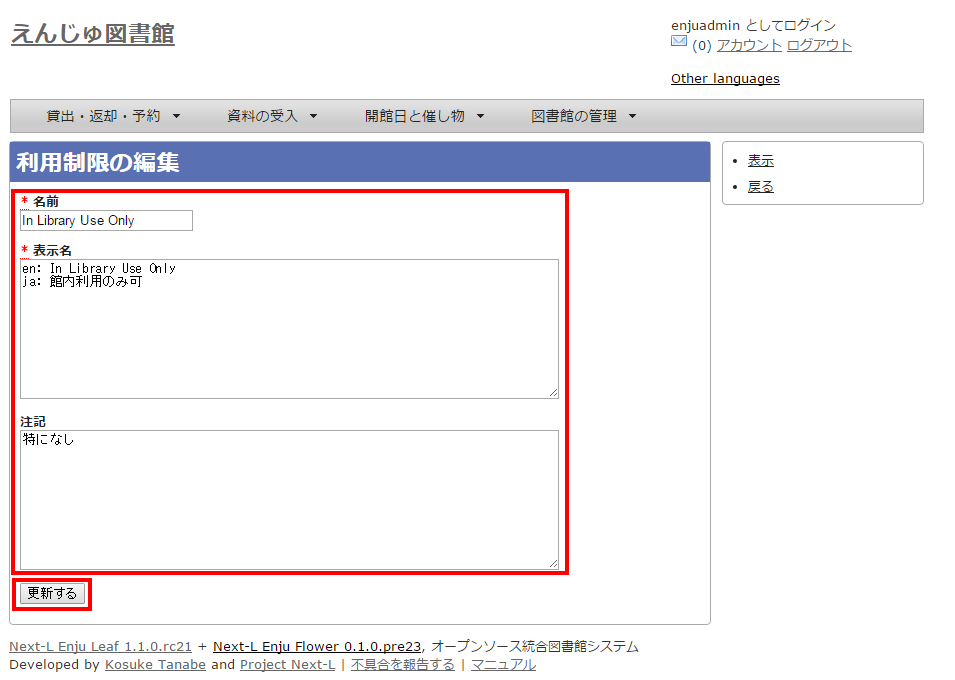

=== 人物・団体の種類を編集する

システムの標準設定を変更する必要がでることは基本的にはありません。
xref:enju_operation_4.adoc#_人物・団体情報を登録する[]の際に表示される
[人物・団体の種類]のメニューで表示される文言や、
メニューの表示順序を変更したいときのみ編集の必要がでます。

==== 設定項目

* 名前：人物・団体の名称を入力します。（入力必須）
* 表示名：画面に表示する名称を入力します。
* 注記：注意事項や特記事項などを入力します。

==== 設定方法

1. ［図書館の管理］メニューから［システムの設定］を選択します。
+
image::../assets/images/1.1/image_system_setup.png[システムの設定]

2. ［人物・団体の種類］をクリックします。
+
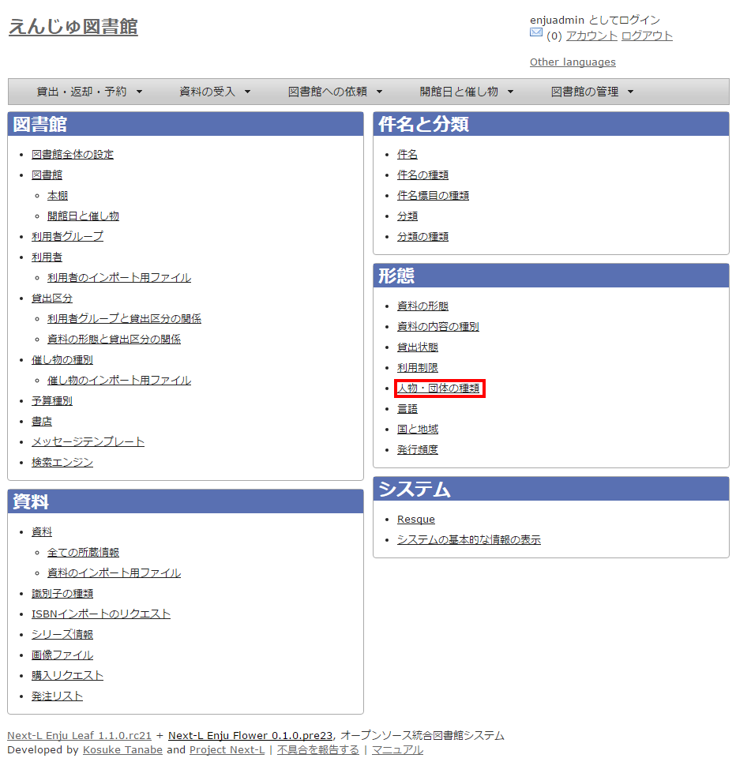

3. 右メニューの[人物・団体の種類の新規作成]をクリックします。
+
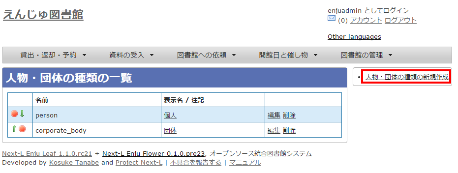
+
[NOTE]
====
【Memo】修正したい場合は[編集]リンクをクリックします。
削除したい場合は，[削除]リンクをクリックします。
ただし、この種類を使った「人物・団体」があるものについては[削除]リンクは
表示されず、削除できません。 
一覧の表示順序を変更するには，
表の1列目に表示されている↑または↓をクリックして行を入れ替えます。
====
+
4. 設定項目に必要事項を入力し、［登録する］ボタンをクリックして，作成します。
+
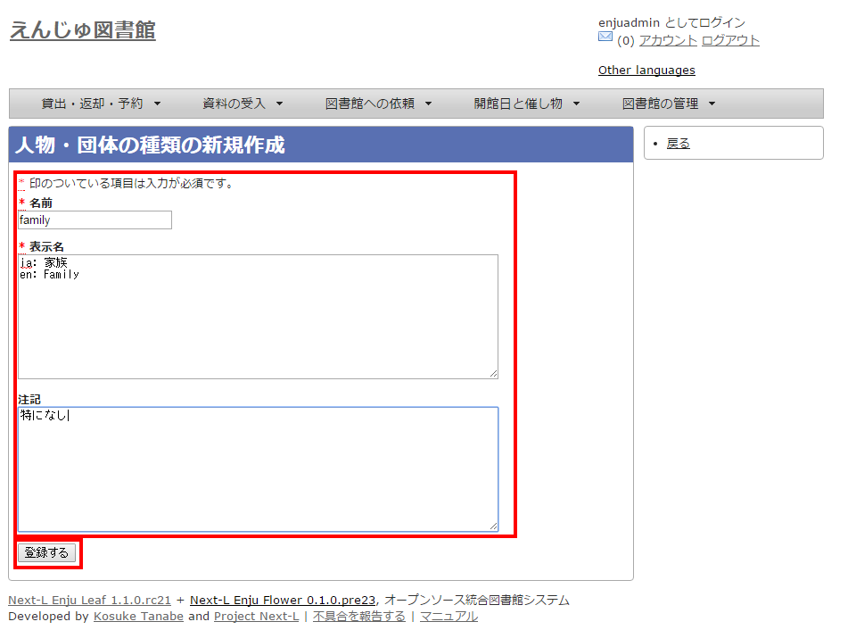

=== 言語を編集する

==== 設定項目

* ネイティブ名：ネイティブ名を入力します。表示言語切り替えのリンクのアンカー名として使用される文字列になります。
* 表示名：画面に表示する名称を入力します。資料の詳細表示の言語で表示される文字列になります。
* ISO 639-1： ISO 639-1の値を入力します。
* ISO 639-2： ISO 639-2の値を入力します。
* ISO 639-3： ISO 639-3の値を入力します。
* 注記：注意事項や特記事項などを入力します。

==== 設定方法

1. ［図書館の管理］メニューから［システムの設定］を選択します。
+
image::../assets/images/1.1/image_system_setup.png[システムの設定]

2. ［言語］をクリックします。
+
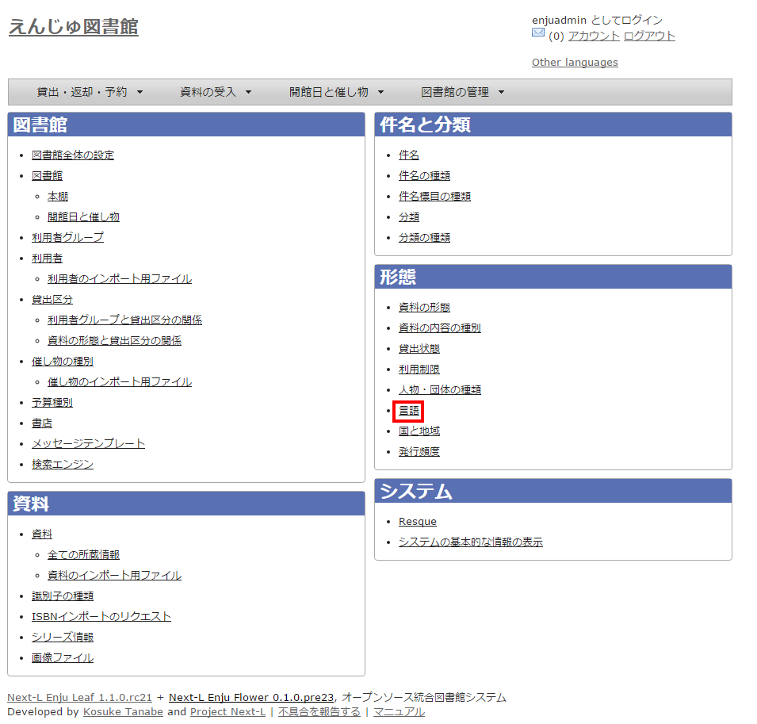

3. 設定したい項目の［編集］をクリックします。
+
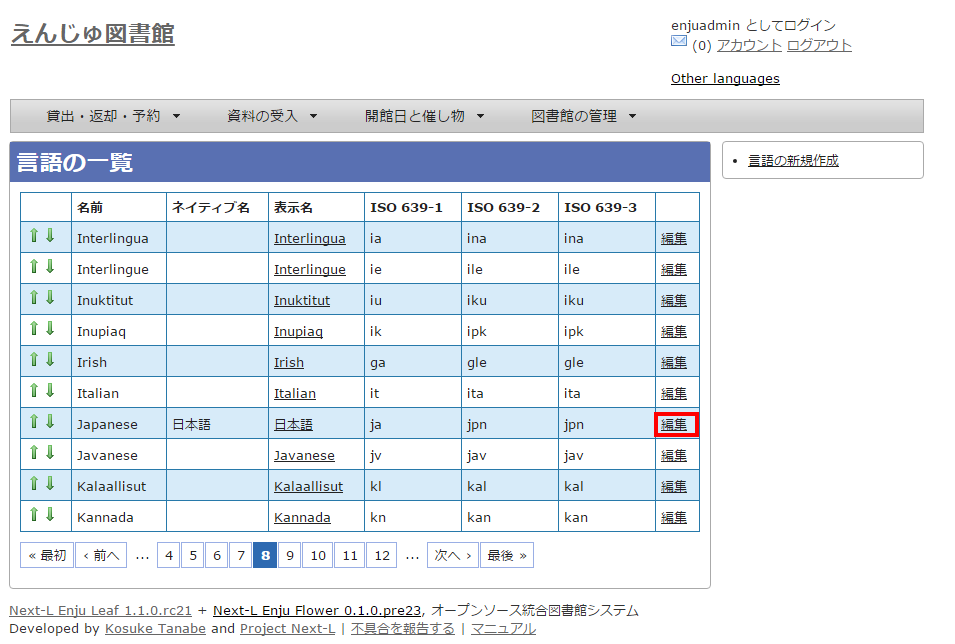
+
[NOTE]
====
【Memo】一覧の表示順序を変更するには，表の1列目に表示されている↑または↓をクリックして行を入れ替えます。
====
+
4. 設定項目に必要事項を入力し、［更新する］ボタンをクリックして，設定内容を更新します。
+
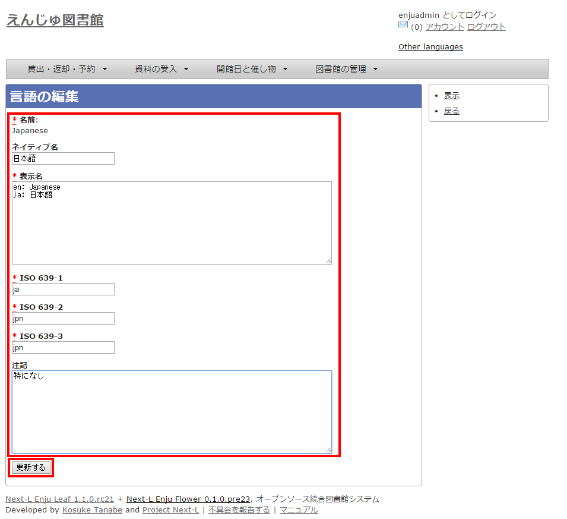

=== 発行頻度を編集する

==== 設定項目

* 名前：発行頻度を入力します。
* 表示名：画面に表示する名称を入力します。
* 注記：注意事項や特記事項などを入力します。

==== 設定方法

1. ［図書館の管理］メニューから［システムの設定］を選択します。
+
image::../assets/images/1.1/image_system_setup.png[システムの設定]

2. ［発行頻度］をクリックします。
+
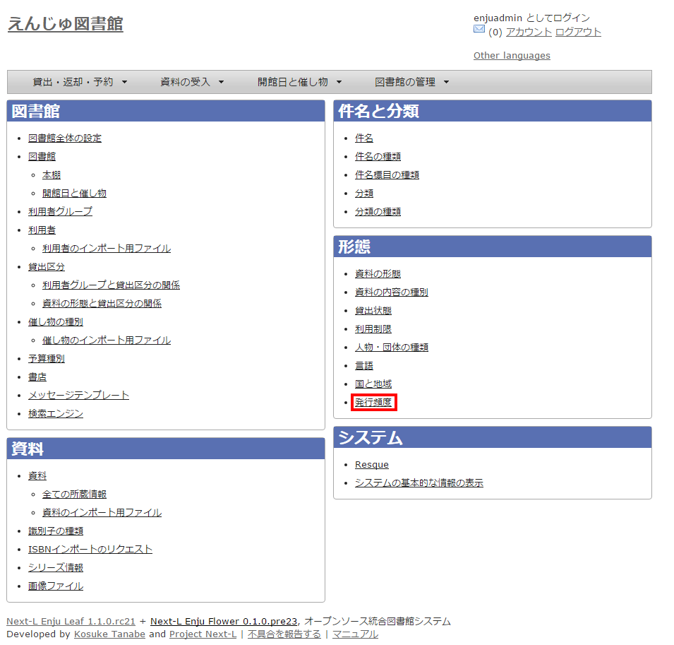

3. 設定したい項目の［編集］をクリックします。
+
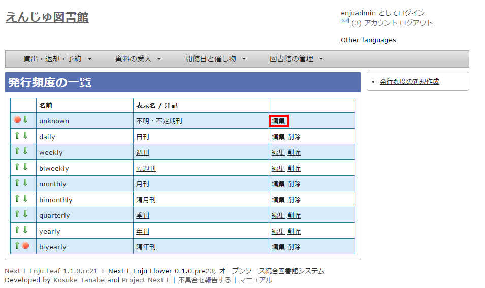
+
[NOTE]
====
【Memo】新規に作成したい場合は、右メニューの[発行頻度の新規作成]をクリックします。削除したい場合は、[削除]リンクをクリックします。ただし、関連する書誌レコードがあるものについては[削除]リンクは表示されず、削除できません。一覧の表示順序を変更するには，表の1列目に表示されている↑または↓をクリックして行を入れ替えます。
====
+
4. 設定項目に必要事項を入力し、［更新する］ボタンをクリックして，設定内容を更新します。
+
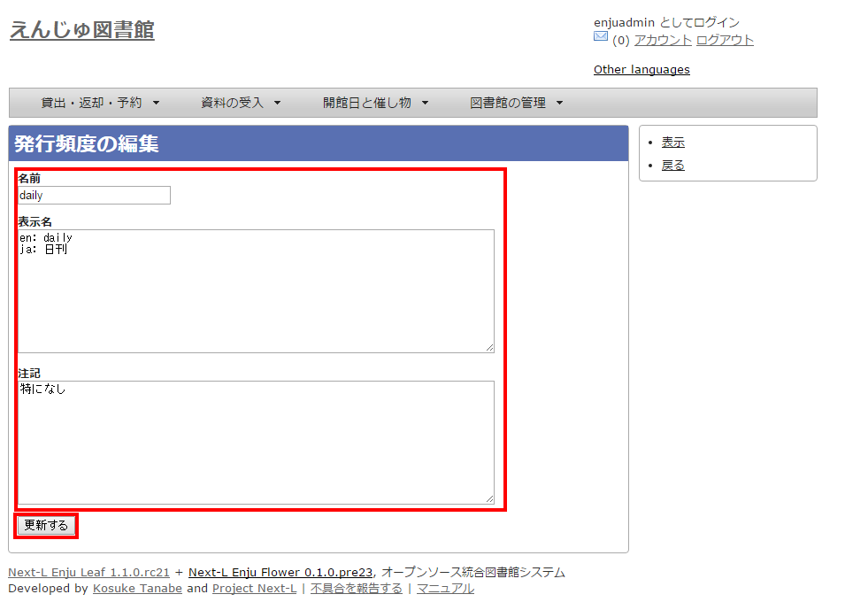
+
[NOTE]
====
【Memo】発行頻度が指定されない場合は，［unknown］が設定されます。
====

=== その他の機能

Enjuでは形態の設定として，その他，次の機能を利用できます。

==== 国と地域を作成する

* ［図書館の管理］メニューから［システムの設定］を選択します。
* ［国と地域］をクリックして，設定します。

=== 書誌のカスタム項目を設定する

主に他システムからの移行時にEnjuの標準の書誌項目にないデータを念のため保存しておきたいといった場合に設定します。
注：この項目に入力したデータは、Librarian以上の権限でログインしたときのみ表示され、また、検索ではヒットしません。

==== 設定項目

* 項目コード：項目をシステムが識別するためのコードを入力します（注：項目コードには英数小文字・アンダースコアのみ使用できます。最初の文字に数字は使用できません）。
* 項目表示名：画面に表示する名称を入力します。（「``ja: ``」を入れると日本語表示に、「``en: ``」を入れると英語表示となります）。
* 注記：注記を入力します。

==== 設定方法

1. ［図書館の管理］メニューから［システムの設定］を選択します。
+
image::../assets/images/1.1/image_system_setup.png[システムの設定]

2. [書誌カスタム項目]をクリックします。
+
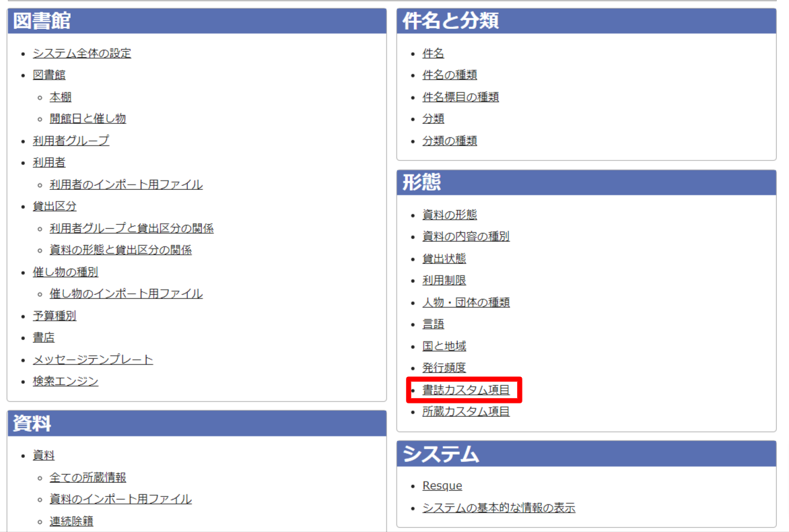

3. [書誌カスタム項目の新規作成]をクリックします。
+
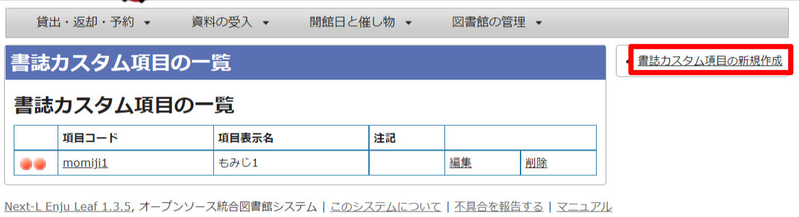

4. 設定項目に必要事項を入力し、［登録する］ボタンをクリックして，設定内容を登録します。
+
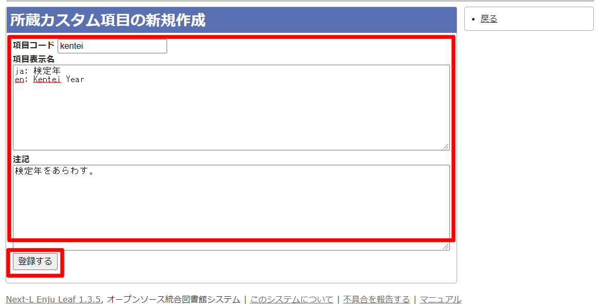

5. 書誌カスタム項目は正常に作成されましたと表示されます。
+
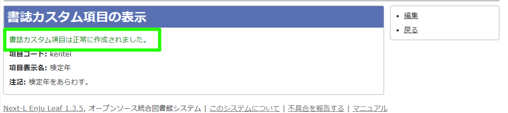

これで、書誌データの新規作成やTSV書誌インポートの際に入力したり、「資料の表示」画面や資料のTSVエクスポートで出力されるようになりました。

書誌TSVインポートや書誌TSVエクスポートの列頭の文字列は、「``manifestation:項目コード``」（例：項目コードが「``kenteinen``」であれば、「``manifestation:keiteinen``」となります。

=== 所蔵のカスタム項目を設定する

主に他システムからの移行時にEnjuの標準の所蔵情報項目にないデータを念のため保存しておきたいといった場合に設定します。
注：この項目に入力したデータは、Librarian以上の権限でログインしたときのみ表示され、また、検索ではヒットしません。

設定方法は、<<_書誌のカスタム項目を設定する>>と同様に行います。

これで、所蔵データの新規作成やTSV所蔵インポートの際に入力したり、「所蔵情報の表示」画面や所蔵のTSVエクスポートで出力されるようになりました。

所蔵情報TSVインポートや所蔵TSVエクスポートの列頭の文字列は、「``item:項目コード``」（例：項目コードが「``kingaku``」であれば、「``item:kingaku``」となります。

include::enju_setup_toc.adoc[]
