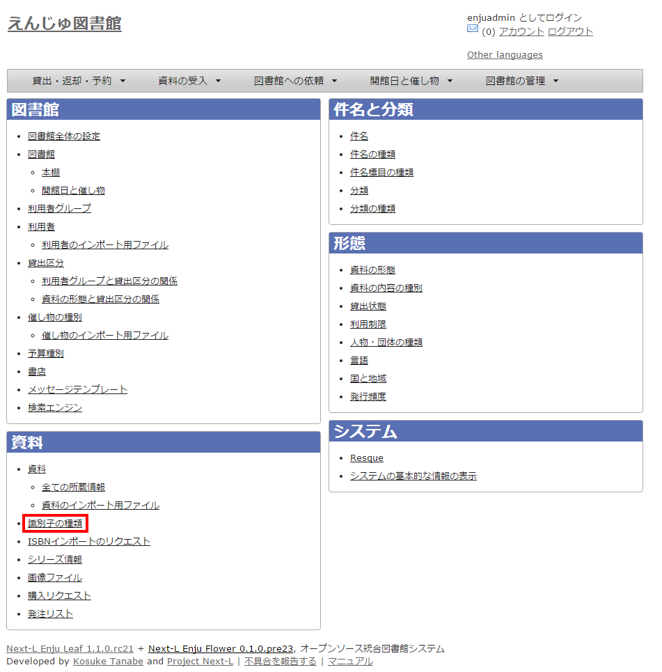
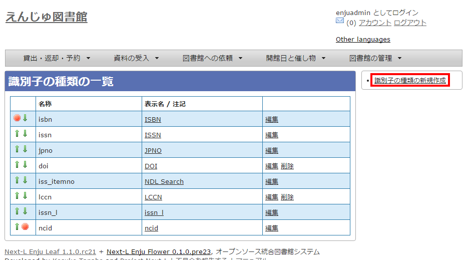
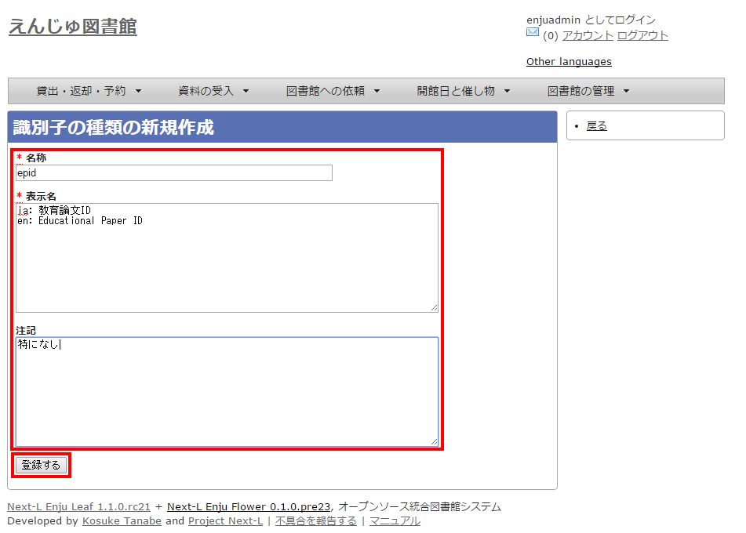

:toc: macro
:sectnums:

toc::[]

== 識別子の種類を設定する

[資料を手動で登録する（運用マニュアル「4-2-7 手動で資料を登録する」参照）](enju_operation_4.html#section4-2-7)ときや、[資料の書誌情報を変更する（運用マニュアル「4-2-8 図書の書誌を編集（修正）する」参照）](enju_operation_4.html#section4-2-8)ときに入力する「識別子」の種類（例：isbn，doiなど）を登録できます。Enju Leaf 1.3.4からこの識別子で入力した値も検索でヒットするようになっています。（注：Enju Leaf 1.1.0では、ここで新たに登録した「識別子の種類」を使った[書誌のTSVインポート（運用マニュアル「4-2-10 TSVファイルの作り方図書（書誌）」参照）](enju_operation_4.html#section4-2-10)には対応していません）。

== 設定項目

* 名称：識別子の種類の名称を入力します。
* 表示名：画面に表示する名称を入力します。
* 注記：注意事項や特記事項などを入力します。

== 設定方法

. ［図書館の管理］メニューから［システムの設定］を選択します。  
+
image::../assets/images/1.1/image_system_setup.png[システムの設定]

. ［識別子の種類］をクリックします。  
+

. 右メニューの［識別子の種類の新規作成］をクリックします。
+

【Memo】入力済みの設定内容を変更する場合は［編集］を，削除する場合は［削除］をクリックします。ただし、関連する書誌レコードがあるものについては[削除]リンクは表示されず、削除できません。  
一覧の表示順序を変更するには，表の1列目に表示されている↑または↓をクリックして行を入れ替えます。

. 設定項目に必要事項を入力し、［登録する］ボタンをクリックして，設定内容を登録します。
+

//image::  

include::enju_setup_toc.adoc[]
