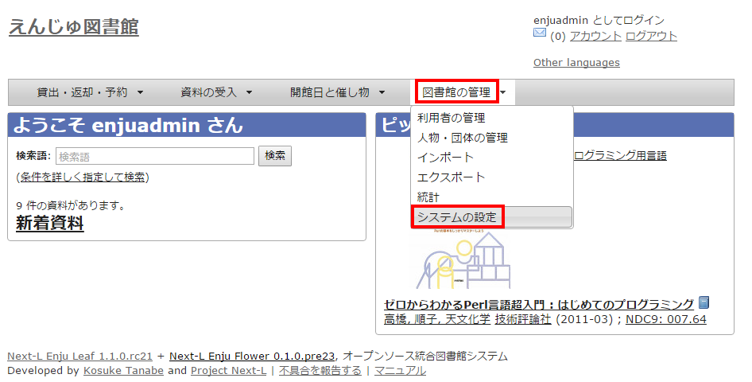
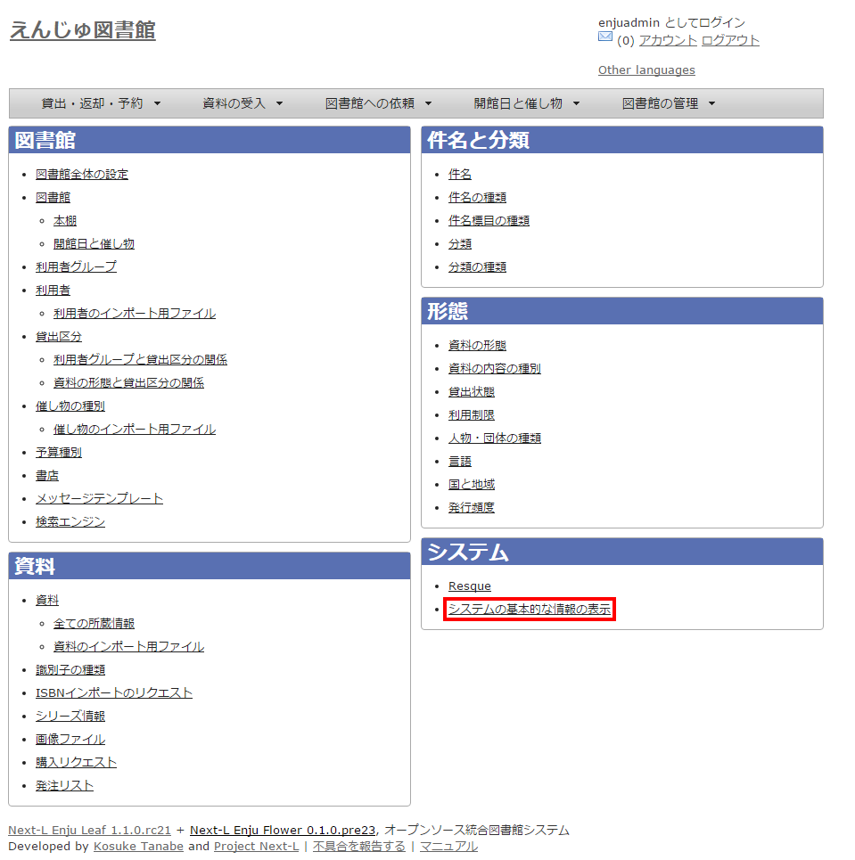
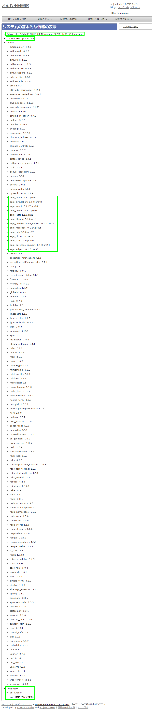
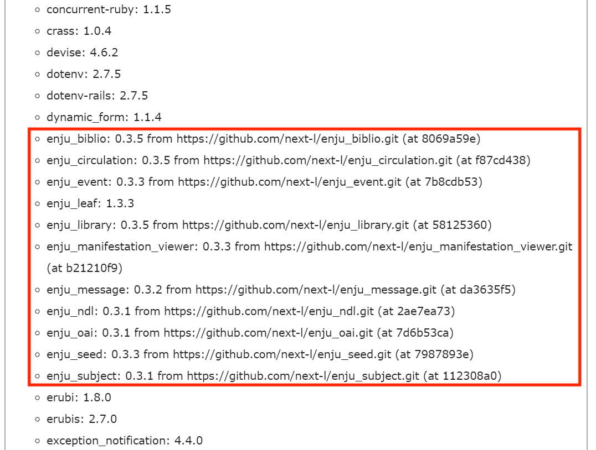
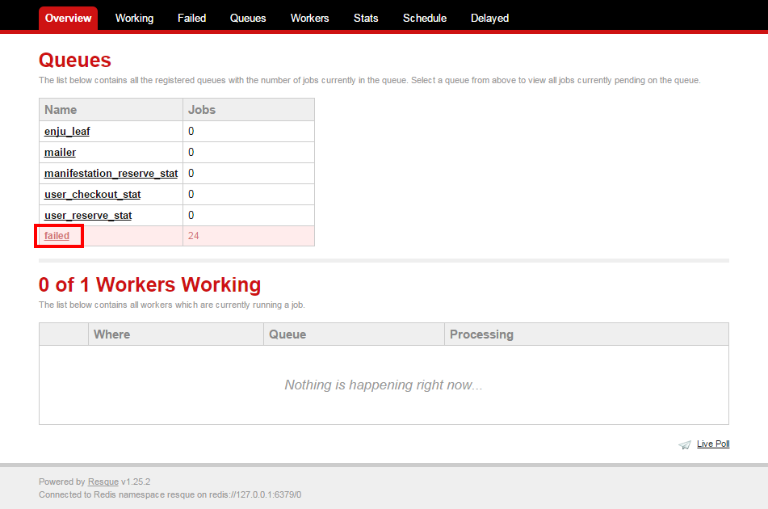
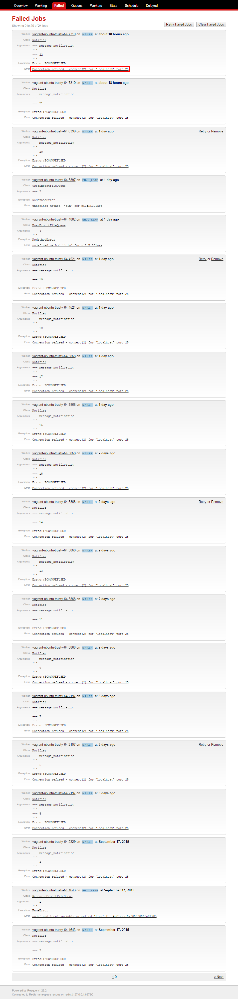
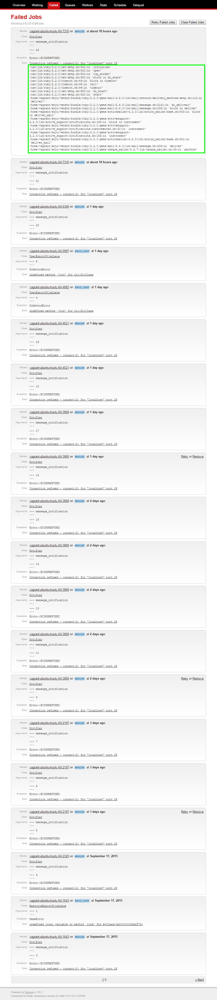
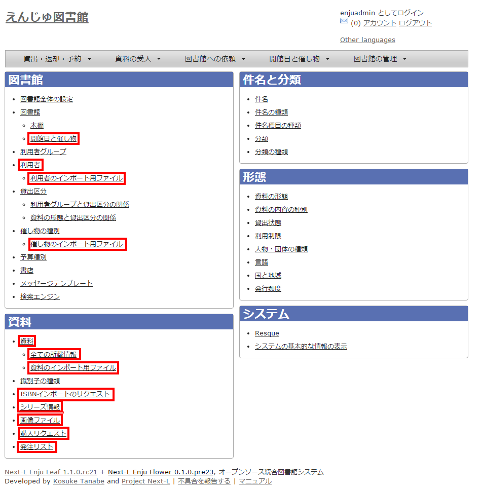

== その他

:toc: macro

toc::[]

=== システムの基本的な情報の表示機能

システムの基本的な情報を確認できる機能があります。不具合の報告時などに、こちらの情報をシステム担当者にお知らせください。

. ［図書館の管理］メニューから［システムの設定］を選択します。
+

. システムの[システムの基本的な情報の表示]リンクをたどります。
+

. システムの基本的な情報を確認できます。
+
* Ruby： Ruby のバージョンが表示されます。（例： ``ruby 2.2.2p95 (2015-04-13 revision 50295) [x86_64-linux-gnu]``)
* Environment: システムの環境が表示されます（例：``production``）
* Gems：Enju の詳細なバージョン等が表示されます（例：``enju_leaf: 1.1.0.rc21，enju_circulation: 0.1.0.pre48``）
* Languages：使用言語が表示されます（例：ja: 日本語 (既定の言語)）
+

+
[NOTE]
====
リリース前のパッケージを使用している場合にはコミットのハッシュ値を表示します。

====

=== 非同期処理の状態確認機能（Resque）

資料等のインポートやエクスポート、自動メール送信などの非同期処理の状態を確認できる機能があります。

. ［図書館の管理］メニューから［システムの設定］を選択します。
+

. システムの[Resque]リンクをたどります。
+
image::../assets/images/1.1/image_initial_resque.png[Resqueリンク]

. Resque の画面で非同期処理の状態を確認できます。エラーを確認するには[failed]リンクをたどります。
+

. 詳細なエラーを確認するために、閲覧したいエラーのリンクをたどります。
+

. 詳細なエラーが表示されます。
+

=== 運用マニュアルにおいて説明する機能

［図書館の管理］メニューから［システムの設定］を選択し表示される画面のうち、
次にあげるメニューについては、運用時に使用するメニューですので、
xref:enju_operation.adoc[運用マニュアル]にて説明します。

* [開館日と催し物] 
** [開館日と催し物]メニューから[全ての催し物]をたどっていける画面と同じ
** 参照：xref:enju_operation_7.adoc#add-closed-days-events[運用マニュアル「休館日と催し物を登録する」]
* [利用者]　
** [図書館の管理]メニューから[利用者の管理]をたどっていける画面と同じ
** 参照：xref:enju_operation_3.adoc[運用マニュアル「利用者情報を管理する」]
* [利用者のインポート用ファイル]
** [図書館の管理]メニューから[インポート]をたどり、[利用者]リンクをたどっていける画面と同じ
** 参照：xref:enju_operation_3.adoc#import-user-data[運用マニュアル「既存のデータから利用者情報をインポートする」]
* [催し物のインポート用ファイルの新規作成]
** [開催日と催し物]メニューから[インポート]をたどっていける画面と同じ
** 参照：xref:enju_operation_7.adoc#import-event-data[運用マニュアル「催し物のデータをインポートする」]
* [資料]
** トップ画面において検索式を何もいれずに[検索]ボタンをクリックしたときにいける画面と同じ
** 参照：xref:enju_user_1.adoc[利用者マニュアル「資料を検索する」]
* [全ての所蔵情報]
** 参照：xref:enju_operation_4.adoc#input-and-show-holdings[運用マニュアル「所蔵情報を登録・一覧表示する」]
* [資料のインポート用ファイル]
** [資料の受入]メニューから「TSVファイルからのインポート]をたどり、右メニューの[資料のインポート用ファイルの一覧]をたどっていける画面と同じ
** 参照：xref:enju_operation_4.adoc#item-tsv-import[運用マニュアル「TSVファイルを読み込んで登録する」]
* [ISBNインポートのリクエスト]
** [資料の受入]メニューから[ISBNを入力]をたどり、[ISBNインポートリクエストの一覧]リンクをたどっていける画面と同じ
** 参照：xref:enju_operation_4.adoc#isbn-import[運用マニュアル「ISBNコードを入力して1件ずつ登録する」]
* [シリーズ情報]
** (現在、運用マニュアル作成中です）
* [画像ファイル]
** 画像を登録した資料の「資料の表示」画面の右メニューにある[画像ファイルの一覧]リンクをたどっていける画面と同じ
** 参照：xref:enju_operation_4.adoc#list-images[運用マニュアル「画像の一覧表示」]
* [購入リクエスト]
** [図書館への依頼]メニューから[購入リクエスト]をたどっていける画面と同じ
** 参照：xref:enju_operation_4.adoc#add-purchase-requests[運用マニュアル「発注したい図書（購入リクエスト）を発注リストに登録する」]
* [発注リスト]
** [図書館の管理]メニューから[発注リスト]をたどっていける画面と同じ
** 参照：xref:enju_operation_4.adoc#make-purchase-list[運用マニュアル「発注リストを作成する」]

include::enju_setup_toc.adoc[]
