:toc: macro

toc::[]

== 資料を検索する

Enjuを利用した資料の検索方法には、演算子やフィールド名を直接入力して検索する方法と、該当のテキストボックスに検索語入力する方法があります。

* キーワードで検索する
* 条件を詳しく指定して検索する
* 演算子やフィールド名を使って検索をする

=== キーワードで検索する

資料を指定したキーワードで検索できます。

==== トップページの検索語にキーワードを入力し、［検索］ボタンをクリックします。  

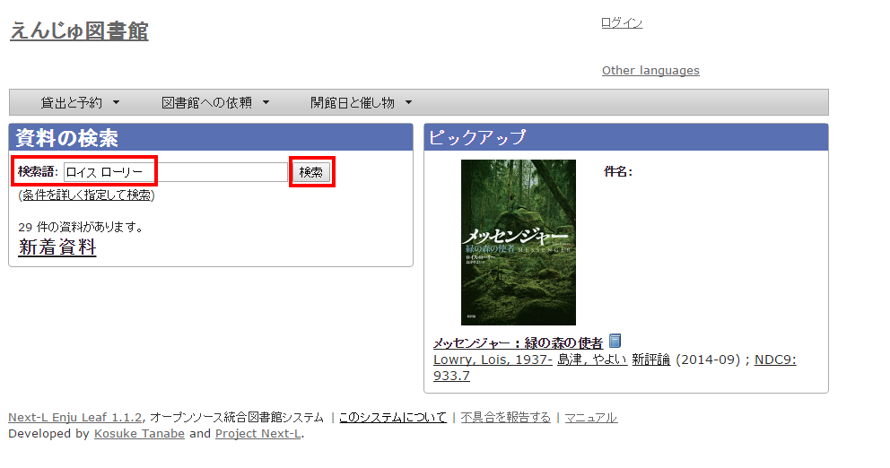
// 

----
【Memo】
* スペースで区切りながらキーワードを入力すると、複数のキーワードに一致する資料を検索できます。
* ISBNでも検索できます。ハイフンありでも、なしでも、10桁でも13桁でも検索可能です。
----
// 

==== キーワードに該当する資料が検索されます。詳細を知りたい資料のタイトルをクリックします。  

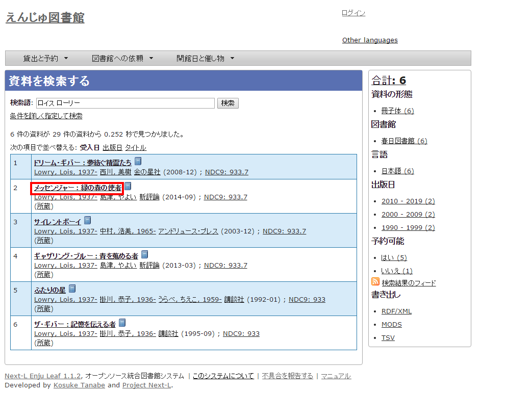

==== 資料の詳細が表示されます。

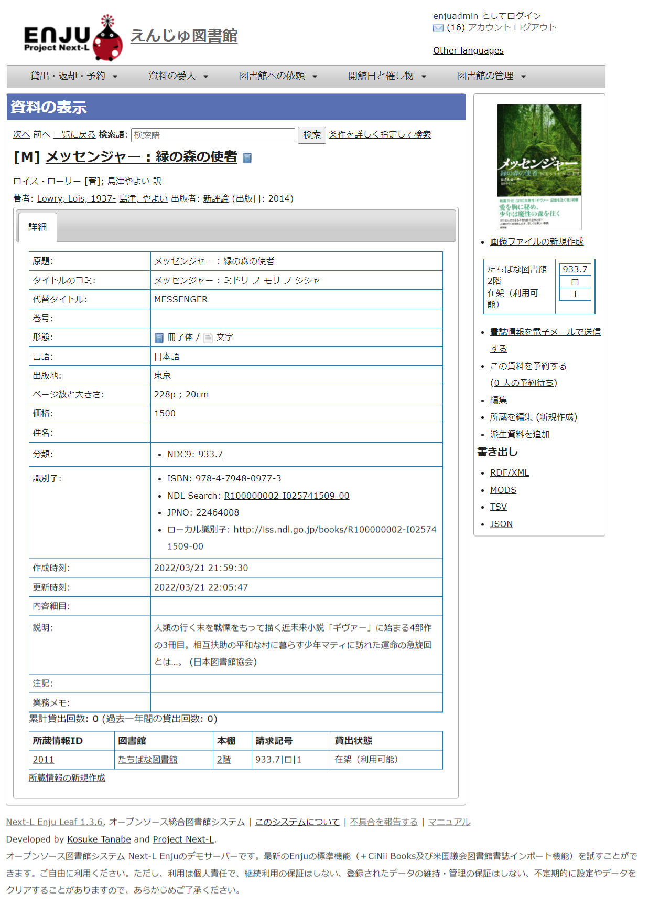

=== 条件を詳しく指定して検索する

条件を詳しく指定して、資料を検索することもできます。

==== トップページの［（条件を詳しく指定して検索）］をクリックします。  

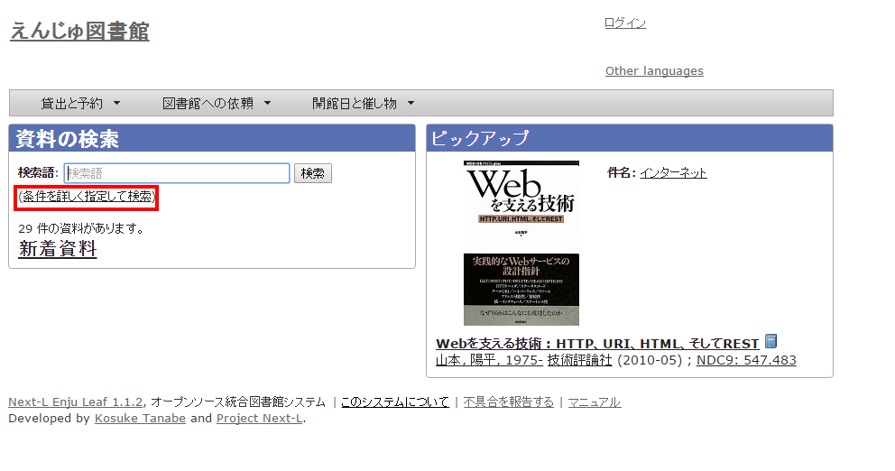

==== 複数の条件を指定して［検索］ボタンをクリックします。  

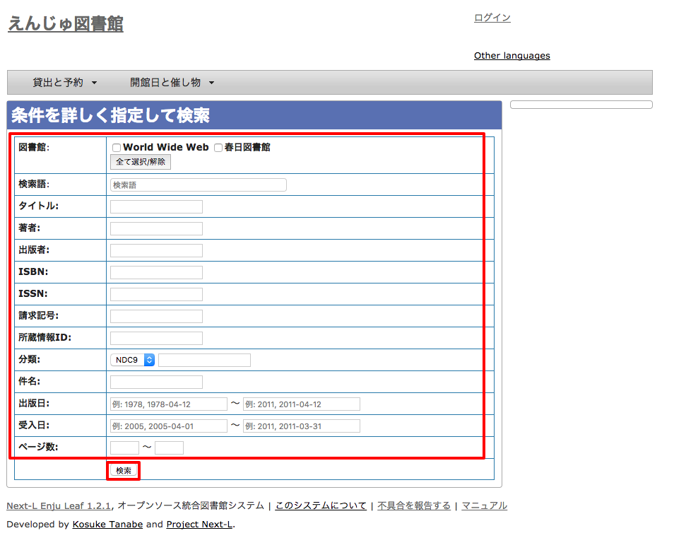

//

[NOTE]
====
* ISBN はハイフンありでもハイフンなしでも検索できます
* 請求記号は前方一致検索します。
* 分類は前方一致検索します。 
====
//

=== フィールド名や演算子を使って検索する

「and」や「or」や 「()」 などの演算子と、フィールド名を組み合わせた検索式を作成できます。

検索式の例：ruby and (Web or ライブラリ)

より詳しい説明については、 [issue #130](https://github.com/next-l/enju_leaf/issues/130)　を参照してください。

=== 検索結果を絞り込む

検索結果の画面に表示された資料の情報は、画面右側のメニューにある絞込みメニュー（ファセット）を使って絞り込めます。
絞り込める項目は標準では以下の5つが用意されています：

* 資料の形態
* 所蔵する図書館
* 資料の言語
* 出版年
* 予約可能の可否

==== 検索結果を表示する。

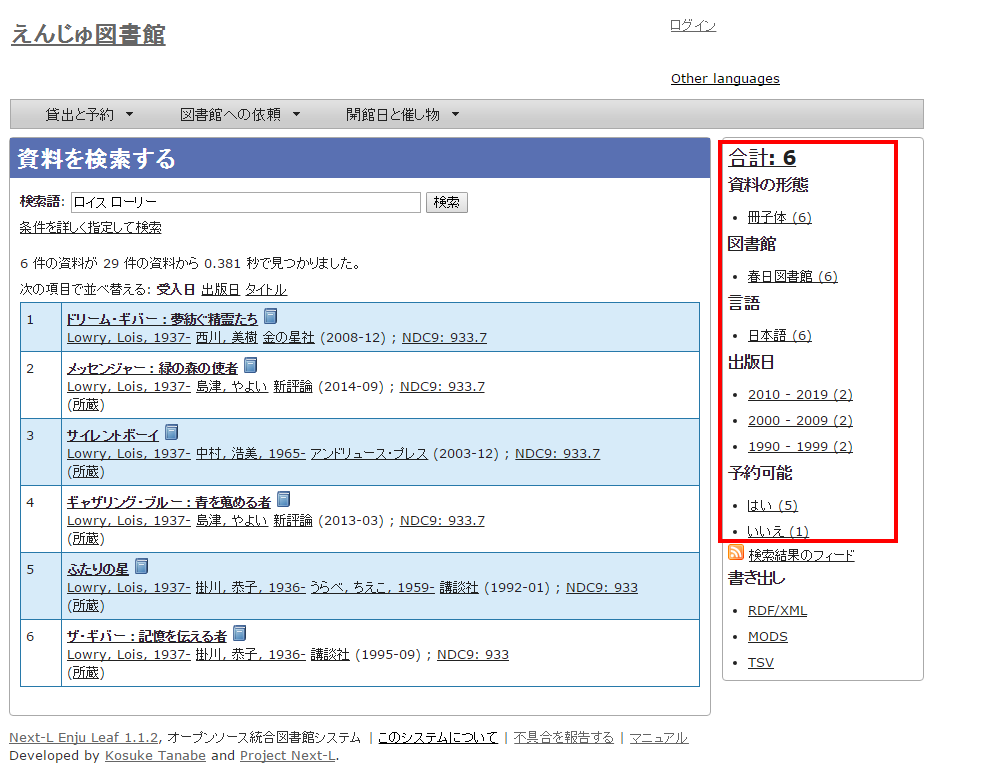

==== 出版日の項目から「2010 - 2019」と書かれたリンクをクリックします。

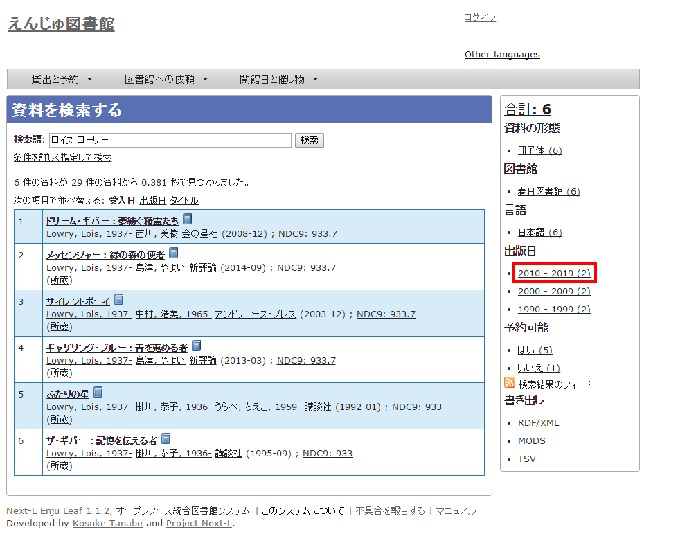

//

----
【Memo】それぞれの絞り込みリンクの表記、たとえば「2010 - 2019 (7)」のうち、カッコ内の数字（7）は、この絞り込みにより該当する資料のヒット件数を示しています。参考にしてみてください。
----
//

==== 出版年が2010年以降の範囲に絞り込まれた検索結果に移ります。

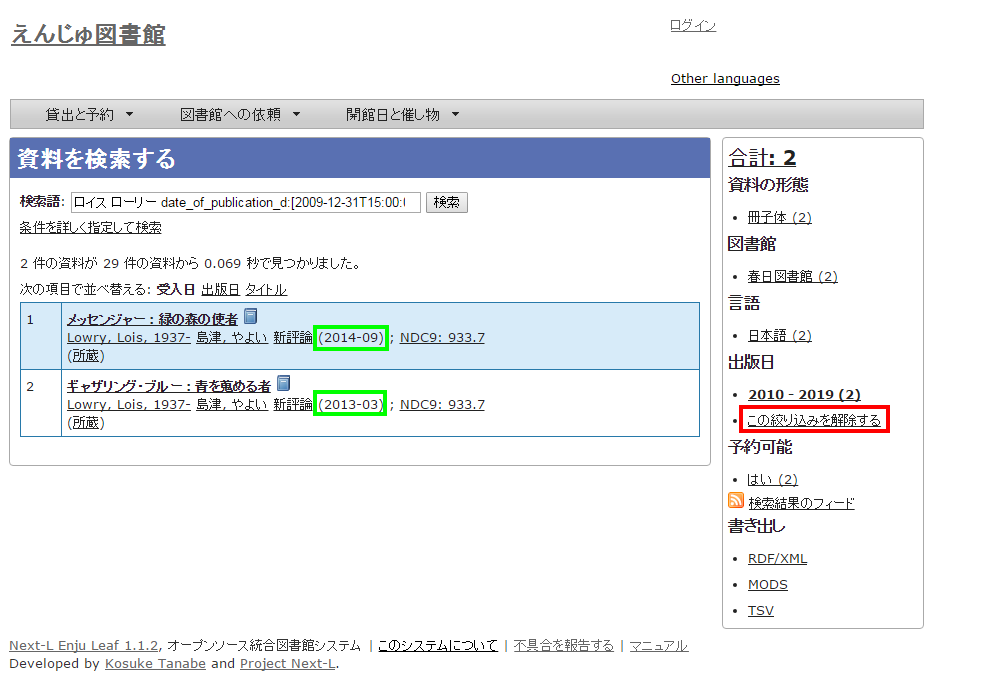

右側の絞り込みリンクが選択した部分（出版日: 2010 - 2019）だけになり、「この絞り込みを解除する」というリンクが付きます。
絞込みを解除したい場合はこの解除するリンクをクリックしてください。
さらに、別の項目も使って絞り込みたい場合は他のファセットを選択することも可能です。

絞り込んだ中から、詳しく見たい資料を選択してクリックします。

=== 検索結果一覧のソート方法を変更する

検索結果一覧の表示順序のソート方法を変更することができます。
書誌作成日の新しさ、出版日の新しさ、適合度（昇順のみ）、タイトルの五十音で、
ソート方法を変更することができます。

==== ソート方法を選び、[表示]ボタンをクリックします。

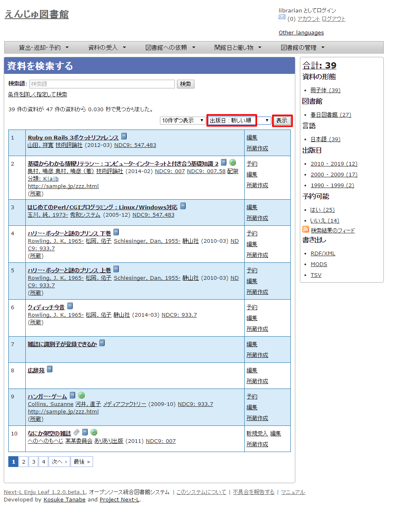

==== 選んだソート方法の順序で表示されます。

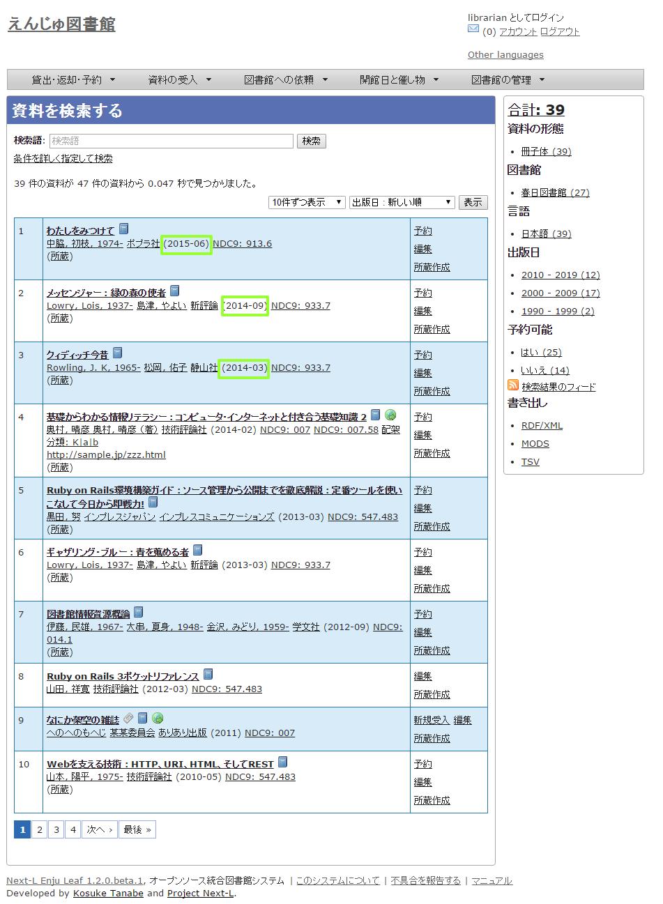

=== 検索結果一覧の表示件数を変更する

検索結果一覧の表示件数を変更することができます。
10件、20件、50件、100件から選ぶことができます。

==== 表示件数を選び、[表示]ボタンをクリックします。

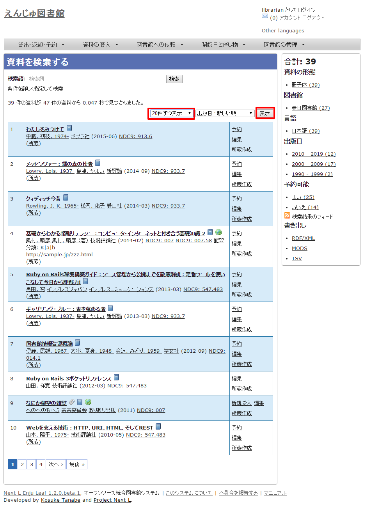

==== 選んだ表示件数分の検索結果が表示されます。

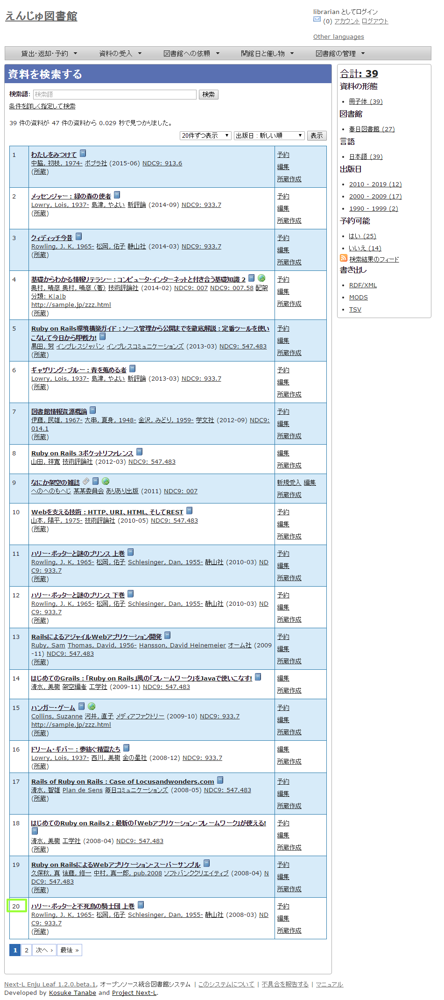

=== 検索結果のフィード(RSS)を取得する

検索結果のRSSを取得することができます。
検索結果の最初の10件（最近登録された10件）を得ることができます。
※検索結果が複数の画面にわたる場合でも、
どの画面の[検索結果フィード]でもかならず最近登録された10件のみとなります。

==== 右メニューの[検索結果のフィード]をクリックします。

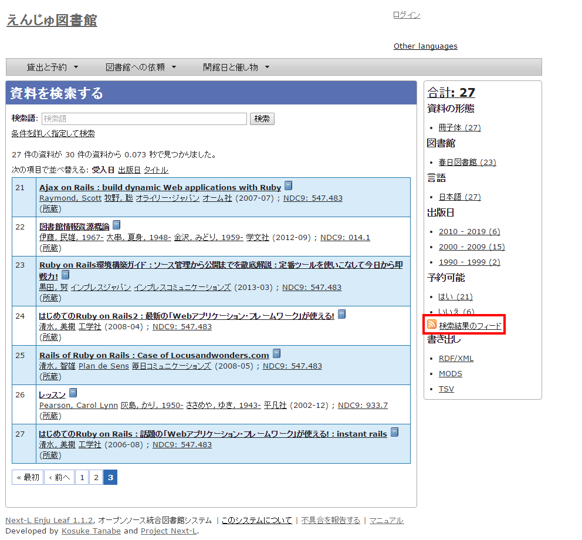

==== 最近登録された10件のRSSが表示されます。

image::../assets/images/1.1/search_result_rss_2.png[RSS]

=== 検索結果一覧の書き出し

==== RDF/XML 形式で書き出し

===== 書き出しをしたい検索結果画面を表示させます。[RDF/XML]リンクをクリックします

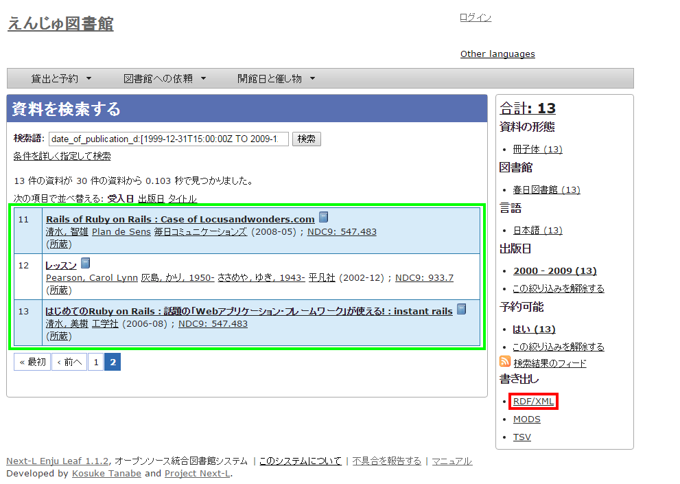

※　現在、画面でみえている結果の分だけが書き出しができます。

===== RDF/XML 形式のファイルがダウンロードできます。

* [出力されるRDF/XMLの例（Web APIマニュアル1-2-2節参照）](enju_webapi_1.html#bib_rdf_example)

==== MOS 形式で書き出し

===== 書き出しをしたい検索結果画面を表示させます。[MODS]リンクをクリックします

※　現在、画面でみえている結果の分だけが書き出しができます。

===== MOS 形式のファイルがダウンロードできます。

<pre>
&lt;?xml version="1.0" encoding="UTF-8"?&gt;
&lt;modsCollection xmlns:xsi="http://www.w3.org/2001/XMLSchema-instance" xmlns="http://www.loc.gov/mods/v3"&gt;
&lt;titleInfo&gt;
  &lt;title&gt;Rails of Ruby on Rails : Case of Locusandwonders.com&lt;/title&gt;
&lt;/titleInfo&gt;
&lt;titleInfo type="alternative"&gt;
  &lt;title/&gt;
&lt;/titleInfo&gt;
&lt;name type="personal"&gt;
  &lt;namePart&gt;清水, 智雄&lt;/namePart&gt;
  &lt;role&gt;
    &lt;roleTerm type="text" authority="marcrelator"&gt;creator&lt;/roleTerm&gt;
  &lt;/role&gt;
&lt;/name&gt;
&lt;name type="personal"&gt;
  &lt;namePart&gt;Plan de Sens&lt;/namePart&gt;
  &lt;role&gt;
    &lt;roleTerm type="text" authority="marcrelator"&gt;creator&lt;/roleTerm&gt;
  &lt;/role&gt;
&lt;/name&gt;
&lt;typeOfResource&gt;text&lt;/typeOfResource&gt;
&lt;originInfo&gt;
  &lt;publisher&gt;毎日コミュニケーションズ&lt;/publisher&gt;
  &lt;dateIssued&gt;2008-05-01 00:00:00 +0900&lt;/dateIssued&gt;
  &lt;frequency&gt;unknown&lt;/frequency&gt;
&lt;/originInfo&gt;
&lt;language&gt;
  &lt;languageTerm authority="iso639-2b" type="code"&gt;jpn&lt;/languageTerm&gt;
&lt;/language&gt;
&lt;physicalDescription&gt;
  &lt;form authority="marcform"&gt;volume&lt;/form&gt;
  &lt;extent/&gt;
&lt;/physicalDescription&gt;
&lt;subject&gt;
&lt;/subject&gt;
&lt;classification authority="ndc9"&gt;547.483&lt;/classification&gt;
&lt;abstract/&gt;
&lt;note/&gt;
&lt;identifier type="isbn"&gt;9784839922214&lt;/identifier&gt;
&lt;recordInfo&gt;
  &lt;recordCreationDate&gt;2015-12-05 12:34:42 +0900&lt;/recordCreationDate&gt;
  &lt;recordChangeDate&gt;2015-12-06 17:33:23 +0900&lt;/recordChangeDate&gt;
  &lt;recordIdentifier&gt;http://localhost:8080/manifestations/3&lt;/recordIdentifier&gt;
&lt;/recordInfo&gt;
&lt;titleInfo&gt;
  &lt;title&gt;レッスン&lt;/title&gt;
&lt;/titleInfo&gt;
&lt;titleInfo type="alternative"&gt;
  &lt;title&gt;The lesson&lt;/title&gt;
&lt;/titleInfo&gt;
&lt;name type="personal"&gt;
  &lt;namePart&gt;Pearson, Carol Lynn&lt;/namePart&gt;
  &lt;role&gt;
    &lt;roleTerm type="text" authority="marcrelator"&gt;creator&lt;/roleTerm&gt;
  &lt;/role&gt;
&lt;/name&gt;
&lt;name type="personal"&gt;
  &lt;namePart&gt;灰島, かり, 1950-&lt;/namePart&gt;
  &lt;role&gt;
    &lt;roleTerm type="text" authority="marcrelator"&gt;creator&lt;/roleTerm&gt;
  &lt;/role&gt;
&lt;/name&gt;
&lt;name type="personal"&gt;
  &lt;namePart&gt;ささめや, ゆき, 1943-&lt;/namePart&gt;
  &lt;role&gt;
    &lt;roleTerm type="text" authority="marcrelator"&gt;creator&lt;/roleTerm&gt;
  &lt;/role&gt;
&lt;/name&gt;
&lt;typeOfResource&gt;text&lt;/typeOfResource&gt;
&lt;originInfo&gt;
  &lt;publisher&gt;平凡社&lt;/publisher&gt;
  &lt;dateIssued&gt;2002-12-01 00:00:00 +0900&lt;/dateIssued&gt;
  &lt;frequency&gt;unknown&lt;/frequency&gt;
&lt;/originInfo&gt;
&lt;language&gt;
  &lt;languageTerm authority="iso639-2b" type="code"&gt;jpn&lt;/languageTerm&gt;
&lt;/language&gt;
&lt;physicalDescription&gt;
  &lt;form authority="marcform"&gt;volume&lt;/form&gt;
  &lt;extent/&gt;
&lt;/physicalDescription&gt;
&lt;subject&gt;
&lt;/subject&gt;
&lt;classification authority="ndc9"&gt;933.7&lt;/classification&gt;
&lt;abstract&gt;1998年全米で大ベストセラーとなった人生の絵本。レッスンとは,「生きる意味」を探すこと。美しい文章と絵で綴られた心うつ物語。 (日本児童図書出版協会)&lt;/abstract&gt;
&lt;note/&gt;
&lt;identifier type="isbn"&gt;9784582831351&lt;/identifier&gt;
&lt;recordInfo&gt;
  &lt;recordCreationDate&gt;2015-11-29 12:08:23 +0900&lt;/recordCreationDate&gt;
  &lt;recordChangeDate&gt;2015-12-10 01:42:21 +0900&lt;/recordChangeDate&gt;
  &lt;recordIdentifier&gt;http://localhost:8080/manifestations/2&lt;/recordIdentifier&gt;
&lt;/recordInfo&gt;
&lt;titleInfo&gt;
  &lt;title&gt;はじめてのRuby on Rails : 話題の「Webアプリケーション・フレームワーク」が使える! : instant rails&lt;/title&gt;
&lt;/titleInfo&gt;
&lt;titleInfo type="alternative"&gt;
  &lt;title/&gt;
&lt;/titleInfo&gt;
&lt;name type="personal"&gt;
  &lt;namePart&gt;清水, 美樹&lt;/namePart&gt;
  &lt;role&gt;
    &lt;roleTerm type="text" authority="marcrelator"&gt;creator&lt;/roleTerm&gt;
  &lt;/role&gt;
&lt;/name&gt;
&lt;typeOfResource&gt;text&lt;/typeOfResource&gt;
&lt;originInfo&gt;
  &lt;publisher&gt;工学社&lt;/publisher&gt;
  &lt;dateIssued&gt;2006-08-01 00:00:00 +0900&lt;/dateIssued&gt;
  &lt;frequency&gt;unknown&lt;/frequency&gt;
&lt;/originInfo&gt;
&lt;language&gt;
  &lt;languageTerm authority="iso639-2b" type="code"&gt;jpn&lt;/languageTerm&gt;
&lt;/language&gt;
&lt;physicalDescription&gt;
  &lt;form authority="marcform"&gt;volume&lt;/form&gt;
  &lt;extent/&gt;
&lt;/physicalDescription&gt;
&lt;subject&gt;
&lt;/subject&gt;
&lt;classification authority="ndc9"&gt;547.483&lt;/classification&gt;
&lt;abstract/&gt;
&lt;note/&gt;
&lt;identifier type="isbn"&gt;9784777512324&lt;/identifier&gt;
&lt;recordInfo&gt;
  &lt;recordCreationDate&gt;2015-11-29 12:05:32 +0900&lt;/recordCreationDate&gt;
  &lt;recordChangeDate&gt;2015-12-14 23:50:35 +0900&lt;/recordChangeDate&gt;
  &lt;recordIdentifier&gt;http://localhost:8080/manifestations/1&lt;/recordIdentifier&gt;
&lt;/recordInfo&gt;
&lt;/modsCollection&gt;
</pre>

==== TSV 形式で書き出し

===== 書き出しをしたい検索結果画面を表示させます。[TSV]リンクをクリックします

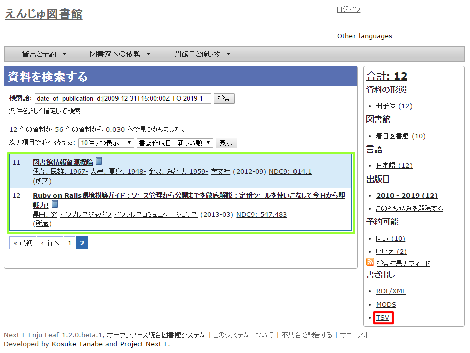

※　現在、画面でみえている結果の分だけが書き出しができます。

===== TSV 形式のファイルがダウンロードできます。 {#bib_tsv}

* [出力されるTSVの例（Web APIマニュアル1-1-2節参照）](enju_webapi_1.html#bib_tsv_example)
* [出力される項目の詳細（Web APIマニュアル1-1-3参照）](enju_webapi_1.html#bib_tsv_export)

==== 1-8-4 JSON 形式で書き出し

===== 書き出しをしたい検索結果画面を表示させます。[JSON]リンクをクリックします

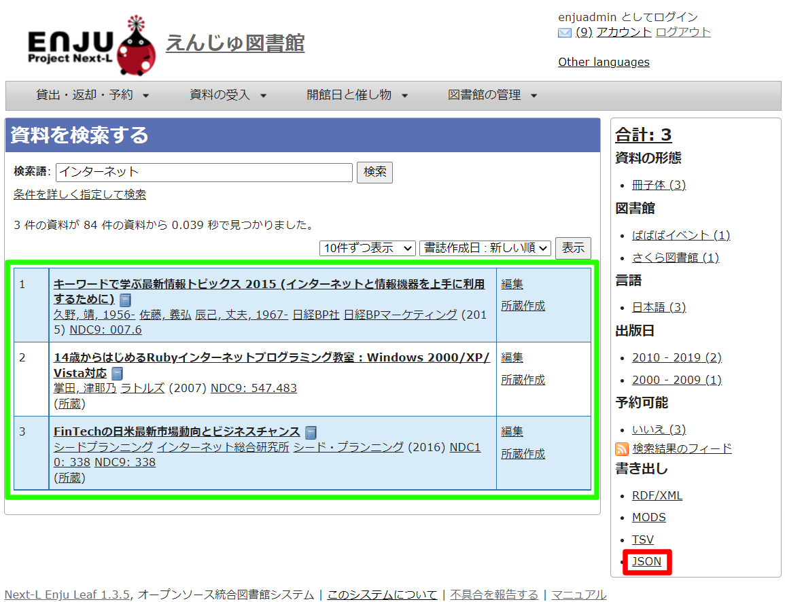

※　現在、画面でみえている結果の分だけが書き出しができます。

===== JSON 形式のファイルがダウンロードできます。 {#bib_json}

* [出力されるJSONの例（Web APIマニュアル「書誌と所蔵のJSON形式のデータの例」参照）](enju_webapi_1.html#bib_json_example)
* [出力される項目の詳細（Web APIマニュアル「書誌と所蔵のJSON形式の項目」参照）](enju_webapi_1.html#bib_json_export)

=== 検索結果詳細の書き出し

==== RDF/XML 形式で書き出し

===== 書き出しをしたい検索結果詳細画面を表示させます。[RDF/XML]リンクをクリックし
ます

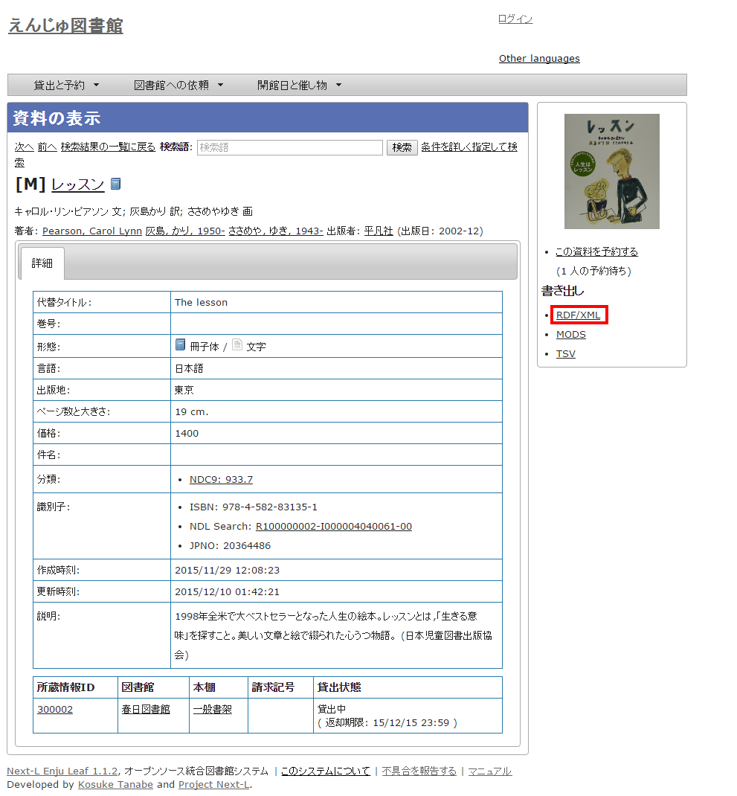

===== RDF/XML 形式のファイルがダウンロードできます。

* [出力されるRDF/XMLの例（Web API マニュアル2-2-2節参照）](enju_webapi_2.html#bib_rdf_example_simple)

==== MOS 形式で書き出し

===== 書き出しをしたい検索結果詳細画面を表示させます。[MODS]リンクをクリックします

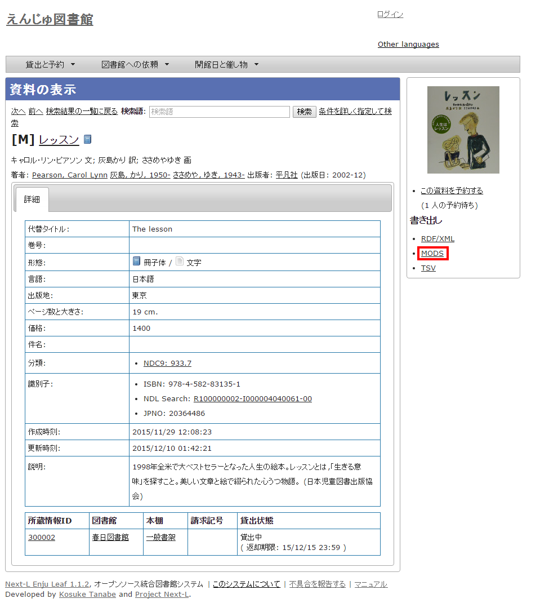

===== MOS 形式のファイルがダウンロードできます。

<pre>
&lt;?xml version="1.0" encoding="UTF-8"?&gt;
&lt;mods version="3.3" xmlns:xsi="http://www.w3.org/2001/XMLSchema-instance" xmlns="http://www.loc.gov/mods/v3"&gt;
&lt;titleInfo&gt;
  &lt;title&gt;レッスン&lt;/title&gt;
&lt;/titleInfo&gt;
&lt;titleInfo type="alternative"&gt;
  &lt;title&gt;The lesson&lt;/title&gt;
&lt;/titleInfo&gt;
&lt;name type="personal"&gt;
  &lt;namePart&gt;Pearson, Carol Lynn&lt;/namePart&gt;
  &lt;role&gt;
    &lt;roleTerm type="text" authority="marcrelator"&gt;creator&lt;/roleTerm&gt;
  &lt;/role&gt;
&lt;/name&gt;
&lt;name type="personal"&gt;
  &lt;namePart&gt;灰島, かり, 1950-&lt;/namePart&gt;
  &lt;role&gt;
    &lt;roleTerm type="text" authority="marcrelator"&gt;creator&lt;/roleTerm&gt;
  &lt;/role&gt;
&lt;/name&gt;
&lt;name type="personal"&gt;
  &lt;namePart&gt;ささめや, ゆき, 1943-&lt;/namePart&gt;
  &lt;role&gt;
    &lt;roleTerm type="text" authority="marcrelator"&gt;creator&lt;/roleTerm&gt;
  &lt;/role&gt;
&lt;/name&gt;
&lt;typeOfResource&gt;text&lt;/typeOfResource&gt;
&lt;originInfo&gt;
  &lt;publisher&gt;平凡社&lt;/publisher&gt;
  &lt;dateIssued&gt;2002-12-01 00:00:00 +0900&lt;/dateIssued&gt;
  &lt;frequency&gt;unknown&lt;/frequency&gt;
&lt;/originInfo&gt;
&lt;language&gt;
  &lt;languageTerm authority="iso639-2b" type="code"&gt;jpn&lt;/languageTerm&gt;
&lt;/language&gt;
&lt;physicalDescription&gt;
  &lt;form authority="marcform"&gt;volume&lt;/form&gt;
  &lt;extent/&gt;
&lt;/physicalDescription&gt;
&lt;subject&gt;
&lt;/subject&gt;
&lt;classification authority="ndc9"&gt;933.7&lt;/classification&gt;
&lt;abstract&gt;1998年全米で大ベストセラーとなった人生の絵本。レッスンとは,「生きる意味」を探すこと。美しい文章と絵で綴られた心うつ物語。 (日本児童図書出版協会)&lt;/abstract&gt;
&lt;note/&gt;
&lt;identifier type="isbn"&gt;9784582831351&lt;/identifier&gt;
&lt;recordInfo&gt;
  &lt;recordCreationDate&gt;2015-11-29 12:08:23 +0900&lt;/recordCreationDate&gt;
  &lt;recordChangeDate&gt;2015-12-10 01:42:21 +0900&lt;/recordChangeDate&gt;
  &lt;recordIdentifier&gt;http://localhost:8080/manifestations/2&lt;/recordIdentifier&gt;
&lt;/recordInfo&gt;
&lt;/mods&gt;
</pre>

==== TSV 形式で書き出し

===== 書き出しをしたい検索結果詳細画面を表示させます。[TSV]リンクをクリックします

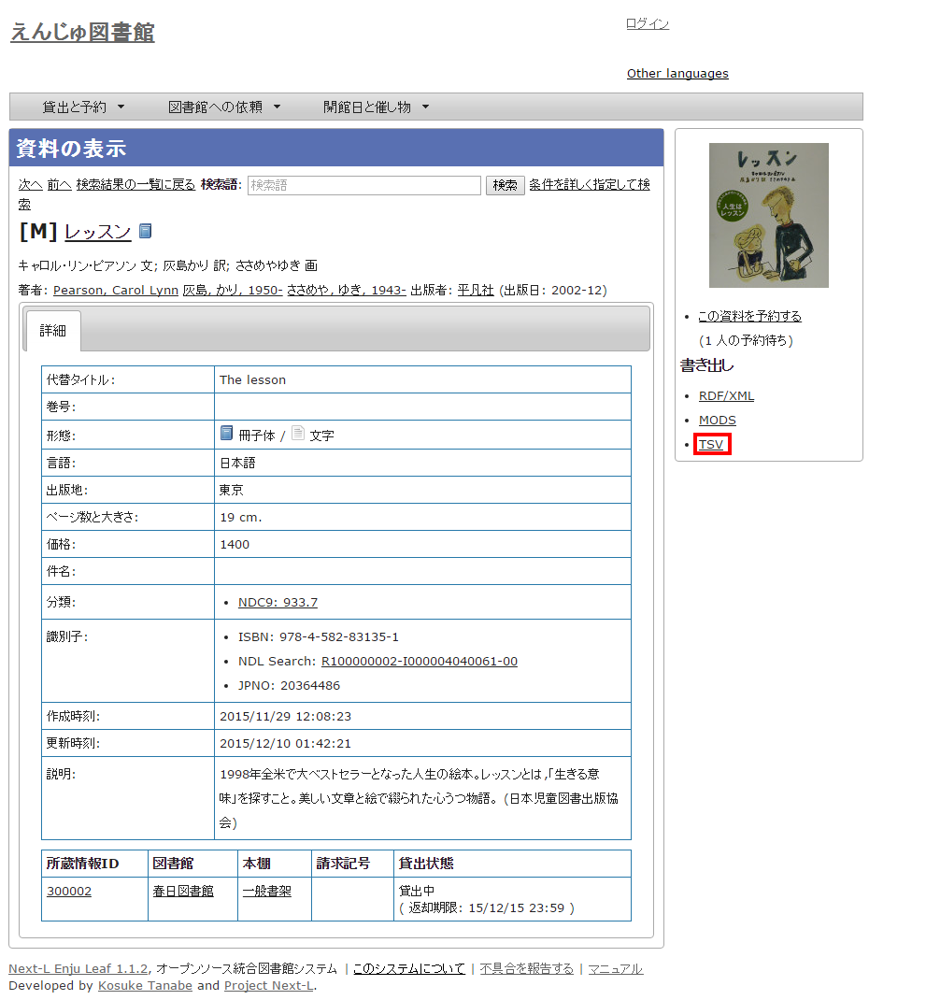

===== TSV 形式のファイルがダウンロードできます。

* [出力されるTSVの例（Web APIマニュアル2-1-2節参照）](enju_webapi_2.html#bib_tsv_example_simple)
* [出力される項目の詳細（Web APIマニュアル2-1-3参照）](enju_webapi_2.html#bib_tsv_export_simple)

=== 検索結果詳細を電子メールで送る

メールアドレスを登録しており、ログインしていると、
検索結果詳細を電子メールで送ることができます。

※　メールアドレスの登録方法は[「3-2メールアドレスや名前などを変更する」](enju_user_3.html#section3-2)を参照してください。

==== 電子メールで送りたい検索結果詳細画面を表示させます。[書誌情報を電子メールで送信する]リンクをクリックします

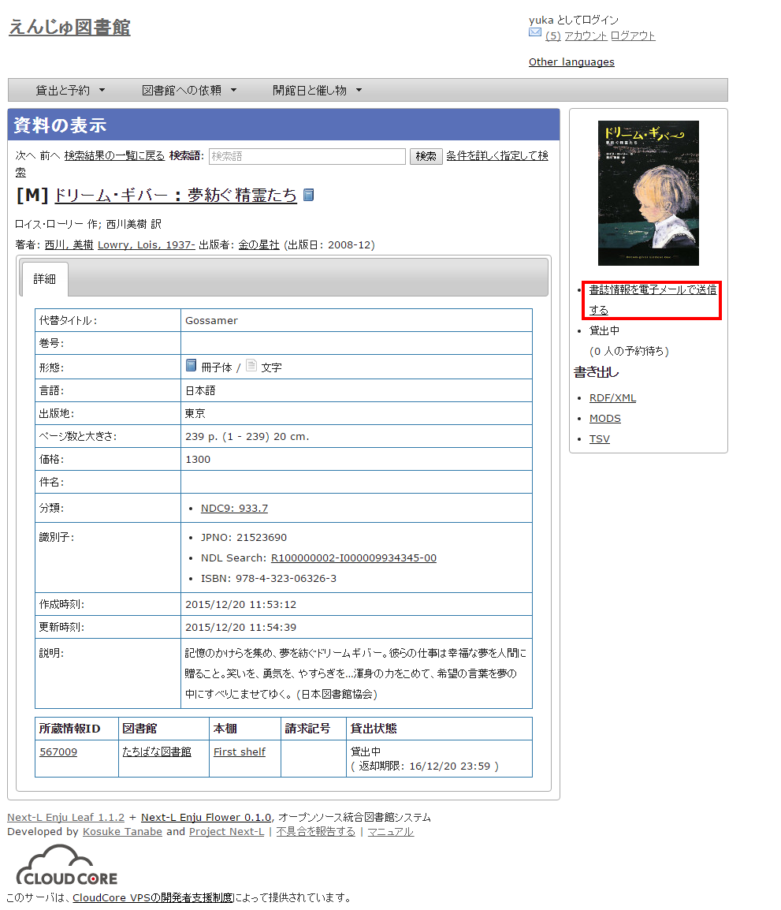

==== [OK]をクリックします。

image::../assets/images/1.2/image_alert.png[ok]

==== 電子メールで送られてきます。

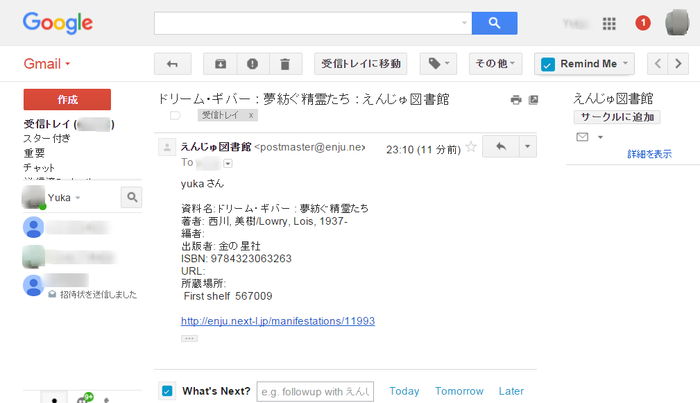


