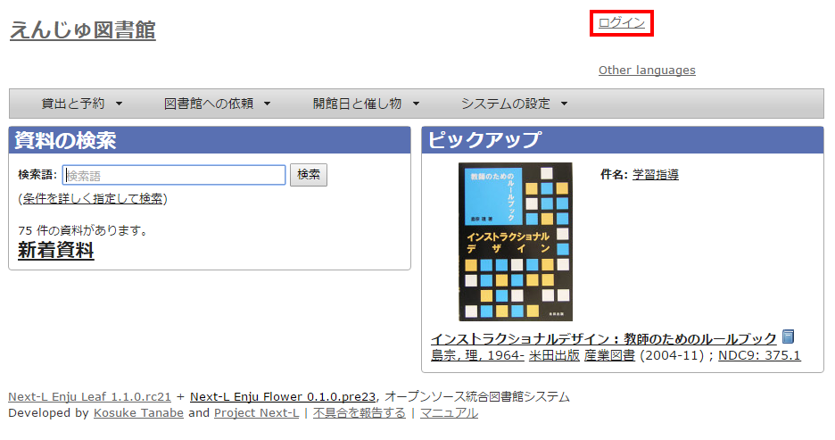
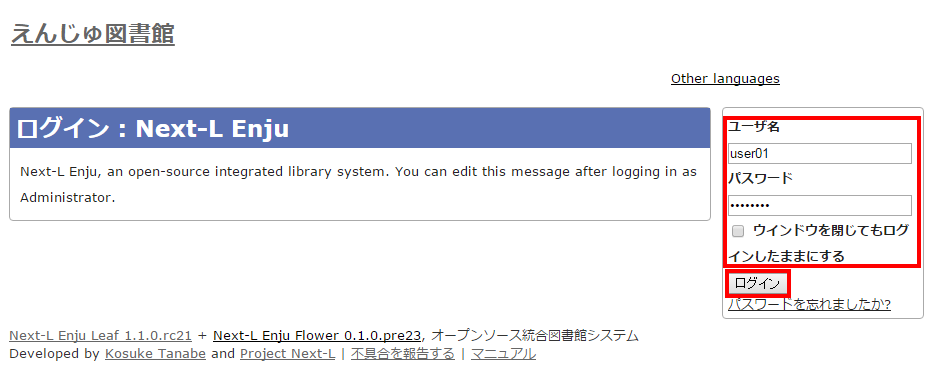
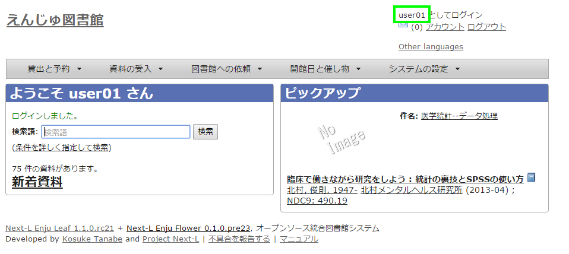
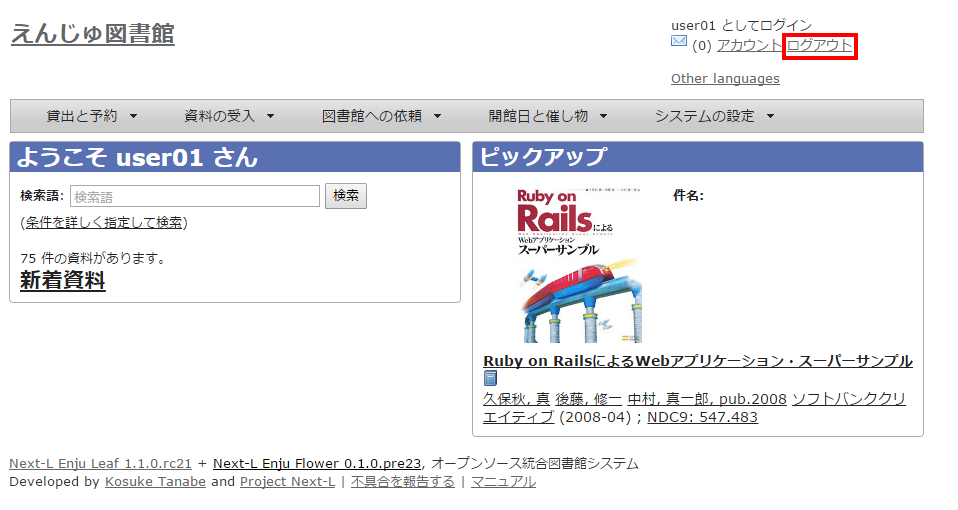

:toc: macro

toc::[]

== ログイン/ログアウトをする

ログインすることで、予約などができるようになります。
ここでは、ログインする方法と、ログアウトする方法について説明します。

=== ログインする

1. Enjuにアクセスし、［ログイン］をクリックします。
+

+
2. ユーザー名とパスワードを入力し［ログイン］をクリックします。
+

+
[NOTE]
====
ブラウザを閉じてもログイン状態を保持したい場合は、［ウィンドウを閉じてもログインしたままにする］をオンにします。

「パスワードを忘れましたか？」のリンクをたどった先の画面で、メールアドレス（Enjuに登録した自分のメールアドレス）を入れて、[パスワードを再発行する]ボタンをクリックすると、再発行されたパスワードがメールで送られてきます。
メールアドレスをあらかじめ設定していない場合は、この機能は使えません。
また、Enjuが動作しているサーバでメールサーバーの設定（xref:enju_install_vm_4.adoc#setup-mail-server[インストールマニュアル「メールサーバーの設定」参照]）がされていない場合もこの機能は動作しません。
====
+
3. 自分のアカウントでログインされていることを確認します。
+

=== ログアウトする

1. ［ログアウト］をクリックします。
+

+
2. ログアウトされたこと（［ログイン］の表示に変わったこと）を画面で確認します。
+
image::../assets/images/1.1/image_user_011.png[Enjuログアウト後]
+
[NOTE]
====
時間の経過にともなって自動ログアウトする機能は用意されていません。
パソコンを共有する時や離席時などには、
きちんとログアウトするよう心がけましょう。
====

include::enju_user_toc.adoc[]
