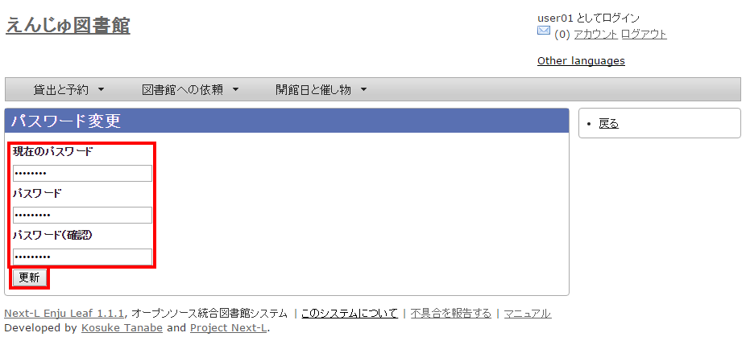
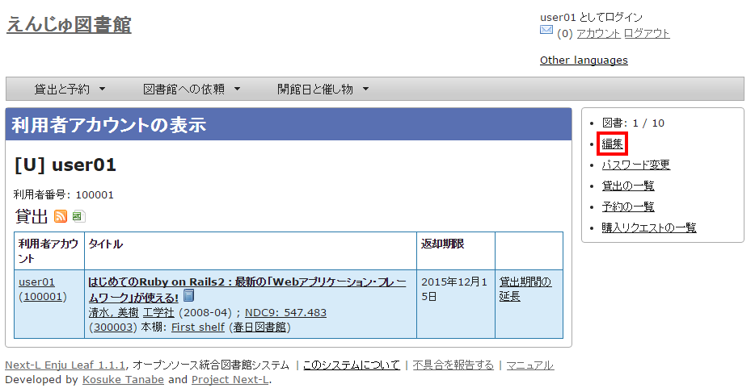

:toc: macro

toc::[]

== パスワード/ユーザアカウント情報を変更する

=== パスワードを変更する

1. 右上の[アカウント]リンクをクリックします。
+
image::../assets/images/1.1/image_user_passwd_003.png[アカウント]
+
2. 右メニューの[パスワード変更]リンクをクリックします。
+
image::../assets/images/1.1/image_user_passwd_005.png[パスワード変更]
+
3. ［現在のパスワード］と「パスワード」「パスワード(確認)」を入力します。パスワードは画面には表示されません。また「パスワード」と「パスワード(確認)」は同じものを入れてください。[更新]ボタンを押します。
+

+
4. 「アカウントは正常に更新されました。」と表示されます。パスワードは変更されました。
+
image:../assets/images/1.1/image_user_passwd_009.png[パスワード変更完了]

=== メールアドレスや名前などを変更する

メールアドレス、名前、画面のメニュー等に表示される言語、キーワードリスト（ピックアップ機能で使用）、貸出期限のicalendar url、貸出の履歴を保存するかどうかなどの情報を修正できます。

1. 右上の[アカウント]リンクをクリックします。
+
image::../assets/images/1.1/image_user_passwd_003.png[アカウント]
+
2. 右メニューの[編集]リンクをクリックします。
+

+
[NOTE]
====
* ユーザ名、利用者番号、貸出履歴が表示されます。
* 右メニューの[貸出の一覧]リンクをクリックすると自身の貸出履歴が表示されます。
* 右メニューの[予約の一覧]リンクをクリックすると自身の予約の一覧が表示されます。
* 右メニューの[購入リクエストの一覧]リンクをクリックすると自身の購入リクエストの一覧が表示されます。
====
3. メールアドレスや名前を編集し、[更新する]をクリックします。
+
image::../assets/images/1.1/image_user_account_005.png[メールアドレスなどを編集]
+
[NOTE]
====
* ユーザ名、有効期限、利用不可、権限、利用者グループ、利用者番号、図書館、参照に必要な権限については変更できません。変更が必要な場合は、職員に連絡ください。
====
+
4. 「メールアドレス」について
+
メールアドレスを登録しておくと、
+
* パスワードを忘れた時に、再設定されたパスワードを送信する機能が使えるようになります。
* 予約の取り置きのメールのお知らせがくるようになります。 ※ Enju Leaf 1.1.0 ではこの機能は動作しません（詳細 https://github.com/next-l/enju_leaf/issues/1016[issue #1016]）。
* 書誌詳細（「書誌情報を電子メールで送信する」リンク）で書誌をメールに送れるようになります。
* （管理者権限のみ）インポート・エクスポート・利用統計の集計の完了通知が来るようになります。
+
5. 「フルネーム」「フルネーム（ヨミ）」について
+
表示に使われます（主に、図書館職員の管理用に用いられます）。
+
6. 「言語」について
+
表示する言語を選ぶことができます。標準では、日本語と英語が選択可能です。
+
7. 「キーワードリスト」について
+
ログインしたときに表示される「ピックアップ」資料は、このキーワードリストにいれたキーワードに関連したものを優先して表示します。
+
8. 「貸出期限のicalendar url」について
+
こちらを[リセット]して表示したURLを使うことで、自身のカレンダーソフトに「貸出期限」などが表示されるように設定できます。
+
9. 「貸出の履歴を保存する」について
+
チェックを入れると、現在借りている本だけでなく、返却した本の記録を閲覧できるようになります。ただし、チェックを入れるまえの返却本は表示されません。

include::enju_user_toc.adoc[]
