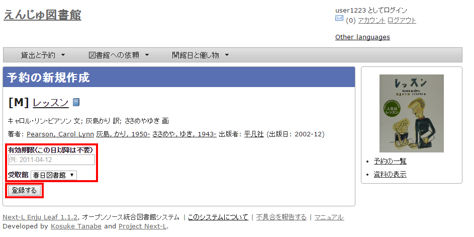

:toc: macro

toc::[]

== 資料を予約する

予約の機能には次のようなものがあります。

* 資料の予約をする
* 予約した資料を確認する
* 予約の変更・取消をする
* 予約した資料が用意されたことを知る
* 予約の一覧をTSVでダウンロードする
* 予約の一覧のRSSを取得する

=== 資料の予約をする

==== ログインせずに検索して後からログインして予約する場合

1. 予約したい本の名前を検索語に入力し、[検索]をクリックします。
+

+
2. 予約したい本が検索されたら、その本のタイトルをクリックします。
+
image::../assets/images/1.1/image_user_reserve_003_nologin_2.png[タイトル]
+
3. 右メニューの[この資料を予約する]をクリック
+
image::../assets/images/1.1/image_user_reserve_003_nologin_3.png[この資料を予約する]
+
4. 自分のユーザー名とパスワードを入力してログインをクリックします。
+
image::../assets/images/1.1/image_user_reserve_003_nologin_4.png[ログイン]
+
5. 必要ならば、「有効期限（この日以降は不要）」と「受け取り館」を入力し、［登録する］ボタンをクリックします。
+
「有効期限（この日以降は不要）」を設定すると、その日を過ぎた予約はキャンセルされます。
+

+
6. 「予約が正常に作成されました」と表示され、予約が作成されます。
+
image::../assets/images/1.1/image_user_reserve_003_nologin_6.png[作成完了]

==== ログインした状態で検索した場合

1. 予約したい本の名前を検索語に入力し、［検索］をクリックします。  
+
image::../assets/images/1.1/image_user_reserve_003.png[検索]
+
2. 予約したい本が検索されたら、［予約］をクリックします。  
+
[NOTE]
====
ログインしていないと[予約]リンクは表示されません
====
+
image::../assets/images/1.1/image_user_reserve_005.png[予約]
+
3. 必要ならば、「有効期限（この日以降は不要）」と「受け取り館」を入力し、［登録する］ボタンをクリックします。  
+
「有効期限（この日以降は不要）」を設定すると、その日を過ぎた予約はキャンセルされます。
+

+
4. 「予約が正常に作成されました」と表示され、予約が作成されます。
+

=== 予約した資料を確認する

1. ［貸出と予約］メニューから［予約の一覧］を選択します。
+
image::../assets/images/1.1/image_user_reserve_011.png[予約の一覧]
+
2. 予約の一覧が表示されます。右メニュー[取置済み]リンクをクリックします。
+
「状態」の列をみれば、「取置済み」や「受付済み」が分かります。「取置済み」や「受付済み」になった場合は、メッセージ機能やメールでお知らせがあります。
予約の詳細な情報を知りたい場合は、Id列のリンクか、資料のタイトルのリンクをクリックします。
+
image::../assets/images/1.1/image_user_reserve_013.png[予約の一覧の取置済み]
+
3. [取置済み]の予約だけが表示されます。右メニューの[この絞り込みを解除する]をクリックします。
+
image::../assets/images/1.1/image_user_reserve_015.png[予約の一覧の絞り込みを解除する]
+
4. 最初に表示したように、すべての予約が表示されます。
+

=== 予約の変更をする

受取館を変えたり、有効期限を変えたりできます。

1. ［貸出と予約］メニューから［予約の一覧］を選択します。
+
image::../assets/images/1.1/image_user_reserve_011.png[予約の一覧]
+
2. [編集]をクリックします。
+
image::../assets/images/1.1/image_user_reserve_019.png[予約の編集リンク]
+
3. 有効期限（この日以降は不要）や受取館を修正します。
+
image::../assets/images/1.1/image_user_reserve_021.png[予約の編集画面]
+
[NOTE]
====
現在、取置済みの予約でも編集できますが、いずれはできないようになる可能性があります（参照： https://github.com/next-l/enju_leaf/issues/839[ issue #839]）。
====

=== 予約の取消（キャンセル）をする

予約を取り消す（キャンセルする）ことができます。

1. ［貸出と予約］メニューから［予約の一覧］を選択します。
+
image::../assets/images/1.1/image_user_reserve_011.png[予約の一覧]
+
2. [取消]をクリックします。
+
image::../assets/images/1.1/image_user_reserve_023.png[予約の取消リンク]
+
3. [OK]をクリックします。
+
image::../assets/images/1.2/image_alert.png[予約の取消のOK]
+
4. 予約が取り消されました。
+

=== 予約の記録を削除する

既に完了したり、取り消したりした予約の記録を削除することができます。

1. ［貸出と予約］メニューから［予約の一覧］を選択します。
+
image::../assets/images/1.1/image_user_reserve_011.png[予約の一覧]
+
2. [削除]をクリックします。
+
image::../assets/images/1.1/image_user_reserve_027.png[予約の削除リンク]
+
3. [OK]をクリックします。
+
image::../assets/images/1.2/image_alert.png[予約の削除のOK]
+
4. 予約の記録1件分が削除されました。
+

=== 予約した資料が用意されたことを知る

[NOTE]
====
現行のEnju Leafではこの機能にバグがあり、メッセージ機能、メール通知機能ともに動作していません(詳細 https://github.com/next-l/enju_leaf/issues/1016[issue #1016])。
====

* メッセージ機能を使って知ることができます。
* xref:enju_user_3.adoc#_メールアドレスを設定[メールアドレスを設定]している場合は、メールでも通知が来ます。

=== 予約の一覧をTSVを表示する

1. ［貸出と予約］メニューから［予約の一覧］を選択します。
+
image::../assets/images/1.1/image_user_reserve_011.png[予約の一覧]
+
2. 右メニューの[TSV]をクリックします。
+
image::../assets/images/1.1/image_user_reserve_031.png[予約のTSVリンク]
+
3. TSVが表示されます。
+

=== 予約の一覧のRSSを表示する

1. ［貸出と予約］メニューから［予約の一覧］を選択します。
+
image::../assets/images/1.1/image_user_reserve_011.png[予約の一覧]
+
2. 右メニューの[RSS]をクリックします。
+

+
3. RSSが表示されます。
+

include::enju_user_toc.adoc[]
