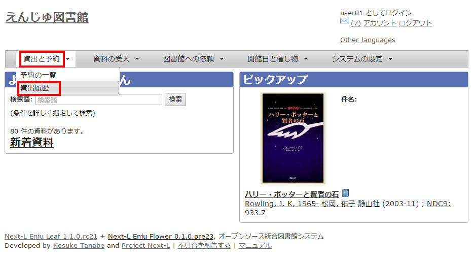
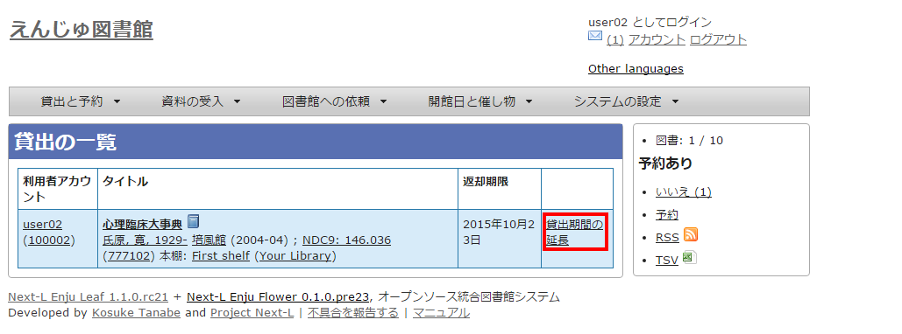
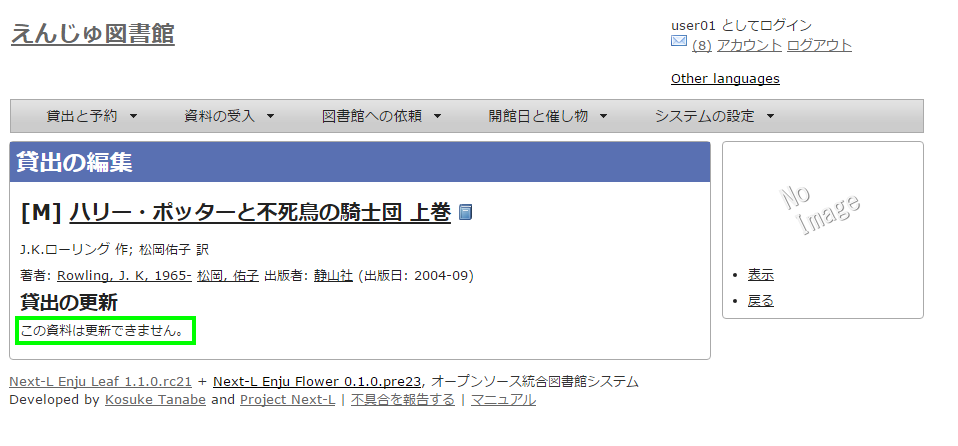
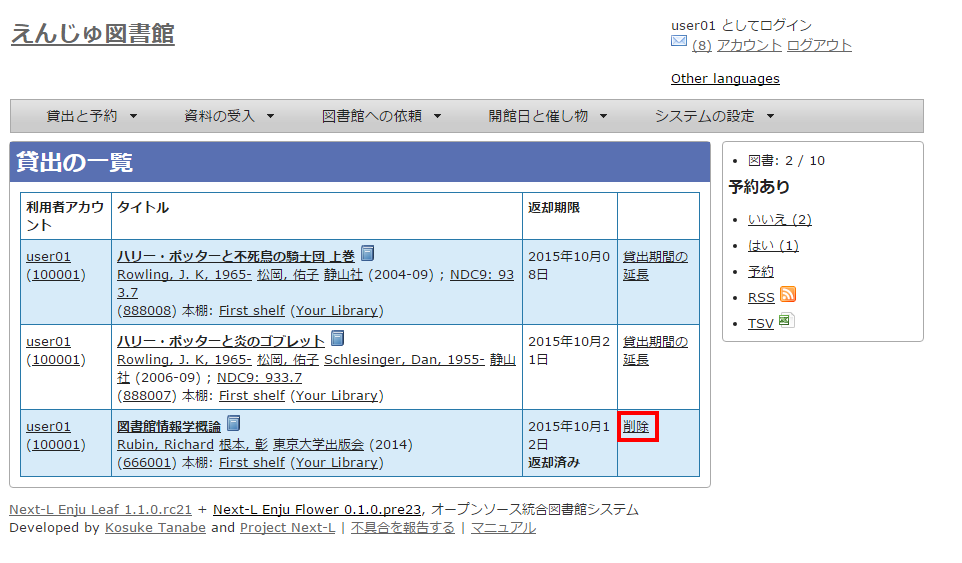
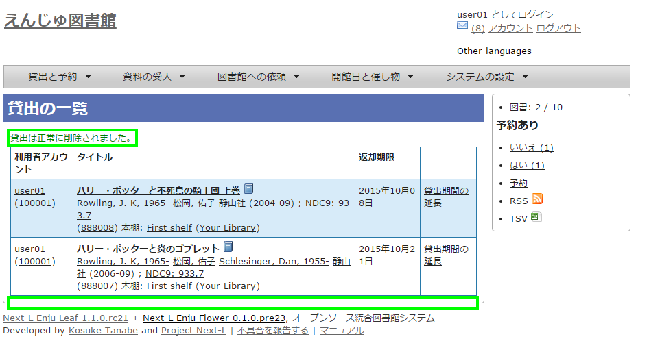
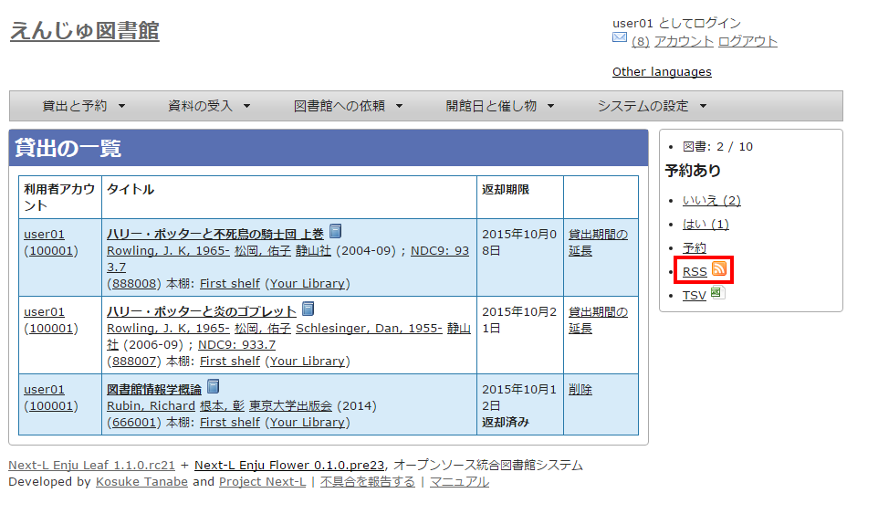

:toc: macro

toc::[]

== 資料の貸出状況を確認する/貸出延長をする

この章では、以下の貸出に関係する機能について説明します。

* 資料の貸出状況を確認する
* 貸出延長をする

=== 資料の貸出状況を確認する

現在借りている本を確認することができます。
また、貸出の履歴を保存する（xref:enju_user_3.adoc#_メールアドレスや名前などを変更する[3-2節参照]）にチェックを入れておくと、返却した本も記録され、閲覧できるようになります。
ただし、チェックを入れるまえに返却した本は記録されていないので表示できません。

1. ［貸出と予約］メニューから［貸出履歴］を選択します。
+

+
2. 貸出履歴が表示されます。右メニューの「予約あり」の下の「あり」をクリックします。
+
image::../assets/images/1.1/image_user_checkouts_003.png[貸出履歴]
+
[NOTE]
====
* この表と同内容を、[アカウント]リンクをたどった先の画面でも見れます。
* 右メニューにある「図書 : 2/ 10」は、「借りている本の数 / 借りられる上限数」を表しています。
* 右メニューの[予約]リンクをたどると、予約の一覧画面へ遷移します。
====
+
3. 予約がかかっている資料だけが表示されます。右メニューの[この絞り込みを解除する]をクリックします。
+
image::../assets/images/1.1/image_user_checkouts_005.png[絞り込みを解除する]
+
4. 絞り込みが解除され、すべての貸出履歴が表示されます。
+
image::../assets/images/1.1/image_user_checkouts_007.png[貸出履歴]

=== 貸出延長をする

1. ［貸出と予約］メニューから［貸出履歴］を選択します。
+

+
2. 貸出履歴が表示されます。[貸出期間の延長]をクリックします。
+

+
3. 新しい貸出期間を確認し、[更新する]をクリックします。
+
image::../assets/images/1.1/image_user_checkouts_011.png[貸出期間の延長]
+
[NOTE]
====
* すでに貸出期間が過ぎている資料の場合
* 予約が入っている資料の場合
は、次のような画面が出て、貸出期間の延長ができません。
+

====

=== 返却済みの貸出の記録を削除する

1. ［貸出と予約］メニューから［貸出履歴］を選択します。
+

+
2. ［削除]リンクをクリックします。
+

+
3. ［OK]をクリックします。
+
image::../assets/images/1.2/image_alert.png[貸出履歴の削除のOK]
+
4. 返却済みの記録が削除されました。
+

=== 貸出の一覧のTSVを表示する

1. ［貸出と予約］メニューから［貸出履歴］を選択します。
+

+
2. 右メニューの［TSV］をクリックします。
+
image::../assets/images/1.1/image_user_checkouts_019.png[貸出履歴のTSVリンク]
+
3. TSVが表示されます。

[source,tsv]
----
username	user_number	item_identifier	title	checked_out_at	due_date	checked_in_at	(created_at: 2020-01-11 15:07:50 +0900)
"zuser01"	"z123"	"011645041"	"イェルサレムのアイヒマン : 悪の陳腐さについての報告"	"2020-01-11 15:06:24 +0900"	"2020-02-10 23:59:59 +0900"	
"zuser01"	"z123"	"110333796"	"基本件名標目表"	"2020-01-11 14:55:44 +0900"	"2020-02-10 23:59:59 +0900"	"2020-01-11 14:55:51 +0900"
----

=== 貸出の一覧のRSSを表示する

1. ［貸出と予約］メニューから［貸出履歴］を選択します。
+

+
2. 右メニューの［RSS］をクリックします。
+

+
3. RSSが表示されます。
+
image::../assets/images/1.1/image_user_checkouts_025.png[貸出履歴のRSS表示]

include::enju_user_toc.adoc[]
